*MetodologIA — Success as a Service · Construido con método, potenciado por la red agéntica.*

# 00 — Plan de Discovery: Campus MetodologIA

## TL;DR

- **Objetivo**: diseñar y validar la arquitectura del **Campus MetodologIA** como plataforma educativa greenfield, inspirada en las cualidades sistémicas de Hubexo (desacople, composabilidad, interoperabilidad, reusabilidad) pero **10× menos ambiciosa**, sobre stack Hostinger + Supabase + Astro + Web Components `[PLAN]`.
- **Variante seleccionada**: `Full-16` (pipeline completo), justificada por ambición pedagógica alta pese a ligereza técnica. `[INFERENCIA]`
- **Timeline del run**: 45-90 min en ejecución autónoma, 9 fases, 4 gates (G1, G1.5, G2, G3) auto-aprobados con banner de `{SUPUESTO}>30%`. `[PLAN]`
- **Marca**: MetodologIA (NO Sofka). Tono premium-aspiracional, español LatAm, "100 Check Standard". `[WEB:metodologia.info]`
- **Público**: mix B2B (clientes corporativos) + B2C (aprendices individuales). `[WEB:metodologia.info]`

> [!WARNING]
> **Banner `{SUPUESTO}>30%`** — Al ser un proyecto greenfield sin código ni stakeholders entrevistados, aproximadamente **40% de las afirmaciones** de este pipeline serán `[SUPUESTO]` o `[INFERENCIA]`. Toda decisión crítica quedará marcada para validación en workshop de kickoff.

---

## 1. Alcance del Discovery

### 1.1 Problema a resolver
MetodologIA posee marca, audiencia y método consolidados `[WEB:metodologia.info]`, pero **no tiene campus operativo**. Se requiere un diseño de arquitectura pedagógica y técnica que permita:

- Publicar catálogo de cursos, matricular aprendices, ejecutar cohortes y emitir certificaciones verificables.
- Operar con costos de infraestructura bajos (Hostinger + Supabase), sin servidor propio. `[PLAN]`
- Respetar estándares IMS 2025-2026 (LTI 1.3, xAPI, OpenBadges 3.0, DUA/UDL 3.0). `[DOC]`
- Servir de referencia para futuras verticales del método. `[INFERENCIA]`

### 1.2 Fuera de alcance (M1-M3)
- IA generativa dentro del campus (tutor IA, grading asistido) → diferido a M4 con ADR explícito. `[PLAN]`
- Integración SIS corporativo OneRoster → M2 solo si aparece primer cliente B2B enterprise. `[SUPUESTO]`
- App móvil nativa → M3+ según tracción. `[SUPUESTO]`
- Multi-tenant → M1 single-tenant; M2 multi-tenant bajo demanda. `[PLAN]`

### 1.3 Criterios de éxito del Discovery
1. 5 entregables AS-IS + Flujos publicados y revisados por Sponsor. `[PLAN]`
2. 16 entregables completos al cierre de `/sdf:run-auto`. `[PLAN]`
3. Arquitectura de 3 capas validada: estático + Edge + Postgres. `[PLAN]`
4. 6 bounded contexts documentados con DDL mínimo. `[PLAN]`
5. Banner `{SUPUESTO}>30%` aceptado por Sponsor para avance condicional. `[INFERENCIA]`

---

## 2. Pipeline — 16 Entregables

```mermaid
flowchart LR
    A[00 Plan] --> B[01 Stakeholders]
    B --> C[02 Brief Técnico]
    C --> D[03 AS-IS]
    D --> E[04 Flujos]
    E --> G1{{G1: AS-IS OK?}}
    G1 -->|auto| F[05 Dominio]
    F --> G[06 Sol. Arch]
    G --> H[07 API]
    H --> I[08 Eventos]
    I --> J[09 Datos]
    J --> G15{{G1.5: Arch OK?}}
    G15 -->|auto| K[10 Security]
    K --> L[11 Accessibility]
    L --> M[12 Testing]
    M --> G2{{G2: Quality OK?}}
    G2 -->|auto| N[13 Pedagogy]
    N --> O[14 Roadmap]
    O --> P[15 Risks]
    P --> G3{{G3: Ready?}}
    G3 -->|auto| Q[16 Pitch + ADRs]
```

| # | Entregable | Fase | Gate |
|---|---|---|---|
| 00 | Discovery Plan | 0-kickoff | — |
| 01 | Stakeholder Map | 1-asis | — |
| 02 | Brief Técnico AS-IS | 1-asis | — |
| 03 | Análisis AS-IS | 1-asis | — |
| 04 | Mapeo de Flujos | 1-asis | **G1** |
| 05 | Modelo de Dominio | 2-design | — |
| 06 | Solution Architecture | 2-design | — |
| 07 | API Contracts | 2-design | — |
| 08 | Event Architecture | 2-design | — |
| 09 | Data Architecture | 2-design | **G1.5** |
| 10 | Security Blueprint | 3-quality | — |
| 11 | Accessibility | 3-quality | — |
| 12 | Testing Strategy | 3-quality | **G2** |
| 13 | Pedagogy Pack | 4-pedagogy | — |
| 14 | Roadmap M1-M3 | 5-delivery | — |
| 15 | Risk Register | 5-delivery | — |
| 16 | Executive Pitch + ADRs | 6-handover | **G3** |

---

## 3. Fases y Quality Gates

### 3.1 Fases
1. **Fase 0 — Kickoff & Priming** (5 min): carga de `priming-rag-*.md`, escaneo de attachments, calibración de brand MetodologIA.
2. **Fase 1 — AS-IS** (15 min): stakeholders, brief técnico, análisis, flujos. Gate G1.
3. **Fase 2 — Design** (20 min): dominio, arquitectura de solución, APIs, eventos, datos. Gate G1.5.
4. **Fase 3 — Quality** (15 min): security, accesibilidad, testing. Gate G2.
5. **Fase 4 — Pedagogy** (10 min): pack pedagógico con scriba (DUA + Bloom + FSRS).
6. **Fase 5 — Delivery** (10 min): roadmap M1-M3, riesgos.
7. **Fase 6 — Handover** (5 min): pitch ejecutivo + ADRs + render HTML brand MetodologIA. Gate G3.

### 3.2 Gates (auto-aprobados con banner)

| Gate | Criterio | Modo |
|---|---|---|
| **G1** AS-IS OK | 5 entregables AS-IS completos, ≥1 Mermaid por entregable, evidencia tagged | 🟢 auto |
| **G1.5** Arch OK | 3 capas + 6 bounded contexts + DDL mínimo + OpenAPI stub | 🟢 auto |
| **G2** Quality OK | RLS + WCAG 2.2 AA gate + testing matrix (Vitest + pgTAP + Playwright + pa11y) | 🟢 auto |
| **G3** Ready | Pitch + 7 ADRs + HTML brand MetodologIA renderizado | 🟢 auto |

> [!NOTE]
> Los gates operan en **modo auto-aprobación** por ser greenfield y para preservar el flujo `/sdf:run-auto`. Cualquier observación crítica se registra en `risk-register.md` para revisión humana posterior.

---

## 4. Dream Team — Comité SAGE v13

10 agentes activados con lente `{TIPO_SERVICIO}=EDUCACION`:

| # | Rol | Agente SAGE | Responsabilidad principal |
|---|---|---|---|
| 1 | Conductor | `discovery-conductor` | Orquestación del pipeline y gates |
| 2 | Analista dominio | `domain-analyst` | Modelado DDD educativo (6 bounded contexts) |
| 3 | Arquitecto | `solutions-architect` | Diseño 3 capas Static + Edge + Postgres |
| 4 | Arquitecto software | `software-architect` | Web Components, Astro, monorepo pnpm |
| 5 | Ingeniero datos | `data-engineer` | Schemas Postgres, RLS, migraciones |
| 6 | Arquitecto API | `api-architect` | OpenAPI 3.1 + PostgREST + Edge Functions |
| 7 | Security lead | `security-architect` | RLS, Ley 1581 CO, GDPR, DSAR |
| 8 | Accessibility | `accessibility-auditor` | WCAG 2.2 AA, DUA/UDL 3.0 |
| 9 | QA lead | `testing-strategist` | Vitest + pgTAP + Playwright + pa11y |
| 10 | SME educativo | `subject-matter-expert: edtech-latam` | Canon IMS, FSRS, benchmark Moodle/Canvas |
| 11* | Risk controller | `risk-controller` | Registro y mitigaciones |
| 12* | Delivery | `delivery-manager` | Roadmap M1-M3, cadencia semanal |

*Roles transversales permanentes.

---

## 5. Variante Seleccionada: `Full-16`

### 5.1 Justificación
| Criterio | Express (3) | Guided (8) | **Full (16)** | Deep (7+gates) |
|---|---|---|---|---|
| Ambición pedagógica | 🔴 insuficiente | 🟡 parcial | 🟢 completa | 🟢 completa |
| Ligereza técnica | 🟢 | 🟢 | 🟢 | 🟡 |
| Canon IMS cubierto | 🔴 | 🟡 | 🟢 | 🟢 |
| Duración | 15 min | 30 min | **45-90 min** | 2-3 h |
| Gates | 0 | 1 | **4** | 2+humanos |

**Veredicto**: `Full-16` equilibra cobertura pedagógica (DUA, FSRS, OpenBadges) con pragmatismo técnico. `[INFERENCIA]`

---

## 6. Timeline del Run

```mermaid
gantt
    title Pipeline `/sdf:run-auto` — Campus MetodologIA
    dateFormat HH:mm
    axisFormat %H:%M
    section Fase 0
    Kickoff & Priming      :00:00, 5m
    section Fase 1 AS-IS
    Stakeholders           :00:05, 4m
    Brief Técnico          :00:09, 4m
    Análisis AS-IS         :00:13, 4m
    Flujos                 :00:17, 3m
    G1 auto                :milestone, 00:20, 0m
    section Fase 2 Design
    Dominio                :00:20, 5m
    Solution Arch          :00:25, 5m
    APIs                   :00:30, 4m
    Eventos                :00:34, 3m
    Datos                  :00:37, 3m
    G1.5 auto              :milestone, 00:40, 0m
    section Fase 3 Quality
    Security               :00:40, 5m
    Accessibility          :00:45, 5m
    Testing                :00:50, 5m
    G2 auto                :milestone, 00:55, 0m
    section Fase 4-6
    Pedagogy Pack          :00:55, 10m
    Roadmap + Risks        :01:05, 10m
    Pitch + HTML brand     :01:15, 5m
    G3 auto                :milestone, 01:20, 0m
```

---

## 7. Supuestos Fundacionales

| # | Supuesto | Evidencia | Impacto si falla |
|---|---|---|---|
| S1 | La marca es **MetodologIA**, no Sofka | `[WEB:metodologia.info]` | 🔴 Crítico: rebranding total |
| S2 | Stack Hostinger + Supabase confirmado por founder | `[PLAN]` | 🔴 Crítico: replantear arquitectura |
| S3 | Público es mix B2B + B2C, mayoritariamente LatAm | `[WEB:metodologia.info]` `[SUPUESTO]` | 🟡 Medio: ajuste de i18n y pricing |
| S4 | "100 Check Standard" es el lema de calidad oficial | `[WEB:metodologia.info]` | 🟡 Medio: rediseño de métricas |
| S5 | Presupuesto permite 16 semanas M1-M3 con 2-3 FTE | `[SUPUESTO]` | 🔴 Crítico: cortar alcance |
| S6 | Founder acepta rol Sponsor + Product Owner inicial | `[SUPUESTO]` | 🟡 Medio: escalar con contratación |
| S7 | Ley 1581 CO aplica por residencia de founder | `[INFERENCIA]` | 🟡 Medio: revisar con abogado |
| S8 | Stripe es la pasarela aceptable | `[SUPUESTO]` | 🟢 Bajo: alternativa Wompi/MercadoPago |

> [!TIP]
> Validar S1, S2, S5 y S6 en workshop de kickoff antes de Fase 2. Los demás pueden confirmarse durante el run.

---

## 8. Disclaimers

> [!WARNING]
> - Estimaciones de esfuerzo en **FTE-meses**, **no comerciales**. No constituyen oferta.
> - Banner `{SUPUESTO}>30%` activo durante todo el pipeline.
> - Este plan NO sustituye levantamiento con stakeholders reales: es base para iteración.

---

*Fecha: 2026-04-20 · Autor: Comité MetodologIA · Discovery SAGE v13.*
*MetodologIA — Success as a Service · Construido con método, potenciado por la red agéntica.*
