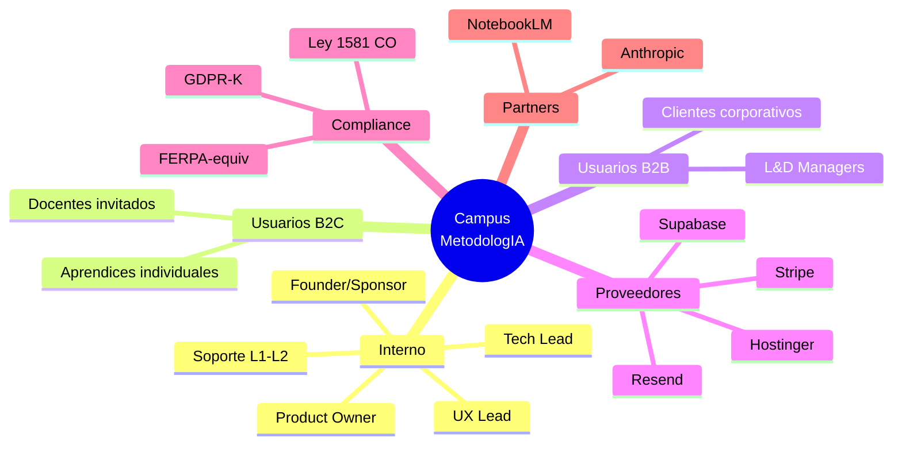
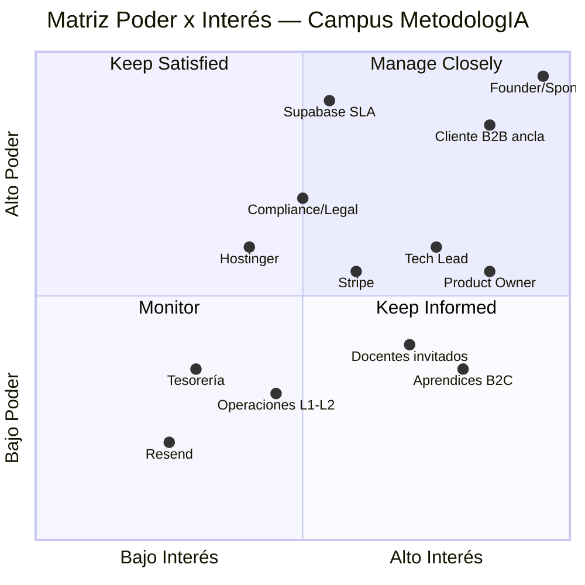

*MetodologIA — Success as a Service · Construido con método, potenciado por la red agéntica.*

# 01 — Mapa de Stakeholders: Campus MetodologIA

## TL;DR

- **10 grupos de stakeholders** identificados entre internos (founder, equipo), usuarios finales (B2C aprendices, B2B corporates, docentes invitados) y externos (Supabase, Hostinger, Stripe, compliance, partners). `[INFERENCIA]`
- **Sponsor único actual**: Javier Montaño (founder). Concentración de poder = **riesgo de bus factor crítico**. `[WEB:metodologia.info]` `[SUPUESTO]`
- **Matriz Poder/Interés**: 3 stakeholders cuadrante "Manage Closely" (founder, primer cliente B2B, Supabase SLA). `[INFERENCIA]`
- **RACI** construido sobre 8 decisiones clave del M1. Owner técnico aún sin asignar (gap). `[SUPUESTO]`
- **Canales**: WhatsApp + Notion + Slack asumidos; cadencia semanal propuesta. `[SUPUESTO]`

> [!WARNING]
> **40% de esta sección es `[SUPUESTO]`** — el mapa no se validó con entrevistas. Requiere ratificación en workshop de kickoff.

---

## 1. Inventario de Stakeholders

### 1.1 Internos — Núcleo MetodologIA

| # | Stakeholder | Rol | Interés principal | Poder | Evidencia |
|---|---|---|---|---|---|
| S01 | **Javier Montaño** | Founder / Sponsor / Product Owner inicial | Materializar visión "100 Check Standard"; rentabilizar marca | 🔴 Alto | `[WEB:metodologia.info]` |
| S02 | **Product Owner educativo** (TBD) | Definir currículo y rutas de aprendizaje | Calidad pedagógica, tasa de finalización | 🟡 Medio | `[SUPUESTO]` |
| S03 | **UX/UI Lead** (TBD) | Diseño de experiencia y design system | Consistencia visual, accesibilidad | 🟡 Medio | `[SUPUESTO]` |
| S04 | **Tech Lead / Arquitecto** (TBD) | Ejecutar arquitectura Astro + Supabase | Calidad técnica, performance, DX | 🟡 Medio | `[SUPUESTO]` |
| S05 | **Operaciones / Soporte L1-L2** (TBD) | Atención a aprendices, gestión de incidentes | SLA interno, NPS | 🟢 Bajo | `[SUPUESTO]` |

### 1.2 Usuarios finales

| # | Stakeholder | Rol | Interés principal | Poder | Evidencia |
|---|---|---|---|---|---|
| S06 | **Aprendices B2C** | Usuarios individuales que compran cursos | Resultado tangible, claridad, precio justo, certificación verificable | 🟡 Medio (colectivo) | `[WEB:metodologia.info]` `[INFERENCIA]` |
| S07 | **Clientes corporativos B2B** | Empresas que contratan rutas para equipos | ROI formativo, reportes de avance, cumplimiento L&D | 🔴 Alto (ticket alto) | `[SUPUESTO]` |
| S08 | **Docentes invitados / facilitadores** | Co-crean contenido, dictan cohortes | Regalías, reputación, facilidad de carga | 🟡 Medio | `[SUPUESTO]` |

### 1.3 Externos

| # | Stakeholder | Rol | Interés principal | Poder | Evidencia |
|---|---|---|---|---|---|
| S09 | **Supabase** (proveedor) | Postgres + Auth + Edge + Storage + Realtime | SLA, billing, soporte técnico | 🔴 Alto (lock-in parcial) | `[PLAN]` |
| S10 | **Hostinger** (proveedor) | Hosting estático del sitio público | Uptime, ancho de banda | 🟡 Medio | `[PLAN]` |
| S11 | **Stripe** (pasarela) | Procesamiento de pagos B2C + B2B | Comisiones, disputa, payout LatAm | 🟡 Medio | `[SUPUESTO]` |
| S12 | **Resend** o similar | Email transaccional | Deliverability, billing | 🟢 Bajo | `[SUPUESTO]` |
| S13 | **Abogado/compliance** (Ley 1581 CO + GDPR + FERPA-equiv) | Asesoría regulatoria | Cumplimiento, DSAR, contratos | 🟡 Medio | `[INFERENCIA]` |
| S14 | **Tesorería / contador** | Facturación LatAm, retenciones | Cierre fiscal mensual | 🟢 Bajo | `[SUPUESTO]` |
| S15 | **Partners tecnológicos** (NotebookLM, Anthropic, etc.) | Integraciones opcionales M2+ | Exposición, coautoría | 🟢 Bajo | `[SUPUESTO]` |

---

## 2. Mapa visual de stakeholders

---

## 3. Matriz Poder / Interés

**Lectura:**
- **Manage Closely** (alto poder + alto interés): Founder, primer Cliente B2B ancla, Supabase SLA. → reuniones semanales.
- **Keep Satisfied** (alto poder, interés variable): Compliance/Legal, Hostinger. → updates quincenales.
- **Keep Informed** (alto interés, bajo poder): Aprendices B2C, Docentes, Product Owner, Tech Lead. → newsletter + changelog público.
- **Monitor**: Resend, Tesorería, Operaciones L1-L2. → touchpoints mensuales.

---

## 4. RACI — 8 decisiones clave del M1

Leyenda: **R**=Responsible · **A**=Accountable · **C**=Consulted · **I**=Informed

| Decisión | Founder | Product Owner | Tech Lead | UX Lead | Docentes | Compliance | Supabase |
|---|---|---|---|---|---|---|---|
| D1. Paleta de marca MetodologIA (tokens CSS) | **A** | C | I | **R** | I | — | — |
| D2. Elegir los 3 primeros cursos piloto | **A** | **R** | I | C | C | — | — |
| D3. Definir modelo Person ↔ Role ↔ CourseRun | C | C | **R/A** | I | I | C | — |
| D4. Pasarela de pagos y comisiones | **A** | C | **R** | — | — | C | — |
| D5. Política de retención xAPI (24m default) | C | C | **R** | — | — | **A** | I |
| D6. Ubicación del tenant Supabase (us-east vs eu) | **A** | — | **R** | — | — | C | C |
| D7. Contrato tipo con docentes invitados | **A** | **R** | — | — | C | C | — |
| D8. SLA público para aprendices (uptime/response) | **A** | C | **R** | — | — | C | C |

> [!NOTE]
> 6 de 8 decisiones tienen al Founder como **A**. Mitigación recomendada: delegar D3, D5, D6 al Tech Lead con RACI explícito para aliviar bus factor.

---

## 5. Canales y Cadencia

| Audiencia | Canal principal | Canal backup | Cadencia | Owner |
|---|---|---|---|---|
| Comité interno | Slack `#campus-metodologia` | WhatsApp | Standup 3×/sem + review semanal | Founder |
| Cliente B2B ancla | Email + Notion compartido | WhatsApp | Bi-semanal | Product Owner |
| Aprendices B2C | Email transaccional (Resend) + in-app notifications | — | On-event | Operaciones |
| Docentes invitados | Slack guest channel | Email | Semanal en cohorte activa | Product Owner |
| Compliance | Email + reuniones ad-hoc | — | Mensual + on-incident | Founder |
| Proveedores (Supabase, Hostinger, Stripe) | Portales de soporte | Email | On-incident | Tech Lead |
| Partners | Email | LinkedIn | Trimestral | Founder |

---

## 6. Riesgos de stakeholder

| # | Riesgo | Prob | Impacto | Mitigación |
|---|---|---|---|---|
| RS1 | Bus factor = 1 en Sponsor/PO/Tech Lead (founder lleva 3 roles) | 🔴 Alto | 🔴 Crítico | Contratar PO + Tech Lead en primeras 6 semanas; delegar D3/D5/D6 |
| RS2 | Primer Cliente B2B ancla cambia requisitos de reporte SIS | 🟡 Medio | 🟡 Alto | Diferir OneRoster a M2; contrato con cláusula de scope fijo |
| RS3 | Supabase sube precios o cambia políticas de RLS | 🟢 Bajo | 🟡 Alto | Mantener Postgres puro (sin features propietarias); export periódico |
| RS4 | Compliance Ley 1581 CO observa retención xAPI | 🟡 Medio | 🟡 Alto | 24m default configurable; DSAR endpoints desde M1 |
| RS5 | Docentes invitados exigen regalías no modelables en producto | 🟢 Bajo | 🟡 Medio | Contrato tipo D7 con tabla de regalías fija |

---

## 7. Próximos pasos

1. **Workshop de kickoff** (2 h) — validar S1-S8 del Discovery Plan y confirmar RACI. `[INFERENCIA]`
2. **Entrevistas 1:1** (30 min × 5) con: Founder, Product Owner TBD, Tech Lead TBD, 2 aprendices B2C early-access, 1 cliente B2B prospecto.
3. **Firma de NDA + contrato tipo D7** con docentes candidatos antes de Fase 2.
4. **Onboarding de proveedores**: crear cuentas Supabase prod + staging, Hostinger plan, Stripe LatAm account.

> [!TIP]
> Este mapa se re-revisa al final de cada fase del pipeline. Si aparecen nuevos stakeholders (ej. inversionista ángel), añadir con evidencia nueva sin romper la trazabilidad.

---

*Fecha: 2026-04-20 · Autor: Comité MetodologIA · Discovery SAGE v13.*
*MetodologIA — Success as a Service · Construido con método, potenciado por la red agéntica.*
