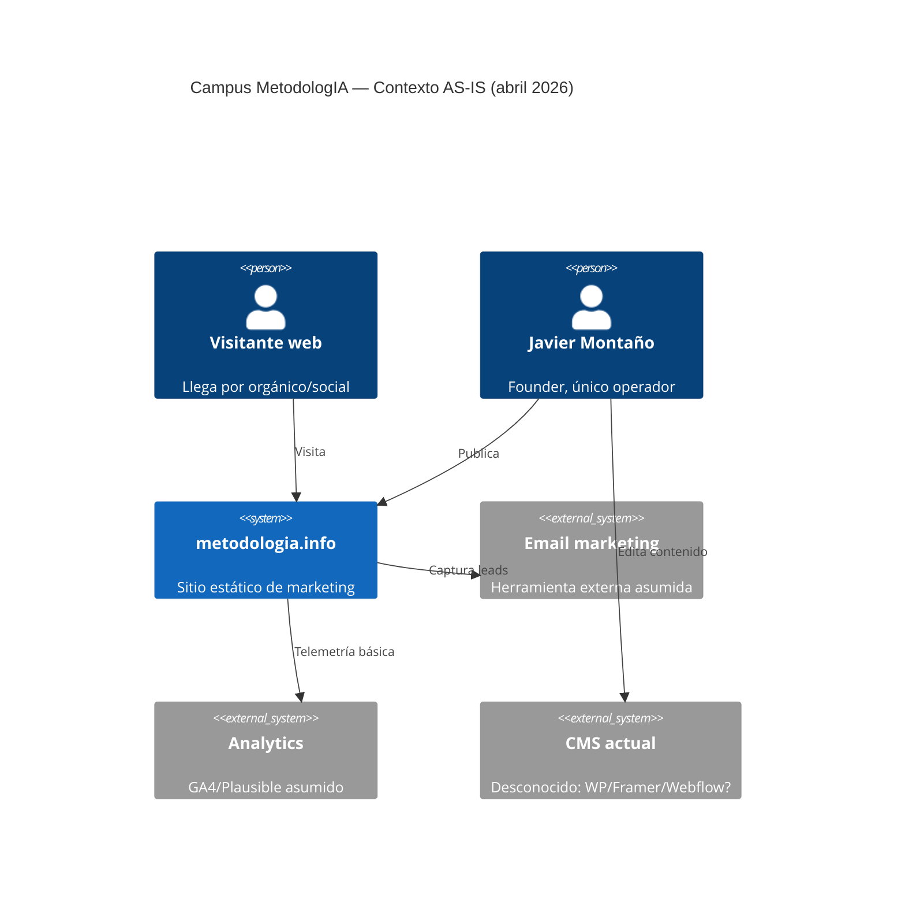
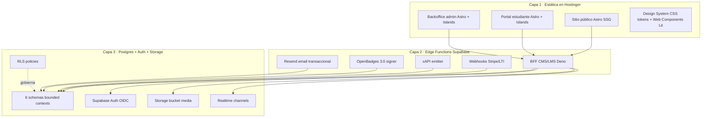

*MetodologIA — Success as a Service · Construido con método, potenciado por la red agéntica.*

# 02 — Brief Técnico AS-IS: Campus MetodologIA

## TL;DR

- **Estado actual**: metodologia.info es un **sitio de marketing** (landing + contenido editorial). NO existe campus, LMS, catálogo transaccional ni lógica de backoffice. `[WEB:metodologia.info]`
- **Greenfield al 95%**: no hay stack heredado, ni pipeline CI, ni tests, ni infraestructura de datos. **Oportunidad de elegir best practices desde cero**. `[INFERENCIA]`
- **Integraciones externas vigentes**: asumidas mínimas (formulario de contacto, quizá email marketing). `[SUPUESTO]`
- **Riesgo CRÍTICO**: arrancar sin CI/tests invitaría deuda técnica desde día 1 → se requiere **cobertura mínima 80% en lógica crítica (RLS, xAPI, enrollment)** desde M1. `[PLAN]`
- **Stack objetivo confirmado**: Hostinger (estático) + Supabase (Postgres + Auth + Edge + Realtime + Storage) + Astro + Web Components. `[PLAN]`

> [!WARNING]
> **~45% de este brief es `[SUPUESTO]`/`[INFERENCIA]`** — no se realizó auditoría técnica del sitio actual. Verificación recomendada: inspección HTML, DNS lookup, WHOIS y entrevista con founder.

---

## 1. Contexto del negocio

MetodologIA es una marca digital fundada por Javier Montaño, posicionada como metodología de "apalancamiento" con filosofía premium-aspiracional y lema **"100 Check Standard"**. `[WEB:metodologia.info]`

- **Mercado**: LatAm, español. Público mix B2B + B2C. `[WEB:metodologia.info]`
- **CTA actuales**: "Descubrir Visión / Explorar Ruta / Soluciones". `[WEB:metodologia.info]`
- **Promesa**: formación que transforma el método de trabajo/vida mediante ejercicios y rutas estructuradas. `[INFERENCIA]`
- **Monetización actual**: desconocida (no hay checkout público visible). `[SUPUESTO]`

---

## 2. Inventario del sistema actual

### 2.1 Frontend público

| Componente | Estado | Evidencia |
|---|---|---|
| Dominio `metodologia.info` | 🟢 activo | `[WEB:metodologia.info]` |
| Landing page | 🟢 publicada | `[WEB:metodologia.info]` |
| Catálogo de cursos transaccional | 🔴 inexistente | `[INFERENCIA]` |
| Checkout/matrícula | 🔴 inexistente | `[INFERENCIA]` |
| Portal de estudiante | 🔴 inexistente | `[INFERENCIA]` |
| Backoffice admin | 🔴 inexistente | `[INFERENCIA]` |
| Design system documentado | 🟡 parcial (marca existe, no tokens formalizados) | `[SUPUESTO]` |

### 2.2 Backend / datos

| Componente | Estado | Evidencia |
|---|---|---|
| Base de datos transaccional | 🔴 inexistente | `[INFERENCIA]` |
| CMS/LMS | 🔴 inexistente | `[INFERENCIA]` |
| Autenticación de usuarios | 🔴 inexistente | `[INFERENCIA]` |
| Pasarela de pagos conectada | 🔴 desconocida | `[SUPUESTO]` |
| Email marketing / CRM | 🟡 asumido (Mailchimp/Brevo) | `[SUPUESTO]` |
| Analítica web | 🟡 asumido (GA4 o Plausible) | `[SUPUESTO]` |

### 2.3 Operaciones y procesos

| Componente | Estado | Evidencia |
|---|---|---|
| CI/CD | 🔴 inexistente | `[INFERENCIA]` |
| Testing (unit/e2e/a11y) | 🔴 inexistente | `[INFERENCIA]` |
| Observabilidad (logs/metrics/traces) | 🔴 inexistente | `[INFERENCIA]` |
| Runbooks de incidentes | 🔴 inexistente | `[INFERENCIA]` |
| Backups automatizados | 🔴 inexistente | `[INFERENCIA]` |
| Documentación técnica | 🔴 inexistente | `[INFERENCIA]` |

---

## 3. Diagrama C4 — Contexto AS-IS

---

## 4. Gaps técnicos y de producto

### 4.1 Gaps funcionales (producto)
1. **Sin catálogo transaccional**: visitante no puede comprar un curso online.
2. **Sin identidad de aprendiz**: no hay login, sesión, ni perfil.
3. **Sin ejecución de curso**: no hay lección, quiz, progreso, ni entrega.
4. **Sin certificación**: no hay badge ni documento verificable al completar.
5. **Sin backoffice**: founder/docente no puede crear course_run, enrolar cohortes, ver analíticas.
6. **Sin reportes B2B**: imposible vender a empresa sin dashboard de avance y completitud.

### 4.2 Gaps no-funcionales (arquitectura)
1. **Sin modelo de datos**: no existe separación `Course` / `CourseRun` / `Enrollment` / `Person`.
2. **Sin estándares IMS**: LTI, xAPI, OpenBadges no emiten nada.
3. **Sin accesibilidad garantizada**: no hay gate WCAG 2.2 AA.
4. **Sin privacidad formal**: consentimientos, retention, DSAR no documentados (Ley 1581 CO expone riesgo).
5. **Sin observabilidad**: un incidente hoy es ciego.
6. **Sin testing**: cualquier cambio futuro es arriesgado.

### 4.3 Oportunidades del greenfield
- **Libertad de stack**: elegir Astro + Supabase + Web Components sin peso de legados. `[PLAN]`
- **DUA/UDL 3.0 en modelo de datos** desde día 1 (trigger Postgres). `[PLAN]`
- **Contratos IMS** como ciudadanos de primera clase. `[PLAN]`
- **Testing desde M1** con Vitest + pgTAP + Playwright + pa11y-ci. `[PLAN]`
- **Privacy-by-design**: RLS + DSAR endpoints + retention policies desde M1. `[PLAN]`

---

## 5. Stack objetivo (TO-BE referencia)

> [!NOTE]
> Este diagrama representa el **objetivo**. El AS-IS actual no tiene Capa 2 ni Capa 3. Solo un subset trivial de Capa 1 (landing estático).

---

## 6. Integraciones externas — hipótesis AS-IS

| Integración | Estado asumido | Confirmación requerida |
|---|---|---|
| Stripe (pagos) | No conectado | ❓ Verificar cuenta business LatAm |
| Resend / SendGrid / Mailchimp (email) | Mailchimp probable | ❓ Auditar API keys y listas |
| Plausible / GA4 (analytics) | GA4 posible | ❓ Inspeccionar `<head>` del sitio |
| NotebookLM MCP | No integrado | `[PLAN]` — llega en M2+ |
| LTI 1.3 (corporates) | No implementado | `[PLAN]` — M1 Tool Consumer |
| Slack / Discord comunidad | No integrado | ❓ Confirmar si existe canal |

> [!TIP]
> Ejecutar auditoría técnica breve (curl + devtools + WHOIS) antes de cerrar este brief en workshop.

---

## 7. Riesgos técnicos top-5

| # | Riesgo | Severidad | Probabilidad | Mitigación |
|---|---|---|---|---|
| RT1 | **Arrancar sin CI/CD ni tests** invita deuda desde sprint 0 | 🔴 Crítico | 🔴 Alto | GitHub Actions + Vitest + pgTAP + Playwright + pa11y-ci desde M1 sprint 1 |
| RT2 | **Acoplar catálogo a ejecución** (tentación WordPress + LearnDash) | 🔴 Crítico | 🟡 Medio | ADR explícito: `Course ≠ CourseRun ≠ Enrollment ≠ Person`; rechazo argumentado a WP |
| RT3 | **Violaciones Ley 1581 CO / GDPR** por retención o DSAR mal modelados | 🔴 Alto | 🟡 Medio | Tabla `consent` + Edge Functions `dsar-export` y `dsar-delete` desde M1; retención xAPI 24m default |
| RT4 | **Dependencia single-vendor** en Supabase (lock-in de features propietarias) | 🟡 Alto | 🟡 Medio | Usar solo Postgres estándar + PostgREST; evitar pg_net, pgvector hasta ADR; export periódico |
| RT5 | **Accesibilidad no-nativa** en Web Components custom rompe WCAG 2.2 AA | 🟡 Alto | 🟡 Medio | Gate CI con `pa11y-ci` + `axe-core` en build; review manual por auditor externo en M3 |

---

## 8. Líneas base técnicas a definir

Antes de cerrar Fase 2 (Design), se requiere confirmar:

- [ ] **Paleta MetodologIA** en tokens CSS formales (no Sofka Neo-Swiss). Owner: UX Lead. `[PLAN]`
- [ ] **Región Supabase**: `us-east-1` (latencia LatAm) vs `eu-west-1` (privacidad GDPR). Owner: Founder + Compliance.
- [ ] **Pasarela**: Stripe vs MercadoPago vs Wompi (comisiones y payout LatAm). Owner: Founder.
- [ ] **Email transaccional**: Resend vs SendGrid (deliverability LatAm). Owner: Tech Lead.
- [ ] **Analítica**: Plausible (privacy-friendly, coste fijo) vs GA4 (funnels). Owner: Product Owner.
- [ ] **Búsqueda**: `pg_trgm` + FTS Postgres vs Meilisearch/Typesense. Owner: Tech Lead.
- [ ] **i18n**: `es-LatAm` primero, `en-US` opcional M3. Owner: Product Owner.

---

## 9. Resumen ejecutivo del AS-IS

> MetodologIA tiene **marca fuerte y audiencia nacida**, pero **cero infraestructura de campus**. Arranca desde cero con la ventaja de no cargar deuda técnica heredada y la obligación de no crearla. La arquitectura propuesta (Hostinger + Supabase + Astro + Web Components + estándares IMS) ofrece el camino más corto a un LMS **desacoplado, composable, interoperable y reusable**, a un costo operacional bajo y con gates de calidad desde M1.

> [!WARNING]
> Estimaciones de esfuerzo en **FTE-meses**, **no comerciales**. No constituyen oferta.

---

*Fecha: 2026-04-20 · Autor: Comité MetodologIA · Discovery SAGE v13.*
*MetodologIA — Success as a Service · Construido con método, potenciado por la red agéntica.*
