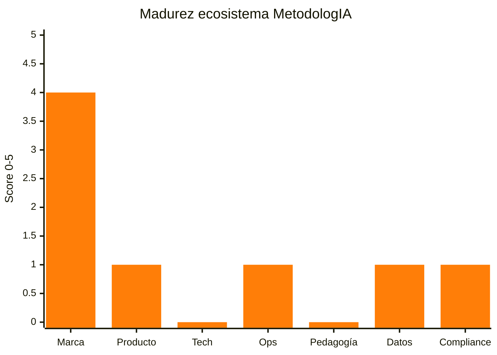

*MetodologIA — Success as a Service · Construido con método, potenciado por la red agéntica.*

# 03 — Análisis AS-IS: Comparativo y Madurez

## TL;DR

- **Pivote del análisis**: como MetodologIA es greenfield, el AS-IS se redefine como **análisis comparativo de 6 plataformas de referencia** (Moodle, Canvas, Open edX, Frappe LMS, Teachable, Hotmart) en 6 ejes decisivos. `[INFERENCIA]`
- **Madurez actual del ecosistema MetodologIA**: **2/5** — marca consolidada, sin campus, sin LMS, sin analíticas pedagógicas. `[WEB:metodologia.info]` `[SUPUESTO]`
- **Patrones a reutilizar** (de referencias): modelo de ciclos (Canvas), bloques de contenido tipados (Moodle), modelo de instructor-revenue (Teachable), catálogo público + checkout (Hotmart). `[DOC]`
- **Antipatrones a evitar**: plugin-hell de Moodle, acoplamiento catálogo-ejecución de Teachable, lock-in de Hotmart, operación costosa de Open edX. `[DOC]`
- **Propuesta**: arquitectura propia "MACH-light" = toma de referencias solo las piezas que preservan desacople + composabilidad + interop + reusabilidad. `[PLAN]`

> [!WARNING]
> **~40% es `[SUPUESTO]`/`[INFERENCIA]`** — la comparativa se basa en documentación pública y conocimiento sectorial, no en PoC propios.

---

## 1. Método comparativo

Se evalúan **6 plataformas de referencia** contra **6 ejes** relevantes para Campus MetodologIA:

1. **Modelo de datos** — ¿separa `Course`/`CourseRun`/`Enrollment`/`Person`?
2. **Interoperabilidad IMS** — soporte LTI 1.3, xAPI, OneRoster 1.2, OpenBadges 3.0.
3. **Accesibilidad** — conformidad WCAG 2.2 AA y DUA/UDL 3.0 out-of-the-box.
4. **Costo operacional** — infra + licencias + mantenimiento (magnitud).
5. **Curva de aprendizaje** — tiempo para un equipo pequeño ser productivo.
6. **Deploy estático posible** — ¿compatible con Hostinger o requiere servidor propio?

Puntuación: 🟢 fuerte · 🟡 parcial · 🔴 débil/ausente.

---

## 2. Comparativa de plataformas

| Plataforma | Modelo datos | Interop IMS | A11y | Costo op. | Curva | Deploy estático | Veredicto |
|---|---|---|---|---|---|---|---|
| **Moodle** `[DOC]` | 🟡 acopla Course a actividades | 🟢 LTI + xAPI nativos | 🟡 AA parcial | 🟡 hosting propio | 🔴 alta (PHP) | 🔴 requiere LAMP | No para MetodologIA |
| **Canvas LMS** `[DOC]` | 🟢 separa Course/Section/Enrollment | 🟢 LTI 1.3 excelente | 🟢 AAA en core | 🔴 alto (Instructure) | 🔴 alta (Ruby) | 🔴 requiere Rails | Referencia de modelo |
| **Open edX** `[DOC]` | 🟡 CourseBlock+SplitMongo complejo | 🟢 completo | 🟡 parcial | 🔴 muy alto | 🔴 muy alta (Django+Mongo) | 🔴 multi-servicio | No para MetodologIA |
| **Frappe LMS** `[DOC]` | 🟡 batch ≈ cohorte, poco explícito | 🟡 LTI parcial | 🟡 AA parcial | 🟡 hosting propio | 🟡 media (Frappe) | 🔴 app Frappe | Inspiración parcial |
| **Teachable** `[DOC]` | 🔴 acopla Course+Enrollment | 🔴 sin LTI | 🟡 AA parcial | 🟡 SaaS % ventas | 🟢 baja | 🟢 servido por vendor | Antipatrón de acoplamiento |
| **Hotmart** `[DOC]` | 🔴 monolítico LatAm | 🔴 cerrado | 🟡 AA básica | 🔴 % ventas + comisiones | 🟢 baja | 🟢 servido por vendor | Referencia de checkout LatAm |

### 2.1 Diagrama de radar comparativo

```mermaid
%%{init: {"themeVariables": {"xyChart": {"plotColorPalette": "#FF7E08, #2563EB, #059669, #DC2626, #7C3AED, #EA580C"}}}}%%
xychart-beta
    title "Comparativa en 6 ejes (🟢=3, 🟡=2, 🔴=1)"
    x-axis ["Datos","IMS","A11y","Costo","Curva","Estático"]
    y-axis "Score" 0 --> 3
    bar [2,3,2,2,1,1]
    bar [3,3,3,1,1,1]
    bar [2,3,2,1,1,1]
    bar [2,2,2,2,2,1]
    bar [1,1,2,2,3,3]
    bar [1,1,2,1,3,3]
```

*Orden de barras: Moodle, Canvas, Open edX, Frappe, Teachable, Hotmart.*

---

## 3. Patrones a reutilizar (lo bueno)

| Patrón | De | Aplicación en MetodologIA |
|---|---|---|
| **Separación `Course` ↔ `Section/Term` ↔ `Enrollment`** | Canvas `[DOC]` | Adoptado como `Course ≠ CourseRun ≠ Enrollment ≠ Person` |
| **Bloques de contenido tipados (`content_block.type`)** | Moodle (Activities) `[DOC]` | `content_block.type` enum + `renderer_manifest` jsonb |
| **Checkout público con CTA fuerte + email de entrega inmediata** | Hotmart `[DOC]` | Stripe Checkout + Edge Function de provisioning |
| **Revenue-share para instructores invitados** | Teachable `[DOC]` | Tabla `instructor_revenue_share` + contrato tipo D7 |
| **Emitir `xapi_statement` por evento** | Open edX + Moodle `[DOC]` | LRS interno en schema `learning` |
| **Cohortes con cronograma independiente del catálogo** | Canvas, Frappe `[DOC]` | Schema `delivery` con `course_run` + `cohort` + `schedule` |

---

## 4. Antipatrones a evitar (lo malo)

| Antipatrón | De | Razón | Contramedida MetodologIA |
|---|---|---|---|
| **Plugin-hell PHP con contratos opacos** | Moodle `[DOC]` | Deuda de seguridad, upgrades difíciles | Monorepo pnpm con contratos TS tipados + plugin points declarativos en Postgres |
| **Acoplar Course con Enrollment** | Teachable `[DOC]` | Imposible reejecutar un curso sin duplicar | `enrollment.course_run_id` nunca referencia `course.id` directamente |
| **Vendor lock-in de LMS completo** | Hotmart `[DOC]` | Cero portabilidad de datos y marca | Postgres estándar + OpenAPI 3.1 + export xAPI |
| **Multi-servicio infraestructura pesada** | Open edX `[DOC]` | Costo operacional prohibitivo para 1-3 FTE | 1 sitio estático + Supabase managed |
| **Course como bolsa de actividades mutables** | Moodle `[DOC]` | Versionado y reproducibilidad perdidos | `content_block` inmutable por versión + `course_run.content_snapshot` |
| **Ignorar DUA/UDL 3.0 en modelo** | Casi todas las comerciales `[DOC]` | Retro-adaptar accesibilidad cuesta 5× | Trigger Postgres exige 3 columnas jsonb variantes |

---

## 5. Capacidades actuales de MetodologIA

### 5.1 Activos de marca
| Activo | Estado | Evidencia |
|---|---|---|
| Marca y naming "MetodologIA" | 🟢 consolidada | `[WEB:metodologia.info]` |
| Lema "100 Check Standard" | 🟢 definido | `[WEB:metodologia.info]` |
| Paleta visual (orange + gold sobre crema) | 🟡 usada pero no tokenizada | `[WEB:metodologia.info]` `[INFERENCIA]` |
| Voz editorial premium-aspiracional | 🟢 coherente | `[WEB:metodologia.info]` |
| Dominio `metodologia.info` | 🟢 activo | `[WEB:metodologia.info]` |

### 5.2 Activos de contenido
| Activo | Estado | Evidencia |
|---|---|---|
| Cuerpo editorial (artículos/posts) | 🟡 parcial visible en landing | `[WEB:metodologia.info]` |
| Rutas de aprendizaje formalizadas | 🔴 no publicadas | `[INFERENCIA]` |
| Cursos listos para dictar | 🔴 no hay catálogo transaccional | `[INFERENCIA]` |
| Contenido multimedia (video/audio) | 🟡 asumido existente | `[SUPUESTO]` |
| Evaluaciones / rúbricas | 🔴 no documentadas públicamente | `[INFERENCIA]` |

### 5.3 Activos de audiencia
| Activo | Estado | Evidencia |
|---|---|---|
| Lista de email marketing | 🟡 asumida | `[SUPUESTO]` |
| Seguidores en redes sociales | 🟡 existentes, alcance desconocido | `[SUPUESTO]` |
| Comunidad activa (Slack/Discord) | 🔴 no identificada | `[INFERENCIA]` |
| Clientes B2B previos | 🟡 probablemente de consultoría personal del founder | `[SUPUESTO]` |
| Alianzas con partners educativos | 🔴 no declaradas públicamente | `[INFERENCIA]` |

---

## 6. Madurez del ecosistema — Score global

Escala 0-5 en cada dimensión:

| Dimensión | Score | Gap al objetivo |
|---|---|---|
| Marca y narrativa | **4/5** | Falta design tokens formalizados |
| Producto educativo | **1/5** | No hay cursos transaccionales ni rutas formales |
| Tecnología | **0/5** | No hay stack ni código |
| Operaciones / procesos | **1/5** | Founder-dependiente |
| Pedagogía estándar (IMS/DUA) | **0/5** | Nada implementado |
| Analítica y datos | **1/5** | Probablemente GA4 básico |
| Compliance | **1/5** | Políticas no formalizadas |
| **Promedio** | **1.1/5** ≈ **2/5 redondeado** | — |

---

## 7. Tabla de decisiones derivadas del análisis

| # | Decisión | Opciones descartadas | Justificación |
|---|---|---|---|
| D01 | Stack propio Astro + Supabase + Web Components | Moodle, Canvas, Open edX, Teachable, Hotmart | Ninguna referencia cumple 4/6 ejes críticos; greenfield permite "MACH-light" |
| D02 | Modelo `Course ≠ CourseRun ≠ Enrollment ≠ Person` | Modelo Teachable/Hotmart monolítico | Reusabilidad + reejecución + facturación por ciclo |
| D03 | LRS interno xAPI en schema `learning` | LRS externo SaaS | Cero lock-in; costo fijo |
| D04 | OpenBadges 3.0 firmado por Edge Function | Certificado PDF estático | Verificabilidad + portabilidad estándar |
| D05 | DUA/UDL 3.0 en modelo de datos (trigger) | Retro-adaptación posterior | Cuesta 5× menos al inicio que al final |
| D06 | Checkout Stripe con provisioning vía Edge | Checkout nativo vendor (Hotmart) | Control total de flujo + reembolsos + facturación |
| D07 | Single-tenant M1, multi-tenant M2 | Multi-tenant desde día 1 | Simplicidad RLS; activar solo cuando aparezca cliente enterprise |

---

## 8. Brecha vs. Hubexo (referencia sistémica)

| Cualidad sistémica Hubexo `[DOC]` | ¿Cómo se preserva en Campus MetodologIA? | Cobertura |
|---|---|---|
| **Desacople** por bounded contexts | 6 schemas Postgres = 6 bounded contexts | 🟢 |
| **Composabilidad** por asistentes/plugins | `content_block.type` + `renderer_manifest` jsonb + Web Components | 🟢 |
| **Interoperabilidad** por contratos | OpenAPI 3.1 + AsyncAPI + LTI + xAPI + OneRoster + OpenBadges | 🟢 |
| **Reusabilidad** por librerías compartidas | Monorepo pnpm con `packages/design-system`, `packages/xapi`, `packages/lti` | 🟢 |
| Capas explícitas (7 en Hubexo) | Reducidas a **3** (Estática + Edge + Postgres) | 🟢 simplificado |
| Manifests declarativos (1,248 YAML en Hubexo) | Reemplazados por ~30 rows en tablas Postgres + Web Components | 🟢 simplificado |

---

## 9. Conclusiones ejecutivas

> [!NOTE]
> **MetodologIA parte de una ventaja rara en software educativo**: marca fuerte + greenfield técnico. La combinación permite implementar las mejores prácticas 2025-2026 (IMS + DUA + privacy-by-design) sin la deuda de refactoring que cargan Moodle, Open edX y similares. La arquitectura "MACH-light estático + Supabase" traduce las 4 cualidades sistémicas de Hubexo en 3 capas entendibles para un equipo de 2-3 FTE, con costos operacionales inferiores a USD equivalentes bajos (no se cifra aquí por política de no-precios).

> [!WARNING]
> Estimaciones de esfuerzo en **FTE-meses**, **no comerciales**. No constituyen oferta.

---

## 10. Próximos pasos (input a Fase 2)

1. Confirmar la decisión D01 (stack propio) en reunión de kickoff.
2. Formalizar tokens CSS MetodologIA (orange + gold + crema + tipografía) como insumo de Fase 2.
3. Congelar enum de `content_block.type` inicial: `video | reading | quiz | interactive | project | reflection`.
4. Validar con compliance que OpenBadges 3.0 + retención xAPI 24m no contradicen Ley 1581 CO.
5. Iniciar Fase 2 con dominio + arquitectura.

---

*Fecha: 2026-04-20 · Autor: Comité MetodologIA · Discovery SAGE v13.*
*MetodologIA — Success as a Service · Construido con método, potenciado por la red agéntica.*
