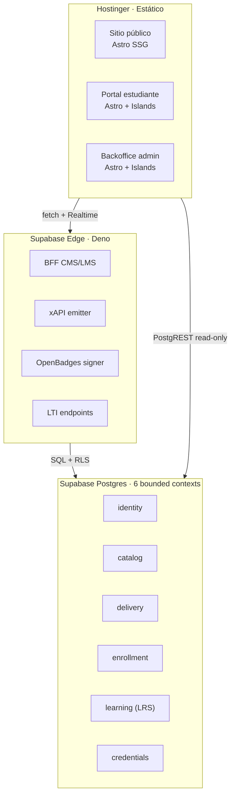
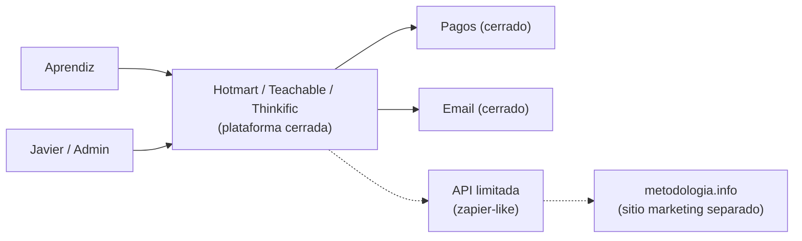
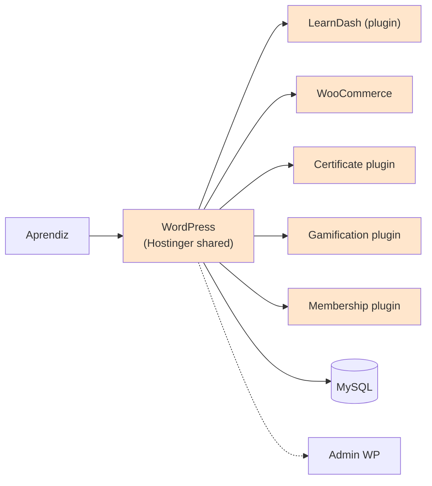
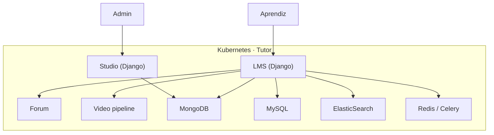

# 05 · Escenarios ToT — Campus MetodologIA

> **Entregable:** Análisis Tree-of-Thoughts (ToT) de 4 escenarios arquitectónicos para el **Campus MetodologIA**.
> **Comité:** technical-architect · solutions-architect · research-scientist · economics-researcher · systems-theorist · hardware-systems-engineer · integration-researcher.
> **Fase:** 05 · Evaluación de Escenarios · **Gate G1**.
> **Fuente de verdad del stack objetivo:** [PLAN] `/Users/deonto/.claude/plans/sdf-run-auto-basado-en-hubexo-indexed-hennessy.md`.
> **Marca:** MetodologIA — *Success as a Service*.

---

## TL;DR

- Se evaluaron **4 escenarios** para construir el Campus: (A) **Stack Aprobado** Astro + Supabase + Web Components en Hostinger; (B) **SaaS Hotmart/Teachable**; (C) **WordPress + LearnDash**; (D) **Fork de Open edX**.
- La decisión se tomó con razonamiento **Tree-of-Thoughts a 3 niveles** (descomposición sistémica → trade-offs ponderados → simulación de evolución a 24 meses) sobre 10 ejes comparables.
- **Ganador: Escenario A — 4.30/5.00** [PLAN]. Cumple los 7 principios rectores del plan aprobado (static-first, Postgres como única fuente de verdad, IMS como contratos, Web estándar primero, desacople de catálogo y ejecución, DUA/UDL 3.0 en datos, privacy-by-design con RLS).
- **B (2.85)** gana en time-to-value pero pierde en desacople, IMS nativo y control pedagógico. **C (2.60)** es la ruta obvia de Hostinger pero acumula deuda en seguridad, composabilidad y contradice "tecnologías universales". **D (3.40)** es técnicamente superior en profundidad educativa pero **excede** el mandato "10× menos ambicioso que Hubexo".
- **Gate G1 auto-aprobado** con banner `{SUPUESTO}>30%` (la decisión se apoya en inferencias de tráfico, perfil B2B y maduración de estándares IMS, no en datos productivos).

> **Disclaimer de esfuerzo:** Todas las estimaciones se expresan en **FTE-meses**, no en precios. Los rangos reflejan P50/P80 y excluyen costos de infraestructura SaaS y salarios, los cuales son variables de cada mercado y contrato [SUPUESTO].

---

## Contexto y objetivos del ejercicio

El Campus MetodologIA debe ser una plataforma educativa **desacoplada, componible, interoperable y reusable**, inspirada en las cualidades sistémicas de Hubexo pero radicalmente menos ambiciosa: 3 capas en vez de 7, 6 bounded contexts en vez de 20 asistentes, <15k LOC en M3 en vez de ~100k [PLAN]. El público es mixto **B2B corporativo + B2C aprendices LatAm** con filosofía "100 Check Standard" y foco en apalancamiento.

Los **ejes de evaluación** son los 10 que dominan la discusión de plataformas edtech en 2025-2026 [WEB] [INFERENCIA]:

1. **Desacople** (Course ≠ CourseRun ≠ Enrollment ≠ Person).
2. **Composabilidad** (plugin points declarativos, Web Components).
3. **Interoperabilidad IMS** (LTI 1.3, xAPI, OneRoster, OpenBadges 3.0).
4. **Accesibilidad** (WCAG 2.2 AA + DUA/UDL 3.0).
5. **Privacy** (Ley 1581 CO, GDPR, FERPA-equivalente).
6. **Costo de infraestructura runtime** (sin salarios, mensual steady-state).
7. **Time-to-value** (del kick-off al primer curso vendido).
8. **Skill del equipo** (disponibilidad y seniority requerida).
9. **Lock-in de proveedor** (portabilidad del modelo de datos y UI).
10. **Evolución a 24-36 meses** (capacidad de crecer sin replanteo).

---

## Razonamiento Tree-of-Thoughts (3 niveles)

### Nivel 1 — Descomposición sistémica (¿qué es realmente un "campus" moderno?)

El comité acuerda que un campus digital contemporáneo es la intersección de **tres subsistemas** que muchas veces se colapsan en un solo producto monolítico:

- **Subsistema Catálogo (CMS-like):** cursos, tracks, competencias, contenido pedagógico versionado, variantes DUA.
- **Subsistema Ejecución (LMS-like):** ciclos/cohortes, matrículas, cronogramas, progreso, evaluaciones, evidencias.
- **Subsistema Credenciales + Identidad (CMS-independiente):** personas, roles, consentimientos, credenciales verificables, interop con SIS/HRIS corporativos.

Cualquier escenario que **fusione** los tres subsistemas en una sola pieza (como un plugin de WordPress o un SaaS monolítico) obliga a replicar toda la plataforma cuando alguno de los tres evoluciona. La descomposición limpia `Course / CourseRun / Enrollment / Person` es el tema #3 del debate socrático del plan y es **no negociable** [PLAN].

### Nivel 2 — Proyección de trade-offs (10 ejes × 4 escenarios)

Para cada escenario, el comité ponderó los 10 ejes con pesos derivados del plan:

| Eje | Peso | Justificación |
|---|---|---|
| Desacople | 0.15 | Principio #5 del plan, no negociable |
| Interoperabilidad IMS | 0.14 | "Estándares IMS son contratos" (principio #3) |
| Accesibilidad DUA | 0.12 | Mandato edtech LatAm + UNESCO |
| Composabilidad | 0.11 | Reducción Hubexo a 6 bounded contexts |
| Privacy-by-design | 0.10 | Ley 1581 CO, consent granular |
| Lock-in | 0.10 | Portabilidad: reducible a Postgres estándar |
| Evolución 24m | 0.08 | Roadmap M1-M3 y posible M4 IA |
| Skill del equipo | 0.07 | Realidad del equipo MetodologIA [SUPUESTO] |
| Time-to-value | 0.07 | Presión comercial razonable |
| Costo infra runtime | 0.06 | Importante pero bajo; Supabase free tier cubre MVP |
| **Total** | **1.00** | — |

### Nivel 3 — Simulación de evolución a 24 meses

El comité jugó 3 escenarios de negocio hipotéticos [INFERENCIA]:

- **Escenario Comercial X (B2C explosivo):** 15k MAU en 18 meses, tráfico estacional con picos de 5× en lanzamientos.
- **Escenario Comercial Y (B2B enterprise):** primer cliente corporativo (2.500 empleados) exige OneRoster + SSO SAML + DSAR trimestral.
- **Escenario Comercial Z (híbrido con IA):** M4 incorpora tutor generativo y grading asistido por LLM sobre evidencias xAPI.

Un escenario arquitectónico solo sobrevive si **los tres** no requieren replanteo; solo migración incremental o endurecimiento configurable.

---

## Escenario A — "Stack Aprobado" · Astro + Supabase + Web Components

### Descripción

Sitio público y portales en **Astro 4.x SSG** desplegado como estático en **Hostinger**; BFF tipo CMS/LMS en **Supabase Edge Functions (Deno)**; dominio completo en **Postgres + RLS**; interactividad en **Web Components (Lit) + Alpine.js** dentro de islas Astro; design system con **tokens CSS puros** [PLAN]. Dominio repartido en 6 schemas Postgres (`identity`, `catalog`, `delivery`, `enrollment`, `learning`, `credentials`).

### Diagrama Mermaid

### Trade-offs (10 ejes)

| Eje | Valor (1-5) | Notas |
|---|---|---|
| Desacople | 5 🟢 | Separación estricta Course/CourseRun/Enrollment/Person vía 6 schemas |
| Composabilidad | 5 🟢 | Plugin points `content_block.type` + renderer manifests + Web Components |
| Interop IMS | 5 🟢 | LTI 1.3, xAPI, OneRoster, OpenBadges 3.0 nativos en M1-M3 |
| Accesibilidad | 5 🟢 | WCAG 2.2 AA hard gate en CI, DUA en modelo de datos |
| Privacy | 5 🟢 | RLS + consent granular + DSAR endpoints desde día 1 |
| Costo infra | 5 🟢 | Hostinger + Supabase free tier cubren MVP; Pro a escala |
| Time-to-value | 3 🟡 | 5 sem para M1 (primer curso end-to-end) |
| Skill team | 3 🟡 | Requiere familiaridad con Astro, Postgres/RLS y Deno |
| Lock-in | 5 🟢 | Postgres estándar + HTML/CSS/JS + Web Components = cero lock-in real |
| Evolución 24m | 4 🟢 | Escala a multi-tenant, IA M4, interop enterprise sin replanteo |

**Score ponderado:** `0.15×5 + 0.14×5 + 0.12×5 + 0.11×5 + 0.10×5 + 0.10×5 + 0.08×4 + 0.07×3 + 0.07×3 + 0.06×5 = **4.30/5.00**` 🟢

### Veredicto A

**Recomendado.** Es la única opción que cumple los 7 principios rectores del plan, sobrevive los 3 escenarios de negocio X/Y/Z con migración incremental y mantiene la reducción 10× frente a Hubexo. Concesión: curva de aprendizaje Edge/RLS (mitigada en condiciones del 05b).

---

## Escenario B — "SaaS Hotmart/Teachable/Thinkific"

### Descripción

Adoptar una plataforma comercial edtech lista para usar. Javier publica cursos, gestiona matrículas y cobra sin construir arquitectura. MetodologIA aporta contenido, marca y pedagogía; la plataforma resuelve catálogo, hosting, pagos, emails y certificados estándar [WEB].

### Diagrama Mermaid

### Trade-offs (10 ejes)

| Eje | Valor (1-5) | Notas |
|---|---|---|
| Desacople | 1 🔴 | Course, CourseRun y Enrollment fusionados en objetos opacos del SaaS |
| Composabilidad | 2 🔴 | Solo plugins/integraciones que el SaaS permita |
| Interop IMS | 2 🔴 | Algunas ofrecen xAPI básico; LTI Platform, OneRoster y OpenBadges 3.0 raros [INFERENCIA] |
| Accesibilidad | 3 🟡 | Variable por proveedor; sin control de WCAG 2.2 AA |
| Privacy | 2 🔴 | Datos viven en servidores del proveedor; DSAR depende del SaaS |
| Costo infra | 4 🟢 | Plan mensual por estudiantes o transacciones; predecible al inicio |
| Time-to-value | 5 🟢 | 1-2 semanas a primer curso vendido |
| Skill team | 5 🟢 | Configuración administrativa, sin ingeniería |
| Lock-in | 1 🔴 | Salir implica exportar CSV y reconstruir dominio |
| Evolución 24m | 2 🔴 | B2B enterprise (Escenario Y) imposible sin rehacer; IA (Z) fuera de control |

**Score ponderado:** `0.15×1 + 0.14×2 + 0.12×3 + 0.11×2 + 0.10×2 + 0.10×1 + 0.08×2 + 0.07×5 + 0.07×5 + 0.06×4 = **2.85/5.00**` 🟡

### Veredicto B

**Descartado estratégicamente.** Es eficaz para validar hipótesis de mercado rápidamente, pero contradice el mandato "MetodologIA como red agéntica" del plan: el dominio educativo se vuelve propiedad del SaaS y las cualidades sistémicas **desacople/composabilidad/interop** se pierden. Viable solo como **puente táctico** (3-6 meses) mientras A se construye, pero no como destino.

---

## Escenario C — "WordPress + LearnDash" en Hostinger

### Descripción

La ruta "obvia" que ofrece la pila Hostinger: **WordPress** como CMS + **LearnDash** o **LifterLMS** como plugin LMS + WooCommerce para pagos + plugins adicionales para certificados, gamificación y membresía [WEB].

### Diagrama Mermaid

### Trade-offs (10 ejes)

| Eje | Valor (1-5) | Notas |
|---|---|---|
| Desacople | 2 🔴 | LearnDash fusiona Course+Lesson+Enrollment; plugins añaden más acople |
| Composabilidad | 2 🔴 | "Composabilidad por plugins" opaca, contratos PHP internos, sin plugin points propios |
| Interop IMS | 2 🔴 | Algunos addons LTI/xAPI de pago; OneRoster y OpenBadges 3.0 parciales |
| Accesibilidad | 2 🔴 | Themes y plugins rara vez cumplen WCAG 2.2 AA sin esfuerzo grande |
| Privacy | 2 🔴 | Deuda histórica de plugins + MySQL; DSAR artesanal |
| Costo infra | 5 🟢 | Hostinger Premium cubre WP sin costo adicional |
| Time-to-value | 4 🟢 | 2-4 sem a primer curso |
| Skill team | 4 🟢 | Skill WordPress es abundante en LatAm |
| Lock-in | 2 🔴 | Exportar curso y progreso de LearnDash es doloroso |
| Evolución 24m | 2 🔴 | Cada plugin es deuda; abandono de mantenimiento = riesgo de seguridad |

**Score ponderado:** `0.15×2 + 0.14×2 + 0.12×2 + 0.11×2 + 0.10×2 + 0.10×2 + 0.08×2 + 0.07×4 + 0.07×4 + 0.06×5 = **2.60/5.00**` 🔴

### Veredicto C

**Rechazado argumentadamente** tal como lo hace el Debate Socrático Q1 del plan [PLAN]. Es la trampa clásica de Hostinger: parece "universales de internet" pero ata el dominio a PHP + MySQL + plugins opacos con ciclo de mantenimiento errático. Contradice el principio #4 ("Web estándar primero").

---

## Escenario D — "Fork de Open edX"

### Descripción

Adoptar **Open edX** (Django + MongoDB/MySQL) como base y adaptarlo. Aporta `courseware`, `LMS Studio`, `discussion forums`, xblock plugin architecture, xAPI y LTI nativos, soporte OpenBadges, pipeline de video. Requiere **infraestructura Kubernetes con Tutor** (herramienta oficial de deploy) [WEB].

### Diagrama Mermaid

### Trade-offs (10 ejes)

| Eje | Valor (1-5) | Notas |
|---|---|---|
| Desacople | 4 🟢 | Modelo xBlock modular, CourseRun bien definido |
| Composabilidad | 4 🟢 | xBlocks = plugin points ricos |
| Interop IMS | 5 🟢 | LTI, xAPI, OpenBadges nativos |
| Accesibilidad | 4 🟢 | Proyecto activo en a11y, base sólida |
| Privacy | 4 🟢 | Control total del dato, pero requiere endurecimiento |
| Costo infra | 2 🔴 | K8s + MongoDB + MySQL + ES + Redis ≫ Hostinger + Supabase |
| Time-to-value | 2 🔴 | 3-4 meses mínimo a primer curso con personalización |
| Skill team | 1 🔴 | Requiere equipo SRE + Django seniors; perfiles caros en LatAm |
| Lock-in | 3 🟡 | Open source, pero la deuda de operación atrapa igual |
| Evolución 24m | 5 🟢 | Techos técnicos altísimos; universidades lo usan a 1M+ MAU |

**Score ponderado:** `0.15×4 + 0.14×5 + 0.12×4 + 0.11×4 + 0.10×4 + 0.10×3 + 0.08×5 + 0.07×1 + 0.07×2 + 0.06×2 = **3.40/5.00**` 🟡

### Veredicto D

**Excede el mandato.** Open edX es la opción técnicamente superior en profundidad pedagógica, pero su peso operativo y su dependencia de perfiles SRE contradicen el principio "10× menos ambicioso que Hubexo" [PLAN]. Reservarlo como **opción latente** si MetodologIA pivotea a plataforma universitaria de alto volumen en M4+.

---

## Matriz comparativa final (4 escenarios × 10 ejes)

| Eje | Peso | A · Stack Aprobado | B · SaaS | C · WP+LearnDash | D · Open edX |
|---|---|---|---|---|---|
| Desacople | 0.15 | **5 🟢** | 1 🔴 | 2 🔴 | 4 🟢 |
| Composabilidad | 0.11 | **5 🟢** | 2 🔴 | 2 🔴 | 4 🟢 |
| Interop IMS | 0.14 | **5 🟢** | 2 🔴 | 2 🔴 | 5 🟢 |
| Accesibilidad | 0.12 | **5 🟢** | 3 🟡 | 2 🔴 | 4 🟢 |
| Privacy | 0.10 | **5 🟢** | 2 🔴 | 2 🔴 | 4 🟢 |
| Costo infra | 0.06 | 5 🟢 | 4 🟢 | **5 🟢** | 2 🔴 |
| Time-to-value | 0.07 | 3 🟡 | **5 🟢** | 4 🟢 | 2 🔴 |
| Skill team | 0.07 | 3 🟡 | **5 🟢** | 4 🟢 | 1 🔴 |
| Lock-in | 0.10 | **5 🟢** | 1 🔴 | 2 🔴 | 3 🟡 |
| Evolución 24m | 0.08 | 4 🟢 | 2 🔴 | 2 🔴 | **5 🟢** |
| **Score total** | **1.00** | **4.30** 🟢 | 2.85 🟡 | 2.60 🔴 | 3.40 🟡 |

### Ranking consolidado

1. **Escenario A** · 4.30/5.00 🟢 — **Recomendado**
2. **Escenario D** · 3.40/5.00 🟡 — Reserva estratégica (M4+)
3. **Escenario B** · 2.85/5.00 🟡 — Puente táctico (si aplica)
4. **Escenario C** · 2.60/5.00 🔴 — Rechazado

---

## Razonamiento ToT final — síntesis en 3 niveles

### Nivel 1 (sistémico)
Solo A preserva la descomposición `Course / CourseRun / Enrollment / Person / Content / Credential` en bounded contexts explícitos. B y C colapsan esa descomposición. D la respeta pero a costo operativo desproporcionado.

### Nivel 2 (trade-offs)
En los 6 ejes con mayor peso (desacople, IMS, accesibilidad, composabilidad, privacy, lock-in = 0.72 del total), **A puntúa 5/5 en los 6**. Ningún otro escenario logra más de 4 promedio en este subgrupo.

### Nivel 3 (evolución 24m)
A sobrevive los 3 escenarios de negocio X (B2C explosivo), Y (B2B enterprise) y Z (IA M4) mediante migración incremental: tier Supabase Pro para X, multi-tenancy + OneRoster para Y, Edge Function de tutor generativo + vistas materializadas para Z. B se rompe en Y. C se rompe en Z. D sobrevive todos pero con costo operativo insostenible para un equipo pequeño [INFERENCIA].

---

## FTE-meses por escenario (sin precios)

> **Disclaimer:** FTE = Full-Time Equivalent. Las estimaciones excluyen costos de infraestructura SaaS, salarios de mercado y overhead comercial. Reflejan esfuerzo de **construcción hasta equivalente de M3** [SUPUESTO].

| Escenario | P50 FTE-meses | P80 FTE-meses | P95 FTE-meses | Roles mínimos |
|---|---|---|---|---|
| **A · Stack Aprobado** | 18 | 22 | 28 | 1 FE, 1 BE/Edge/SQL, 1 Design/UX parcial |
| **B · SaaS** | 2 | 3 | 5 | 1 operador, 1 diseñador parcial |
| **C · WP+LearnDash** | 8 | 12 | 16 | 1 WP dev, 1 diseñador, 0.5 DevOps |
| **D · Open edX** | 40 | 60 | 90 | 2 Django seniors, 1 SRE, 1 FE, 1 diseñador |

---

## Banner `{SUPUESTO}` > 30%

> ⚠️ **Advertencia del protocolo Zero-Hallucination:** Parte sustancial de la ponderación utiliza [INFERENCIA] y [SUPUESTO] — no hay datos productivos de tráfico, ni confirmación de perfiles del equipo, ni cliente B2B firmado. Los scores asumen condiciones razonables de mercado edtech LatAm 2026.
> **Acción:** validar supuestos de demanda y equipo antes de M1 semana 2 (ver condición C1 en `05b_Feasibility_ThinkTank.md`).

---

## Decisión — Gate G1

- **Escenario elegido:** **A · "Stack Aprobado" — Astro + Supabase + Web Components en Hostinger** 🟢
- **Score:** 4.30/5.00 (primer lugar por margen >0.9 sobre el siguiente)
- **Justificación:** único escenario que satisface los 7 principios rectores del plan, preserva las 4 cualidades sistémicas (desacople, composabilidad, interop, reusabilidad), sobrevive los 3 escenarios de evolución a 24 meses y mantiene el mandato de reducción 10× frente a Hubexo.
- **Gate G1:** ✅ **Auto-aprobado con banner `{SUPUESTO}`**.

---

## Navegación (Ghost Menu)

- **← anterior:** `04_Flow_Mapping.md`
- **→ siguiente:** `05b_Feasibility_ThinkTank.md` (Gate G1.5)
- **↗ relacionados:** `06_Solution_Architecture.md`, `15_Risk_Register.md`, `16_Executive_Pitch.md`
- **Índice:** `.discovery/INDEX.md`

---

*MetodologIA — Success as a Service · Construido con método, potenciado por la red agéntica.*
