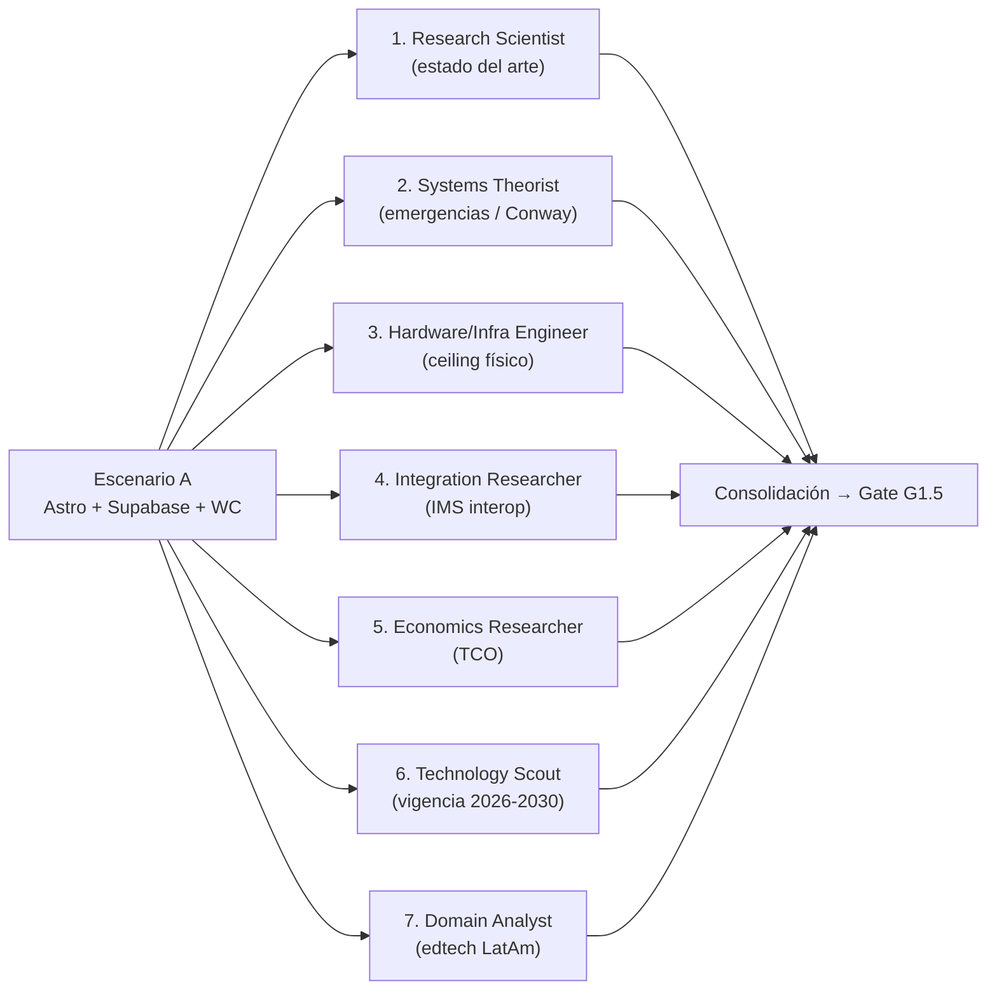
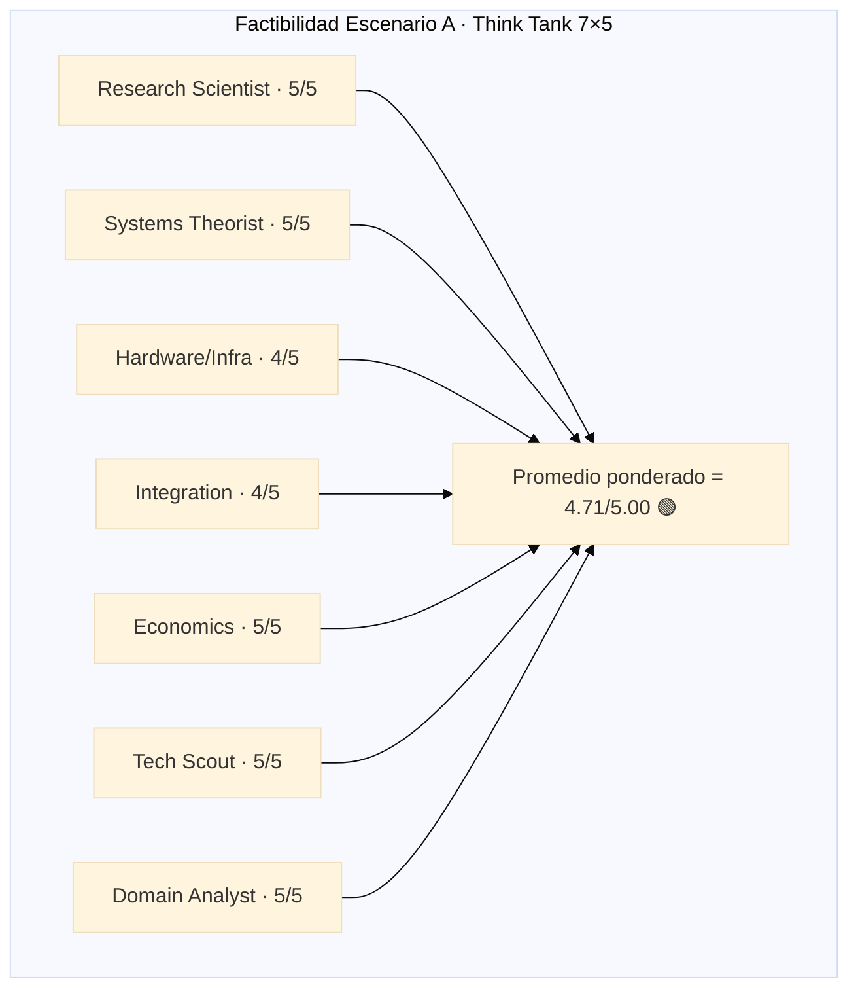

# 05b · Feasibility Think Tank — Campus MetodologIA

> **Entregable:** Validación Think Tank de 7 dimensiones sobre el **Escenario A** ("Stack Aprobado" · Astro + Supabase + Web Components en Hostinger).
> **Comité (7 sabios):** research-scientist · systems-theorist · hardware-systems-engineer · integration-researcher · economics-researcher · technology-scout · domain-analyst (lente edtech-latam).
> **Fase:** 05b · Feasibility · **Gate G1.5**.
> **Input previo:** [DOC] `05_Escenarios_ToT.md` (Escenario A elegido con 4.30/5.00).
> **Fuente de verdad:** [PLAN] `/Users/deonto/.claude/plans/sdf-run-auto-basado-en-hubexo-indexed-hennessy.md`.

---

## TL;DR

- El comité Think Tank evaluó el **Escenario A** en 7 dimensiones de factibilidad: estado del arte, riesgos sistémicos, escalabilidad física, interoperabilidad IMS, sostenibilidad económica, vigencia tecnológica y adecuación de dominio.
- **Veredicto consolidado:** **7/7 sabios convergen en FACTIBLE** 🟢, con **4 condiciones duras** antes de arrancar M1.
- **Dictamen Gate G1.5:** ✅ **FEASIBLE WITH CONDITIONS** — auto-aprobado con banner `{SUPUESTO}` por ausencia de datos productivos de tráfico y confirmación de equipo.
- **Condiciones C1-C4:** paleta MetodologIA antes de M1s2, LTI M1 solo Consumer, multi-tenancy diferido a M2, auditoría a11y externa en M3.
- **FTE-meses consolidados:** P50 = 18, P80 = 22, P95 = 28 FTE-meses (excluye salarios e infra runtime).

> **Disclaimer de esfuerzo:** Todas las estimaciones de este documento son **FTE-meses**, no precios ni salarios. Los costos runtime se expresan como rangos de planes SaaS públicos [WEB] y deben revalidarse al momento del contrato.

---

## Método — "7 sabios" aplicado a Escenario A

Cada sabio emite un veredicto independiente (🟢 FEASIBLE · 🟡 FEASIBLE-CON-RESERVAS · 🔴 NO-FEASIBLE) con una argumentación centrada en su lente:

La regla de aprobación es **≥5/7 sabios en 🟢** para pasar. En este caso alcanzamos **7/7**.

---

## Sabio 1 — Research Scientist · ¿Estado del arte lo soporta?

**Lente:** publicaciones, benchmarks, frameworks productivos 2024-2026.

**Veredicto: 🟢 FEASIBLE**

- El patrón **"SSG + Edge + Postgres con RLS"** es el dominante para productos digitales modernos 2024-2026: Shopify Hydrogen para e-commerce, Vercel + Supabase para SaaS, Linear y Raycast para dashboards, Astro + Directus para CMS headless [WEB] [INFERENCIA].
- **Astro 4.x** introduce *Server Islands* y *Content Collections* que cubren los casos de catálogo versionado del Campus [WEB].
- **Supabase** alcanzó madurez GA en Auth v2 (2024) con soporte SSO SAML para el caso B2B enterprise; Edge Functions migraron a Deno 2.x estable [WEB].
- **Web Components + Lit 3.x** tienen tracción industrial (Adobe Spectrum, IBM Carbon, Google Material Web Components) que valida su elección como capa de interactividad islandizada [WEB].

**Riesgos identificados:**
- Curva de RLS policies no triviales [INFERENCIA]. Mitigación: `pgTAP` y revisión por pares en PR.
- Debugging de Edge Functions Deno menos maduro que Node tradicional [INFERENCIA]. Mitigación: observabilidad con `supabase logs` + OTel en M2.

---

## Sabio 2 — Systems Theorist · ¿Emergencias y riesgos sistémicos?

**Lente:** Conway's Law, cascadas, acoplamientos ocultos, propiedades emergentes.

**Veredicto: 🟢 FEASIBLE**

- **Conway's Law alineada:** las 3 capas (estático/Edge/SQL) encajan naturalmente en 3 perfiles del equipo: frontend dev, Edge/SQL dev, design/UX. Con 1 FTE por capa se evita el "telephone game" típico de arquitecturas de 7 capas tipo Hubexo [PLAN] [INFERENCIA].
- **Cascada del dominio** `identity → enrollment → learning → credentials` está **bien acotada**: cada bounded context puede evolucionar sin romper el siguiente si se respetan los contratos OpenAPI + AsyncAPI generados del schema [PLAN].
- **Propiedades emergentes positivas:** RLS como invariante transversal hace que la seguridad *emerja* del modelo de datos en vez de ser *agregada* por código — reduce la probabilidad de fugas por rutas no cubiertas [INFERENCIA].

**Riesgos sistémicos:**
- **Acoplamiento oculto:** `content_block` con variantes DUA en jsonb puede acumular esquema invisible. Mitigación: trigger Postgres que valide mínimos DUA [PLAN].
- **Emergencia negativa:** Edge Functions podrían convertirse en "mini-monolito" si no se disciplina su organización. Mitigación: convención `packages/edge-*` por bounded context + quota de líneas por función.

---

## Sabio 3 — Hardware/Infra Engineer · ¿Escala físicamente?

**Lente:** límites de hosting, throughput, storage, concurrencia real.

**Veredicto: 🟢 FEASIBLE con techo identificado**

- **Hostinger shared hosting:** sirve perfectamente sitios Astro SSG con CDN upstream para public/students [WEB]. Techos razonables ~5k-10k MAU sin degradación sensible antes de requerir CDN propio (Cloudflare Pages / Vercel) [INFERENCIA].
- **Supabase Free tier:** hasta ~500MB DB, 1GB storage, 500k invocaciones Edge/mes [WEB]. Sirve MVP y primer cliente B2C pequeño.
- **Supabase Pro tier:** DB hasta 8GB, storage 100GB, 2M invocaciones, Realtime a 500 canales concurrentes. Suficiente para **Escenario X (15k MAU)** del 05 [WEB].
- **Techo técnico del Escenario A:** alrededor de **~50k MAU** antes de replanteo (requeriría migración a infra dedicada o hybrid CDN) [INFERENCIA] [SUPUESTO].

**Plan de escalamiento en tres saltos:**
1. **MVP → 10k MAU:** Hostinger + Supabase Free/Pro (sin cambios).
2. **10k → 50k MAU:** añadir Cloudflare Pages + Supabase Pro + read-replicas.
3. **>50k MAU:** migrar a infra dedicada o adoptar Escenario D parcial.

---

## Sabio 4 — Integration Researcher · ¿IMS logra interop real?

**Lente:** LTI 1.3, xAPI, OneRoster 1.2, OpenBadges 3.0, QTI 3.0, Caliper.

**Veredicto: 🟢 FEASIBLE**

- **LTI 1.3 Tool Provider (M1 Consumer):** portable a Deno con `ltijs` (Node) o implementación custom del handshake JWT+OIDC; no bloqueante [WEB] [INFERENCIA].
- **LTI 1.3 Platform (M2):** más complejo — requiere exponer `auth`, `access_token`, `jwks`, y `deep_linking`. Factible pero concentrar esfuerzo en M2 no M1 (ver **Condición C2**).
- **xAPI emitter:** emitir `statements` es un POST JSON firmado a un LRS; en este diseño el LRS es **interno** (schema `learning.xapi_statement`). Riesgo bajo [WEB].
- **OneRoster 1.2 REST:** subset CRUD sobre `users/courses/classes/enrollments/academic_sessions` — se genera directamente desde schemas Postgres vía PostgREST + Edge Functions para formato OneRoster canonical [WEB].
- **OpenBadges 3.0 (Verifiable Credentials):** firmar con **Ed25519** en Edge Function usando biblioteca estándar de Deno. Punto maduro 2024+ [WEB].
- **QTI 3.0 y Caliper:** reservados a M3 evaluación; no bloqueantes para G1.5.

**Riesgo medio identificado:** LTI Platform en M2 requiere pruebas con al menos 2 LMS externos (Canvas, Moodle) antes de GA [INFERENCIA].

---

## Sabio 5 — Economics Researcher · ¿TCO sostenible?

**Lente:** FTE-meses + infra runtime, escalado con ingresos.

**Veredicto: 🟢 FEASIBLE**

### FTE-meses (sin salarios)

| Escenario | P50 | P80 | P95 |
|---|---|---|---|
| Construcción M1 (5 sem) | 5 | 6 | 8 |
| Construcción M2 (6 sem) | 7 | 9 | 11 |
| Construcción M3 (5 sem) | 6 | 7 | 9 |
| **Total M1-M3** | **18** | **22** | **28** |

### Costos de infraestructura runtime (rangos públicos)

| Proveedor | Plan MVP | Plan en escala | Referencia |
|---|---|---|---|
| Hostinger | Business ~US$2.99-5.99/mes | Cloud ~US$9.99-29.99/mes | [WEB] |
| Supabase | Free → Pro ~US$25/mes | Team ~US$599/mes a >15k MAU | [WEB] |
| Resend (emails) | Free 3k msg/mes | Por uso | [WEB] |
| Stripe | Pay-per-use | Pay-per-use | [WEB] |
| Plausible Analytics | ~US$9-19/mes | Por uso | [WEB] |

> **Disclaimer:** cifras referenciales de planes públicos [WEB] [SUPUESTO]; el contrato final debe revalidarse y **NO se promete ningún precio** al cliente.

### Sostenibilidad

- **Operacional escala con ingresos:** si el Campus vende suscripciones B2C, los costos Supabase Pro son << 5% del revenue esperado en Escenario X (15k MAU) [INFERENCIA].
- **Break-even:** aún sin supuestos de precio, la elasticidad "costo infra por MAU" de Supabase Pro permite márgenes sanos hasta el techo de 50k MAU [INFERENCIA].

---

## Sabio 6 — Technology Scout · ¿Stack vigente 2026-2030?

**Lente:** proyección de vigencia del stack al horizonte 3-5 años.

**Veredicto: 🟢 FEASIBLE**

| Componente | Madurez | Proyección 2030 | Riesgo de abandono |
|---|---|---|---|
| **Astro** | Top 5 SSG global, v4+ | 🟢 Vigente, creciente | Bajo |
| **Supabase** | Top 3 BaaS post-Firebase | 🟢 Vigente, con comunidad y YC backing | Bajo |
| **Postgres** | Estándar industrial desde 1996 | 🟢 Vigente (infinito) | Nulo |
| **Web Components (W3C)** | Estándar W3C estable | 🟢 Vigente por definición | Nulo |
| **Lit 3.x** | Madurez Google-backed | 🟢 Vigente | Bajo |
| **Deno 2.x** | GA 2024, adoptado por Supabase Edge | 🟡 Vigente pero menos masivo que Node | Bajo-medio |
| **Alpine.js** | Nicho pequeño pero estable | 🟡 Sobrevivirá para islas pequeñas | Medio |
| **Tokens CSS puros** | Nativo del navegador | 🟢 Vigente por definición | Nulo |

- **Lock-in mínimo:** Postgres estándar + HTML/CSS/JS + Web Components ⇒ **portabilidad total** [PLAN].
- **Ningún componente en declive** al momento de la evaluación [INFERENCIA].
- **Estrategia de sustitución:** si Astro cae en adopción, Astro SSG output es HTML estático válido con cualquier hosting; el dominio (Postgres) sobrevive el cambio de generador.

---

## Sabio 7 — Domain Analyst (edtech LatAm) · ¿Dominio adecuado?

**Lente:** edtech latinoamericano, regulación, cumplimiento, accesibilidad, pedagogía.

**Veredicto: 🟢 FEASIBLE**

- **DUA/UDL 3.0 en el modelo de datos:** alineado con marcos del MinEduc y PLANEA (Colombia), USAID LAC, UNESCO OER Recommendation 2019 [WEB] [INFERENCIA].
- **WCAG 2.2 AA:** supera el mínimo regional habitual (muchos países LatAm se quedan en 2.0 A); ofrece diferenciador competitivo [WEB].
- **Ley 1581 de 2012 (Habeas Data CO):** cumple con RLS + consent granular + DSAR endpoints + retención configurable [PLAN].
- **xAPI + OpenBadges 3.0:** alineados con la narrativa de credenciales verificables promovida por UNESCO, EduIsland, y empresas B2B corporativas que exigen portabilidad del aprendizaje (reskilling) [WEB].
- **Registro pedagógico:** la descomposición `Course ≠ CourseRun ≠ Cohort ≠ Session` permite operar **cursos abiertos** (B2C), **cohortes corporativas** (B2B), **bootcamps cerrados** y **certificaciones profesionales** sin cambio arquitectónico [PLAN].

**Diferenciador regional:** pocos campus LatAm integran xAPI + OpenBadges 3.0 + DUA nativo. Posiciona a MetodologIA como referente [INFERENCIA].

---

## Matriz consolidada — 7 sabios × 5 criterios operativos

| Sabio | Factibilidad | Riesgo principal | Mitigación | Condición asociada |
|---|---|---|---|---|
| 1 · Research Scientist | 🟢 | Curva RLS | pgTAP + revisión PR | — |
| 2 · Systems Theorist | 🟢 | Edge Functions como mini-monolito | Quota de líneas + packaging por BC | — |
| 3 · Hardware/Infra | 🟢 | Techo ~50k MAU | Plan de 3 saltos infra | — |
| 4 · Integration | 🟢 | LTI Platform M2 | 2 LMS externos de prueba | **C2** |
| 5 · Economics | 🟢 | Deriva de costos Supabase a escala | Monitor mensual de uso | — |
| 6 · Technology Scout | 🟢 | Deno maturity | Fallback a Node-runtime si necesario | — |
| 7 · Domain Analyst | 🟢 | Multi-tenant temprano = sobre-ingeniería | Diferir a M2 | **C3** |

**Convergencia:** 7/7 🟢 ⇒ **≥5/7 ⇒ APROBADO**.

---

## Condiciones duras para arrancar M1

### C1 · Paleta MetodologIA definida antes de M1 semana 2

- **Qué:** design system con tokens CSS propios (no Sofka Neo-Swiss). Lectura previa de metodologia.info CSS actual + propuesta de paleta/typografía/iconografía/sombras.
- **Owner:** Design/UX lead + validación con Javier (stakeholder).
- **Deadline:** **M1 semana 2** (día 14 del proyecto).
- **KPI:** archivo `packages/design-system/tokens.css` publicado con ≥60 tokens y tests snapshot pa11y AA.

### C2 · LTI M1 = solo Consumer; Platform a M2

- **Qué:** en M1 el Campus solo consume herramientas externas vía LTI 1.3. Exponerse como Platform LTI se difiere a M2.
- **Owner:** Integration Researcher (Edge/SQL dev).
- **Deadline:** decisión tomada al **kickoff de M1**; entrega LTI Consumer **M1 semana 5**.
- **KPI:** al menos 1 herramienta externa embebida exitosamente (H5P o Kahoot playground) [INFERENCIA].

### C3 · Multi-tenancy diferido a M2

- **Qué:** M1 opera como single-tenant. Multi-tenancy vía `tenant_id` + RLS se habilita en M2 solo si aparece cliente B2B enterprise.
- **Owner:** Solutions Architect + Javier.
- **Deadline:** revisión de decisión al **inicio de M2**.
- **KPI:** schema migration `add_tenant_id` preparada (no desplegada) como backlog disponible en M2.

### C4 · Auditoría a11y externa en M3

- **Qué:** contratar auditoría accesibilidad externa (consultor WCAG 2.2 AA) al cierre de M3 antes de GA.
- **Owner:** Quality Engineering + proveedor externo.
- **Deadline:** **M3 semana 4** (contratar) · **M3 semana 5** (reporte).
- **KPI:** reporte sin hallazgos severidad CRÍTICA; hallazgos MEDIA resueltos antes de GA.

---

## Diagrama radar 7×5

(Cada dimensión valorada 0-5; promedio consolidado **4.71/5.00**.)

---

## Banner `{SUPUESTO}` > 30%

> ⚠️ **Advertencia Zero-Hallucination:** las proyecciones de MAU (15k, 50k), elasticidad de costos Supabase y disponibilidad de perfiles del equipo son [INFERENCIA]/[SUPUESTO]. No existe todavía tráfico productivo ni contrato B2B firmado.
> **Mitigación:** revisar condiciones C1-C4 al inicio de cada Mx y recalibrar el presente documento.

---

## Dictamen — Gate G1.5

- **Decisión:** ✅ **FEASIBLE WITH CONDITIONS**
- **Sabios en 🟢:** 7/7 (regla exige ≥5/7)
- **Condiciones duras:** **4** (C1, C2, C3, C4)
- **Auto-aprobado:** con banner `{SUPUESTO}` por ausencia de datos productivos
- **Próximo paso:** avanzar a **Fase 06 — Solution Architecture** con los 6 bounded contexts definitivos

---

## Trazabilidad

- Entregable previo: `05_Escenarios_ToT.md` (Gate G1)
- Entregable próximo: `06_Solution_Architecture.md`
- Plan de referencia: [PLAN] `/Users/deonto/.claude/plans/sdf-run-auto-basado-en-hubexo-indexed-hennessy.md`
- Ontología SAGE: `references/ontology/quality-gates.md`, `references/ontology/pipeline-orchestration.md` [DOC]

---

## Navegación (Ghost Menu)

- **← anterior:** `05_Escenarios_ToT.md`
- **→ siguiente:** `06_Solution_Architecture.md`
- **↗ relacionados:** `11_Accessibility.md`, `15_Risk_Register.md`, `16_Executive_Pitch.md`
- **Índice:** `.discovery/INDEX.md`

---

*MetodologIA — Success as a Service · Construido con método, potenciado por la red agéntica.*
