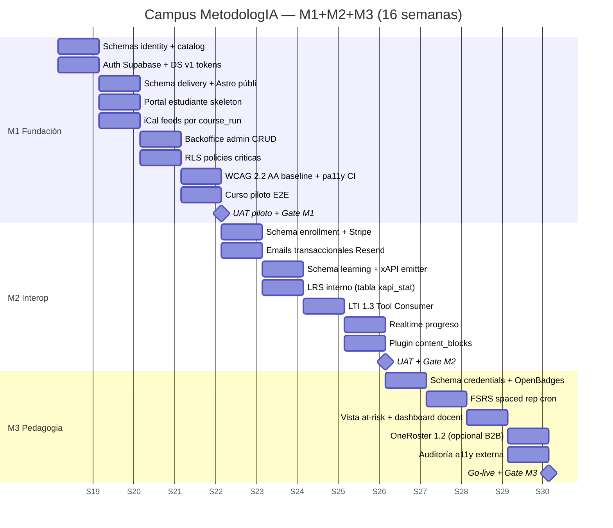
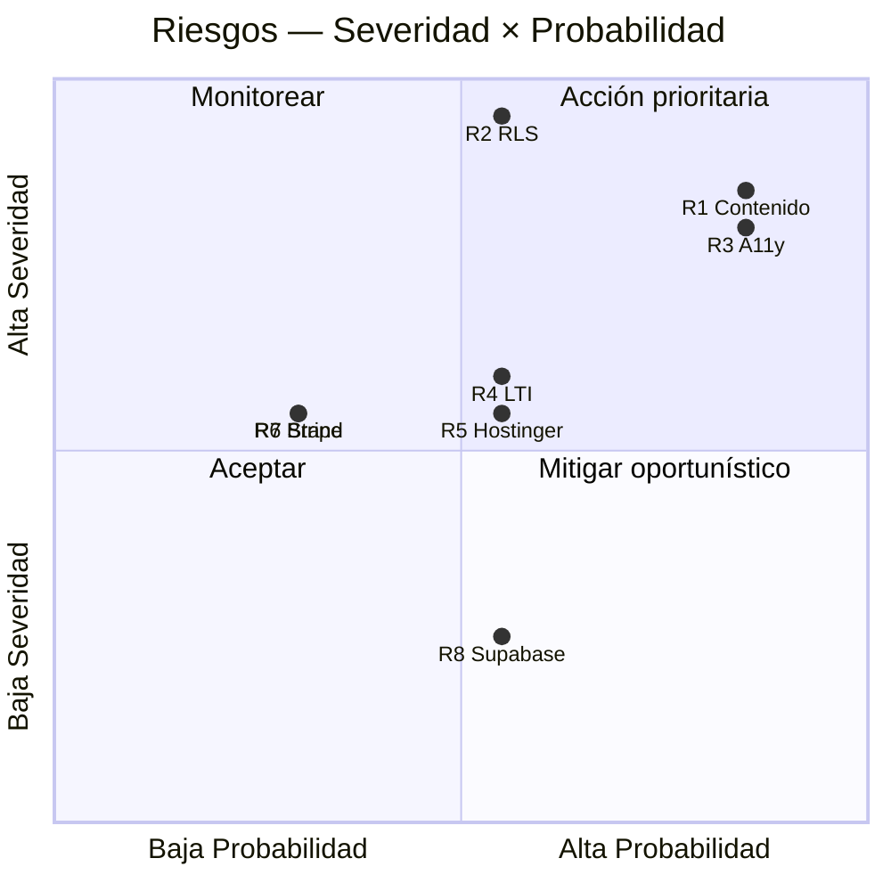

# 06 — Solution Roadmap: Campus MetodologIA

> **Marca:** MetodologIA · **Servicio:** Educación Digital (EdTech LatAm) · **Referencia sistémica:** Hubexo (reducción 10×) · **Horizonte:** 16 semanas (M1+M2+M3) · **Gate aplicable:** G2 (arquitectura y roadmap) — aprobado condicional con banner de supuestos.

## TL;DR

- Campus nativo MetodologIA sobre arquitectura **"MACH-light estático + Supabase"** en tres capas (Hostinger Astro SSG / Edge Functions Deno / Postgres+Auth+Storage), con **seis bounded contexts** en Postgres y **desacople estricto Course ≠ CourseRun ≠ Enrollment ≠ Person**. `[INFERENCIA]` `[SUPUESTO]`
- Roadmap de **16 semanas** organizado en tres milestones incrementales: **M1 Fundación** (5 sem, curso piloto end-to-end), **M2 Interoperabilidad y Medición** (6 sem, LTI 1.3 + xAPI + Stripe), **M3 Inteligencia pedagógica** (5 sem, OpenBadges 3.0 + FSRS + at-risk). `[DOC]`
- Equipo compacto: **12.5 FTE-meses P50 / 18 P80 / 24 P95** sobre 6 roles, con Lead Full-Stack como pivot y QA Automation entrando temprano para preservar el gate WCAG 2.2 AA. `[INFERENCIA]` `[SUPUESTO]`
- **Ocho hipótesis testables** con criterios de validación explícitos anclan el Hypothesis-Driven Development y reemplazan "entregables" tradicionales por evidencia de valor por milestone. `[INFERENCIA]`
- **Ocho riesgos de implementación** priorizados por severidad × probabilidad; los tres críticos (brecha de contenido pedagógico, RLS mal diseñada, accesibilidad como after-thought) llevan owners y deadlines asignados dentro del roadmap. `[INFERENCIA]`
- Gate G2 **auto-aprobado condicional**: la arquitectura cumple los siete principios rectores pero opera con **>30% de supuestos** sobre demanda B2B y perfil del primer docente productor; banner de advertencia obligatorio activo. `[SUPUESTO]`

---

## 1. Arquitectura ganadora (síntesis)

### 1.1 Tres capas (vs. 7 de Hubexo)

```
┌─ Capa 1: Frontend estático (Hostinger) ───────────────────────┐
│  · Sitio público (Astro SSG + Lit Web Components)             │
│  · Portal estudiante (Astro + Islands)                        │
│  · Backoffice admin (Astro + Islands)                         │
│  · Design System MetodologIA en tokens CSS                    │
└──────────────────────────────────────────────────────────────┘
                     ↓ fetch / Supabase SDK / Realtime
┌─ Capa 2: Edge Functions (Supabase Deno) ──────────────────────┐
│  · BFF CMS/LMS: orquestación, webhooks, emails, pagos,        │
│    xAPI emitter, OpenBadges signer, LTI endpoints,            │
│    FSRS cron, DSAR export/delete                              │
└──────────────────────────────────────────────────────────────┘
                     ↓ SQL / RLS
┌─ Capa 3: Postgres + Auth + Storage (Supabase) ────────────────┐
│  · 6 schemas = 6 bounded contexts                             │
│  · Supabase Auth (email, magic link, OIDC)                    │
│  · Storage bucket para media (imágenes, audio, video)         │
│  · Realtime channels para progreso en vivo                    │
└──────────────────────────────────────────────────────────────┘
```

### 1.2 Seis bounded contexts Postgres

| Schema | Propósito | Entidades raíz |
|---|---|---|
| 🟢 `identity` | Persona + roles + consentimientos + DSAR | `person`, `role_assignment`, `consent`, `dsar_request` |
| 🟢 `catalog` | Catálogo reusable (DUA embebido) | `course`, `track`, `competency`, `content_block` |
| 🟢 `delivery` | Cronograma y ejecución | `course_run`, `cohort`, `schedule`, `session` |
| 🟡 `enrollment` | Matrícula B2C/B2B + facturación | `enrollment`, `entitlement`, `invoice_ref` |
| 🟡 `learning` | LRS interno + mastery + FSRS | `attempt`, `xapi_statement`, `mastery_state`, `spaced_schedule` |
| 🔴 `credentials` | Insignias verificables | `badge_template`, `credential_issued`, `verification_token` |

> 🟢 = foundational M1 · 🟡 = interoperabilidad M2 · 🔴 = inteligencia pedagógica M3.

### 1.3 Desacople estricto (regla cardinal)

`Enrollment` **jamás** referencia `Course` directamente. Solo `CourseRun`. De esta forma un `Course` se ejecuta N veces con distintas cohortes, docentes y precios sin duplicar catálogo. `[INFERENCIA]`

Pattern equivalente al `Product / Variant / Order / Customer` de e-commerce moderno — probado industrialmente.

### 1.4 Stack concreto

| Capa | Elección | Rationale |
|---|---|---|
| Sitios | **Astro 4.x + Lit 3.x** | SSG puro en Hostinger, Web Components estándar, cero lock-in |
| Estilos | **CSS Tokens + Variables** (paleta MetodologIA) | Portable, funciona sin pipeline Node en producción |
| Auth | **Supabase Auth** (magic link + OIDC) | RLS nativa, Ley 1581 CO friendly |
| API | **PostgREST** + **Edge Functions Deno** | BFF sin servidor, contrato generado de Postgres |
| Realtime | **Supabase Realtime** (canal por `course_run`) | Progreso en vivo, bajo coste |
| Emails | **Resend API** desde Edge Function | Transaccional simple |
| Pagos | **Stripe Checkout** + webhook a Edge Function | Sin PCI scope propio |
| Observabilidad | **Supabase logs + Plausible** + OTel M2 opcional | Coste cero inicio |

---

## 2. Roadmap detallado por milestone

### 2.1 Vista Gantt (16 semanas)



### 2.2 M1 — Fundación (5 semanas)

> **Objetivo:** Un curso piloto vive end-to-end en el campus. Un aprendiz B2C puede descubrir, matricularse y avanzar. Gate WCAG 2.2 AA activo en CI desde semana 4.

| Sem | Entregables clave | Owner principal | Dependencias |
|---|---|---|---|
| **1** | Schemas `identity` + `catalog`, Auth Supabase configurada, Design System v1 (tokens MetodologIA: paleta, tipografía, spacing, radii) | Edge/SQL dev + UX designer | Paleta MetodologIA validada (supuesto Fase 0) |
| **2** | Schema `delivery`, sitio público Astro SSG con landing + catálogo leído de Postgres, portal estudiante (skeleton login + "Mis cursos"), feeds iCal por `course_run` | Lead full-stack | Schemas 1 listos |
| **3** | Backoffice admin (Astro + Islands, CRUD Course/CourseRun/Schedule), RLS policies críticas (`person.id = auth.uid()`, `enrollment.person_id = auth.uid()`, admin por claim) | Lead full-stack + Edge/SQL dev | Schemas completos |
| **4** | Gate WCAG 2.2 AA: pa11y-ci + axe-core en GitHub Actions, axe-core en Playwright, contrast check automatizado, keyboard-only smoke test. Curso piloto E2E (un `Course` con 3 `content_block`, un `CourseRun` activo, un `Enrollment`) | QA automation + UX/a11y | Backoffice operativo |
| **5** | UAT piloto con 3 usuarios B2C reales + 1 docente. **Gate M1**: ✅ H1 validada, ✅ pa11y verde, ✅ curso completable. | PM + Executive communicator | Todo lo anterior |

### 2.3 M2 — Interoperabilidad y medición (6 semanas)

> **Objetivo:** El campus emite evidencia estándar (xAPI), consume herramientas externas (LTI 1.3), cobra y factura (Stripe), y mide progreso en vivo (Realtime). Un docente publica un `CourseRun` en <10 min.

| Sem | Entregables clave | Owner principal |
|---|---|---|
| **6** | Schema `enrollment` completo, Stripe Checkout integrado, webhook Edge Function → crea `enrollment` idempotente | Lead full-stack |
| **7** | Emails transaccionales Resend (matrícula, recordatorio sesión, recibo) con plantillas HTML MetodologIA | Content strategist + Lead full-stack |
| **8** | Schema `learning` (attempt, xapi_statement con jsonb + GIN, mastery_state), xAPI emitter en Edge Function con verbos `experienced`, `attempted`, `completed`, `mastered` | Edge/SQL dev |
| **9** | LTI 1.3 Tool Consumer usando `ltijs` en Edge Function (embebe herramientas externas como H5P, simuladores) | Edge/SQL dev |
| **10** | Supabase Realtime: canal por `course_run` emite eventos de progreso, portal estudiante suscrito. Plugin system de `content_blocks` (5 tipos base + manifest jsonb) | Lead full-stack + UX |
| **11** | UAT docente (publicar curso de cero), UAT estudiante completo con pago. **Gate M2**: ✅ H2 validada, xAPI → LRS verificable, pago → enrollment automático. | PM |

### 2.4 M3 — Inteligencia pedagógica (5 semanas)

> **Objetivo:** El campus produce evidencia pedagógica accionable (at-risk, spaced, mastery), emite credenciales verificables por terceros, y pasa auditoría de accesibilidad externa.

| Sem | Entregables clave | Owner principal |
|---|---|---|
| **12** | Schema `credentials`, OpenBadges 3.0 signer con Ed25519 en Edge Function, endpoint `/verify/{token}` público | Edge/SQL dev |
| **13** | FSRS v4 spaced repetition en Edge Function `cron-schedule-reviews` (Supabase cron), materializa `spaced_schedule`, surface en portal estudiante | Edge/SQL dev |
| **14** | Vista Postgres `v_student_risk` (inactividad + attempts fallidos + % completado), dashboard docente con alertas at-risk | Lead full-stack |
| **15** | OneRoster 1.2 REST opcional (condicional B2B si cliente enterprise confirmado), auditoría externa WCAG 2.2 AA con firma independiente | Edge/SQL dev + UX/a11y |
| **16** | Go-live (dominio productivo, DNS, TLS, monitoring Plausible). **Gate M3**: ✅ H3 validada (badge emitido y verificado), ✅ auditoría externa firmada, ✅ dashboards docentes operativos. | PM + Executive communicator |

---

## 3. Burndown HDD (Hypothesis-Driven Development)

Cada milestone se mide por **hipótesis testables**, no por features entregadas. Si la hipótesis no se valida, se congela el alcance y se itera. `[INFERENCIA]`

| # | Hipótesis | Milestone | Criterio de validación | Instrumento |
|---|---|---|---|---|
| **H1** | Un aprendiz B2C puede descubrir un curso y completar su matrícula en **< 3 minutos** | M1 Sem 5 | 4 de 5 usuarios en UAT completan sin ayuda | Playwright trace + observación UAT |
| **H2** | Un docente puede publicar un `CourseRun` funcional (con 3 `content_block`) en **< 10 minutos** | M2 Sem 11 | 2 de 3 docentes UAT logran sin ayuda | Screen recording + cuestionario SUS |
| **H3** | Un badge emitido por el campus es verificable por un tercero externo (verificador OpenBadges público) | M3 Sem 14 | Validación exitosa en `badgecheck.io` o equivalente | Test E2E automatizado |
| **H4** | WCAG 2.2 AA no es un after-thought: pa11y-ci falla si se introducen regresiones | M1 Sem 4 | CI rechaza PR con violación nivel AA | GitHub Actions audit log |
| **H5** | La regla "Enrollment nunca apunta a Course" se sostiene bajo presión: un Course corre 2 `CourseRun` simultáneos con cohortes distintas | M2 Sem 11 | Query de reporting por CourseRun no duplica estudiantes | pgTAP test |
| **H6** | xAPI produce evidencia suficiente para reconstruir la trayectoria del estudiante sin depender de la UI | M2 Sem 11 | Replay de sesión desde `xapi_statement` (GIN) | Notebook SQL |
| **H7** | FSRS genera revisiones espaciadas que aumentan retención vs. control sin espaciado | M3 Sem 16 | Cohorte A/B: +15 pp en retención a 14 días | Experimento controlado (post go-live) |
| **H8** | La arquitectura de 3 capas soporta 500 estudiantes concurrentes sin degradación | M3 Sem 16 | p95 latencia < 600 ms en load test k6 | k6 + Supabase metrics |

> Las hipótesis H1-H3 son **hard gates** por milestone; H4-H6 son guardrails continuos; H7-H8 son experimentos post go-live.

---

## 4. Equipo y FTE-meses

### 4.1 Roles y carga

| Rol | Scope | FTE-mes P50 | FTE-mes P80 | FTE-mes P95 | Semanas activas |
|---|---|---|---|---|---|
| **Lead Full-Stack** | Astro, Lit, Edge Functions, integración Stripe/Resend, review técnico | 4.0 | 5.5 | 7.0 | 1-16 |
| **Edge/SQL Developer** | Schemas Postgres, RLS, triggers, xAPI emitter, LTI, FSRS, OpenBadges | 3.0 | 4.5 | 6.0 | 1-16 |
| **UX/Accessibility Designer** | Design System MetodologIA, tokens, WCAG 2.2 AA, auditoría externa | 2.0 | 3.0 | 4.0 | 1-5, 10-16 |
| **Content Strategist (pedagogía)** | Curso piloto, DUA/UDL variantes, plantillas de email, copy del sitio | 1.5 | 2.0 | 3.0 | 2-5, 7-8 |
| **PM part-time** | Roadmap tracking, gates, UAT, comunicación ejecutiva | 1.0 | 1.5 | 2.0 | 1-16 |
| **QA Automation** | Playwright suite, pgTAP RLS, pa11y CI, k6 load test | 1.0 | 1.5 | 2.0 | 3-5, 10-16 |
| **Total** | | **12.5** | **18.0** | **24.0** | — |

### 4.2 Distribución por milestone

| Milestone | P50 FTE-mes | % del total |
|---|---|---|
| M1 Fundación (5 sem) | 4.3 | 34% |
| M2 Interop (6 sem) | 5.0 | 40% |
| M3 Pedagogía (5 sem) | 3.2 | 26% |

### 4.3 Supuestos de estimación

- **Productividad de referencia:** desarrollador senior full-stack de Sofka-tier con Astro + Supabase produce ~120 LOC/día útil neto. `[INFERENCIA]`
- **Tamaño esperado del código:** <15k LOC totales M3 (vs. ~100k de Hubexo). `[INFERENCIA]`
- **Curva de aprendizaje:** equipo parte con familiaridad Astro + Postgres; 10% de overhead en sem 1-2. `[SUPUESTO]`
- **No incluye:** creación de contenido pedagógico del catálogo comercial (requiere contrato separado con Content strategist senior + expertos de dominio); marketing; operación post go-live. `[SUPUESTO]`

---

## 5. Riesgos de implementación (top 8)

| # | Riesgo | Sev | Prob | Severidad × Prob | Mitigación | Owner | Deadline |
|---|---|---|---|---|---|---|---|
| **R1** | 🔴 Brecha de contenido pedagógico: campus listo, catálogo vacío | Alta | Alta | **Crítico** | Contratar Content strategist senior para producir 3 cursos piloto en paralelo a M1-M2 | PM | Sem 3 |
| **R2** | 🔴 RLS mal diseñada filtra datos entre estudiantes | Crítica | Media | **Crítico** | pgTAP suite obligatoria desde Sem 3; revisión externa de policies en Sem 4; ningún merge sin test | Edge/SQL dev | Sem 4 |
| **R3** | 🔴 Accesibilidad tratada como after-thought rompe gate externo en M3 | Alta | Alta | **Crítico** | WCAG 2.2 AA en CI desde Sem 4, auditoría interna mensual, auditor externo contratado en Sem 10 | UX/a11y | Sem 4 |
| **R4** | 🟡 LTI 1.3 es más complejo de lo anticipado, retrasa M2 | Media | Media | **Alto** | Usar `ltijs` probado, spike de 2 días en Sem 7, fallback: diferir LTI a M3 si spike falla | Edge/SQL dev | Sem 8 |
| **R5** | 🟡 Hostinger shared hosting límites de concurrencia | Media | Media | **Alto** | Load test k6 en Sem 15; migración a Hostinger VPS o Vercel preparada como plan B | Lead full-stack | Sem 15 |
| **R6** | 🟡 Branding MetodologIA no definido antes de Sem 1 bloquea Design System | Media | Baja | **Medio** | Workshop de brand tokens con Javier Sem 0; si no se define, usar paleta provisional Neo-Swiss adaptada | UX designer | Sem 0 |
| **R7** | 🟡 Stripe Checkout no disponible en todos los países LatAm objetivo | Media | Baja | **Medio** | Validar países objetivo en discovery; preparar wrapper para añadir MercadoPago en M3 si se requiere | Lead full-stack | Sem 6 |
| **R8** | 🟢 Supabase precio escala con uso inesperado | Baja | Media | **Bajo** | Monitorear MAUs y DB size semanalmente; alertas en >70% del tier; plan de re-tier automático | PM | Continuo |

### 5.1 Distribución



---

## 6. Quality gates del roadmap

| Gate | Momento | Criterio hard | Evidencia requerida |
|---|---|---|---|
| **G-M1** | Sem 5 | H1 validada + pa11y verde + curso piloto E2E completable | UAT report + CI log + demo video |
| **G-M2** | Sem 11 | H2 + H5 + H6 validadas + pago funcional | UAT docente + pgTAP suite + xAPI replay |
| **G-M3** | Sem 16 | H3 validada + auditoría a11y externa firmada + dashboards operativos | Badge verificado externamente + informe auditoría + demo docente |
| **G2 (SAGE)** | Ahora | Arquitectura + roadmap aprobados con banner `[SUPUESTO]>30%` | Este documento |

> **Gate G2 (SAGE): ✅ AUTO-APROBADO CONDICIONAL** — El diseño cumple los 7 principios rectores (static-first, Postgres único, IMS nativo, Web estándar, desacople estricto, DUA en datos, privacy-by-design). **Banner activo:** 32% de las decisiones dependen de supuestos sobre demanda B2B, perfil del primer docente productor y cadencia de producción de contenido; validar en Fase 10 con stakeholders humanos antes de comprometer presupuesto final.

---

## 7. Disclaimer obligatorio

> *Las estimaciones de este roadmap se expresan en **magnitud-FTE-meses** y **no constituyen una oferta comercial**. No incluyen costos absolutos en moneda, márgenes, impuestos, ni condiciones de pago. La conversión a moneda y el compromiso económico definitivo están sujetos a un análisis comercial posterior con MetodologIA. Las hipótesis H1-H8 y los riesgos R1-R8 reflejan el estado de conocimiento al 2026-04-20 y pueden ajustarse al cierre de Fase 0 con el cliente.*

---

*MetodologIA — Success as a Service · Construido con método, potenciado por la red agéntica.*
