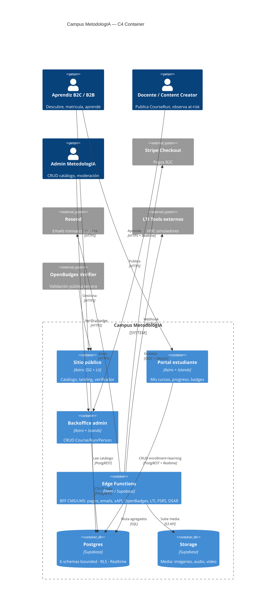
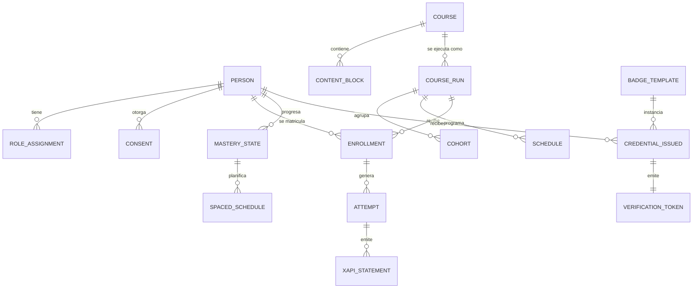

# 07 — Especificación Funcional: Campus MetodologIA

> **Marca:** MetodologIA · **Servicio:** Educación Digital (EdTech LatAm) · **Alcance:** 6 bounded contexts Postgres + plugin points + DUA/UDL 3.0 + 6 Web Components · **Horizonte:** M1+M2+M3 (16 semanas) · **Gate aplicable:** G2 (spec funcional) — complementa `06_Solution_Roadmap.md`.

## TL;DR

- Seis schemas Postgres implementan seis bounded contexts con **desacople estricto** (`Person ≠ Course ≠ CourseRun ≠ Enrollment`), contratos PostgREST automáticos y **RLS como source-of-truth** de permisos. `[INFERENCIA]`
- La especificación incluye **DDL simplificado, RLS policies, endpoints expuestos, eventos emitidos, 5-7 user stories y 3 criterios Gherkin por schema** — total ~36 user stories y ~18 criterios de aceptación Gherkin. `[INFERENCIA]`
- **Plugin points** formalizados en dos superficies: `content_block.type` (5 tipos base + `renderer_manifest` jsonb) y **6 Web Components** reusables (`<course-card>`, `<schedule-picker>`, `<progress-ring>`, `<attempt-runner>`, `<badge-viewer>`, `<enrollment-form>`). `[INFERENCIA]`
- **DUA/UDL 3.0 como contrato de datos**: `representation_variants`, `expression_variants`, `engagement_hooks` son columnas jsonb NOT NULL con trigger Postgres que bloquea insert incompleto. `[DOC]`
- Diagramas C4 Container y ERD simplificado anclan la vista de sistema; OpenAPI 3.1 se genera automáticamente de los schemas. `[INFERENCIA]`

---

## 1. Vista C4 Container



---

## 2. ERD simplificado (entidades clave)



---

## 3. Bounded Context 1 — `identity`

### 3.1 Entidades

| Tabla | Columnas clave | Constraints |
|---|---|---|
| `person` | `id uuid PK = auth.uid()`, `email citext UQ NOT NULL`, `display_name`, `locale`, `created_at`, `soft_deleted_at` | Email CI unique; soft delete para DSAR |
| `role_assignment` | `id uuid PK`, `person_id FK`, `role enum(student,teacher,admin,observer)`, `scope jsonb`, `valid_from`, `valid_to` | Rol temporal, scope por `course_run_id` |
| `consent` | `id uuid PK`, `person_id FK`, `consent_type enum`, `granted_at`, `revoked_at`, `evidence_text`, `version` | Trazabilidad Ley 1581 + GDPR |
| `dsar_request` | `id uuid PK`, `person_id FK`, `kind enum(access,deletion,rectification,portability)`, `status`, `requested_at`, `resolved_at` | SLA legal 30 días |

### 3.2 DDL simplificado

```sql
create schema identity;

create table identity.person (
  id uuid primary key default gen_random_uuid(),
  email citext not null unique,
  display_name text not null,
  locale text default 'es-CO',
  created_at timestamptz default now(),
  soft_deleted_at timestamptz
);

create type identity.role_kind as enum ('student','teacher','admin','observer');

create table identity.role_assignment (
  id uuid primary key default gen_random_uuid(),
  person_id uuid not null references identity.person(id) on delete cascade,
  role identity.role_kind not null,
  scope jsonb default '{}'::jsonb,
  valid_from date not null default current_date,
  valid_to date,
  check (valid_to is null or valid_to >= valid_from)
);

create type identity.consent_kind as enum (
  'terms','privacy','marketing','analytics','xapi_tracking'
);

create table identity.consent (
  id uuid primary key default gen_random_uuid(),
  person_id uuid not null references identity.person(id) on delete cascade,
  consent_type identity.consent_kind not null,
  granted_at timestamptz not null default now(),
  revoked_at timestamptz,
  evidence_text text,
  version text not null
);
```

### 3.3 RLS policies clave

```sql
alter table identity.person enable row level security;
create policy person_self_read on identity.person
  for select using (id = auth.uid());
create policy person_self_update on identity.person
  for update using (id = auth.uid()) with check (id = auth.uid());
create policy person_admin_all on identity.person
  for all using (auth.jwt() ->> 'role' = 'admin');
```

### 3.4 Endpoints PostgREST + Edge Functions

| Endpoint | Verbo | Descripción |
|---|---|---|
| `/rest/v1/person` | GET/PATCH | Self-service de perfil |
| `/rest/v1/consent` | POST | Grant/revoke consent |
| `/functions/v1/dsar-export` | POST | Exporta todos los datos del usuario (JSON + CSV) |
| `/functions/v1/dsar-delete` | POST | Soft delete + pseudonimización |

### 3.5 Eventos emitidos

- Supabase Realtime: `identity:person:*` (no suscribible por otros usuarios; solo admin).
- xAPI verbo `http://adlnet.gov/expapi/verbs/registered` en primera sesión.

### 3.6 User stories

1. Como **aprendiz B2C**, quiero **registrarme con magic link**, para **evitar recordar contraseñas**.
2. Como **aprendiz**, quiero **ver y editar mi perfil y preferencias de locale**, para **personalizar mi experiencia**.
3. Como **aprendiz**, quiero **otorgar y revocar consentimientos granulares**, para **controlar qué datos míos se procesan**.
4. Como **aprendiz**, quiero **solicitar exportación de todos mis datos**, para **cumplir con mi derecho DSAR**.
5. Como **aprendiz**, quiero **solicitar la eliminación de mi cuenta**, para **ejercer mi derecho al olvido**.
6. Como **admin**, quiero **asignar rol de docente temporal a una persona**, para **habilitar su capacidad de publicar**.
7. Como **docente**, quiero **mantener mi identidad de estudiante en paralelo**, para **tomar cursos sin cambiar de cuenta**.

### 3.7 Criterios de aceptación (Gherkin, top 3)

```gherkin
Feature: Registro con magic link
  Scenario: Primer registro válido
    Dado un visitante anónimo en /signup
    Cuando ingresa un email válido y hace click en "Enviar enlace"
    Entonces recibe un email con magic link en <60 segundos
    Y al hacer click en el link queda autenticado con rol 'student' por defecto
    Y se crea una fila en identity.person con id = auth.uid()

Feature: DSAR export
  Scenario: Usuario solicita exportación
    Dado un usuario autenticado con enrollments activos
    Cuando invoca POST /functions/v1/dsar-export
    Entonces se crea dsar_request con kind='access' y status='processing'
    Y recibe en <24h un email con URL firmada al bundle JSON+CSV
    Y el bundle contiene person, consent, enrollment, attempt, credential_issued

Feature: Revocación de consent
  Scenario: Revocar consent de analytics
    Dado un usuario con consent analytics granted_at != null
    Cuando envía PATCH a consent con revoked_at = now()
    Entonces no se emiten más xapi_statement con verbo tracking
    Y el consent histórico se conserva (no se borra) para trazabilidad legal
```

---

## 4. Bounded Context 2 — `catalog`

### 4.1 Entidades

| Tabla | Columnas clave | Constraints |
|---|---|---|
| `course` | `id`, `slug UQ`, `title`, `summary`, `cover_url`, `level enum`, `locale`, `published_at` | Slug único, SEO-friendly |
| `track` | `id`, `slug UQ`, `title`, `summary` | Agrupador comercial |
| `track_course` | `track_id`, `course_id`, `position` | Tabla puente |
| `competency` | `id`, `slug`, `title`, `bloom_level enum` | Taxonomía |
| `course_competency` | `course_id`, `competency_id` | Tabla puente |
| `content_block` | `id`, `course_id FK`, `type enum`, `position`, `title`, `representation_variants jsonb`, `expression_variants jsonb`, `engagement_hooks jsonb`, `renderer_manifest jsonb`, `bloom_level` | DUA NOT NULL, trigger validador |

### 4.2 DDL simplificado

```sql
create schema catalog;

create type catalog.level_kind as enum ('intro','intermedio','avanzado','experto');
create type catalog.block_type as enum ('video','quiz','reading','interactive','project');
create type catalog.bloom_level as enum (
  'recordar','comprender','aplicar','analizar','evaluar','crear'
);

create table catalog.course (
  id uuid primary key default gen_random_uuid(),
  slug text not null unique,
  title text not null,
  summary text,
  cover_url text,
  level catalog.level_kind not null default 'intro',
  locale text not null default 'es-CO',
  published_at timestamptz
);

create table catalog.content_block (
  id uuid primary key default gen_random_uuid(),
  course_id uuid not null references catalog.course(id) on delete cascade,
  type catalog.block_type not null,
  position int not null,
  title text not null,
  representation_variants jsonb not null,
  expression_variants jsonb not null,
  engagement_hooks jsonb not null,
  renderer_manifest jsonb not null,
  bloom_level catalog.bloom_level not null,
  created_at timestamptz default now(),
  unique (course_id, position)
);

create or replace function catalog.validate_dua() returns trigger as $$
begin
  if jsonb_array_length(coalesce(new.representation_variants->'modes','[]'::jsonb)) < 2 then
    raise exception 'DUA: requires >= 2 representation modes';
  end if;
  return new;
end;
$$ language plpgsql;

create trigger trg_validate_dua
before insert or update on catalog.content_block
for each row execute function catalog.validate_dua();
```

### 4.3 RLS policies clave

```sql
alter table catalog.course enable row level security;
create policy course_public_read on catalog.course
  for select using (published_at is not null);
create policy course_admin_write on catalog.course
  for all using (auth.jwt() ->> 'role' in ('admin','teacher'));
```

### 4.4 Endpoints expuestos

| Endpoint | Verbo | Descripción |
|---|---|---|
| `/rest/v1/course?published_at=not.is.null` | GET | Catálogo público |
| `/rest/v1/course?slug=eq.{slug}` | GET | Detalle por slug |
| `/rest/v1/content_block?course_id=eq.{id}&order=position` | GET | Bloques ordenados |
| `/functions/v1/import-scorm` | POST | Import cmi5/SCORM (M2) |

### 4.5 Eventos emitidos

- Realtime: `catalog:course:published` cuando `published_at` pasa de null → value.
- xAPI: `http://adlnet.gov/expapi/verbs/experienced` cuando el estudiante abre un `content_block`.

### 4.6 User stories

1. Como **admin**, quiero **crear un curso con slug SEO-friendly**, para **publicarlo en el sitio público**.
2. Como **docente**, quiero **añadir content_blocks ordenados**, para **construir la secuencia pedagógica**.
3. Como **docente**, quiero **declarar variantes DUA por bloque**, para **cumplir UDL 3.0**.
4. Como **visitante**, quiero **explorar el catálogo sin autenticarme**, para **evaluar antes de matricularme**.
5. Como **aprendiz**, quiero **ver competencias asociadas a un curso**, para **alinear con mi plan de aprendizaje**.
6. Como **admin**, quiero **agrupar cursos en tracks**, para **vender rutas comerciales**.

### 4.7 Criterios Gherkin (top 3)

```gherkin
Feature: Publicación de curso
  Scenario: Publicar curso válido
    Dado un admin autenticado
    Y un course con >= 1 content_block que cumple DUA
    Cuando establece published_at = now()
    Entonces el curso aparece en /rest/v1/course sin autenticación
    Y se emite evento Realtime catalog:course:published

Feature: Validación DUA
  Scenario: Insertar content_block sin modos de representación
    Dado un docente autenticado
    Cuando intenta insertar content_block con representation_variants.modes = []
    Entonces el trigger bloquea con error 'DUA: requires >= 2 representation modes'
    Y el bloque NO se inserta

Feature: Navegación del catálogo
  Scenario: Visitante anónimo explora
    Dado un visitante anónimo
    Cuando visita /catalogo
    Entonces ve solo cursos con published_at != null
    Y NO ve cursos en borrador (RLS bloquea)
```

---

## 5. Bounded Context 3 — `delivery`

### 5.1 Entidades

| Tabla | Columnas clave |
|---|---|
| `course_run` | `id`, `course_id FK`, `code UQ` (ej: `PRD-2026Q2`), `start_date`, `end_date`, `capacity`, `status enum(draft,open,running,closed,archived)`, `price_fte_magnitude jsonb` |
| `cohort` | `id`, `course_run_id FK`, `label`, `max_seats` |
| `schedule` | `id`, `course_run_id FK`, `rrule text` (iCal RFC 5545), `timezone`, `location_url` |
| `session` | `id`, `schedule_id FK`, `start_at`, `end_at`, `recording_url`, `status` |

### 5.2 DDL simplificado

```sql
create schema delivery;

create type delivery.run_status as enum ('draft','open','running','closed','archived');

create table delivery.course_run (
  id uuid primary key default gen_random_uuid(),
  course_id uuid not null references catalog.course(id),
  code text not null unique,
  start_date date not null,
  end_date date not null,
  capacity int,
  status delivery.run_status not null default 'draft',
  price_fte_magnitude jsonb,
  check (end_date >= start_date)
);

create table delivery.schedule (
  id uuid primary key default gen_random_uuid(),
  course_run_id uuid not null references delivery.course_run(id) on delete cascade,
  rrule text not null,
  timezone text not null default 'America/Bogota',
  location_url text
);
```

### 5.3 RLS policies clave

```sql
alter table delivery.course_run enable row level security;
create policy run_public_open on delivery.course_run
  for select using (status in ('open','running'));
create policy run_teacher_write on delivery.course_run
  for all using (
    exists (
      select 1 from identity.role_assignment
      where person_id = auth.uid() and role in ('teacher','admin')
    )
  );
```

### 5.4 Endpoints expuestos

| Endpoint | Descripción |
|---|---|
| `/rest/v1/course_run?status=in.(open,running)` | Runs inscribibles |
| `/functions/v1/ical-feed?run={id}` | Feed iCal RFC 5545 por run |
| `/functions/v1/run-open` | Abre un run (draft → open) con validaciones |

### 5.5 Eventos

- Realtime: `delivery:course_run:status_changed`.
- xAPI: `scheduled`, `launched`.

### 5.6 User stories

1. Como **docente**, quiero **clonar un course_run pasado como plantilla**, para **no reconstruir el cronograma**.
2. Como **aprendiz**, quiero **ver sesiones próximas en mi calendario personal vía iCal**, para **no perder clases**.
3. Como **admin**, quiero **establecer capacidad máxima**, para **evitar overbooking**.
4. Como **docente**, quiero **marcar un run como `closed`**, para **cerrar matrículas**.
5. Como **aprendiz**, quiero **ver la próxima sesión con countdown**, para **prepararme**.
6. Como **admin**, quiero **archivar runs pasados**, para **mantener el catálogo limpio**.

### 5.7 Gherkin (top 3)

```gherkin
Feature: Apertura de run
  Scenario: Open run con schedule completo
    Dado un course_run en status='draft' con schedule definido
    Cuando un docente invoca POST /functions/v1/run-open
    Entonces status pasa a 'open' y se emite evento Realtime

Feature: iCal feed
  Scenario: Aprendiz matriculado descarga feed
    Dado un aprendiz con enrollment activo en run X
    Cuando visita /functions/v1/ical-feed?run=X con token firmado
    Entonces recibe un .ics válido RFC 5545 con todas las sesiones

Feature: Capacidad
  Scenario: Intento de enrollment sobre capacity
    Dado un course_run con capacity=50 y 50 enrollments activos
    Cuando un aprendiz intenta matricularse
    Entonces el Edge Function responde 409 Conflict 'run_full'
```

---

## 6. Bounded Context 4 — `enrollment`

### 6.1 Entidades

| Tabla | Columnas clave |
|---|---|
| `enrollment` | `id`, `person_id FK identity.person`, `course_run_id FK delivery.course_run`, `status enum(pending,active,completed,cancelled)`, `enrolled_at`, `completed_at`, `source enum(b2c,b2b,invite)`, UNIQUE(person_id, course_run_id) |
| `entitlement` | `id`, `enrollment_id FK`, `kind enum(full,preview,trial)`, `valid_from`, `valid_to` |
| `invoice_ref` | `id`, `enrollment_id FK`, `provider enum(stripe,manual)`, `external_id`, `amount_fte_magnitude jsonb`, `status` |

### 6.2 DDL simplificado

```sql
create schema enrollment;

create type enrollment.status_kind as enum ('pending','active','completed','cancelled');
create type enrollment.source_kind as enum ('b2c','b2b','invite');

create table enrollment.enrollment (
  id uuid primary key default gen_random_uuid(),
  person_id uuid not null references identity.person(id),
  course_run_id uuid not null references delivery.course_run(id),
  status enrollment.status_kind not null default 'pending',
  enrolled_at timestamptz default now(),
  completed_at timestamptz,
  source enrollment.source_kind not null default 'b2c',
  unique (person_id, course_run_id)
);

create table enrollment.invoice_ref (
  id uuid primary key default gen_random_uuid(),
  enrollment_id uuid not null references enrollment.enrollment(id) on delete cascade,
  provider text not null,
  external_id text not null,
  amount_fte_magnitude jsonb,
  status text not null default 'pending'
);
```

### 6.3 RLS policies clave

```sql
alter table enrollment.enrollment enable row level security;
create policy enroll_self_read on enrollment.enrollment
  for select using (person_id = auth.uid());
create policy enroll_self_insert on enrollment.enrollment
  for insert with check (person_id = auth.uid());
```

### 6.4 Endpoints

| Endpoint | Descripción |
|---|---|
| `/rest/v1/enrollment?person_id=eq.{auth.uid()}` | "Mis matrículas" |
| `/functions/v1/checkout-create` | Crea Stripe Session |
| `/functions/v1/stripe-webhook` | Webhook idempotente → enrollment |
| `/functions/v1/enrollment-cancel` | Cancela con política |

### 6.5 Eventos

- Realtime: `enrollment:enrollment:status_changed`.
- xAPI: `registered`, `exited`.
- Trigger email Resend al pasar `pending → active`.

### 6.6 User stories

1. Como **aprendiz**, quiero **matricularme con tarjeta vía Stripe Checkout**, para **acceder inmediatamente**.
2. Como **aprendiz B2B**, quiero **canjear un invite code**, para **acceder sin pago directo**.
3. Como **aprendiz**, quiero **ver el estado de mi matrícula**, para **saber si debo pagar**.
4. Como **aprendiz**, quiero **cancelar dentro de 7 días**, para **ejercer política de reembolso**.
5. Como **admin**, quiero **matricular manualmente**, para **casos excepcionales B2B**.
6. Como **docente**, quiero **ver lista de matriculados de mi run**, para **preparar el onboarding**.
7. Como **admin**, quiero **ver tabla de conversión invite → enrollment**, para **medir campañas**.

### 6.7 Gherkin (top 3)

```gherkin
Feature: Matrícula B2C con Stripe
  Scenario: Pago exitoso
    Dado un aprendiz autenticado en /curso/X
    Cuando hace click en "Matricularme" y paga en Stripe
    Entonces el webhook recibe checkout.session.completed
    Y se crea enrollment con status='active' y source='b2c'
    Y se crea invoice_ref.status='paid'
    Y se envía email de confirmación

Feature: Idempotencia del webhook
  Scenario: Stripe reenvía el mismo evento
    Dado un webhook ya procesado para session_id=S
    Cuando Stripe reenvía el mismo evento
    Entonces NO se crea un segundo enrollment
    Y se responde 200 OK con indicador 'already_processed'

Feature: Unique constraint
  Scenario: Intento de doble matrícula
    Dado un aprendiz ya matriculado en run R
    Cuando intenta crear otro enrollment para run R
    Entonces Postgres responde 409 Conflict por unique constraint
```

---

## 7. Bounded Context 5 — `learning`

### 7.1 Entidades

| Tabla | Columnas clave |
|---|---|
| `attempt` | `id`, `enrollment_id FK`, `content_block_id FK`, `started_at`, `ended_at`, `score numeric`, `outcome enum(pass,fail,incomplete)` |
| `xapi_statement` | `id uuid`, `actor jsonb`, `verb jsonb`, `object jsonb`, `result jsonb`, `context jsonb`, `stored timestamptz`, GIN index |
| `mastery_state` | `person_id`, `competency_id`, `level numeric[0..1]`, `last_updated` |
| `spaced_schedule` | `id`, `person_id`, `content_block_id`, `next_review_at`, `stability numeric`, `difficulty numeric` (FSRS v4) |

### 7.2 DDL simplificado

```sql
create schema learning;

create table learning.xapi_statement (
  id uuid primary key default gen_random_uuid(),
  actor jsonb not null,
  verb jsonb not null,
  object jsonb not null,
  result jsonb,
  context jsonb,
  stored timestamptz not null default now()
);
create index idx_xapi_actor_gin on learning.xapi_statement using gin (actor);
create index idx_xapi_verb_gin on learning.xapi_statement using gin (verb);
create index idx_xapi_object_gin on learning.xapi_statement using gin (object);

create table learning.attempt (
  id uuid primary key default gen_random_uuid(),
  enrollment_id uuid not null references enrollment.enrollment(id),
  content_block_id uuid not null references catalog.content_block(id),
  started_at timestamptz not null default now(),
  ended_at timestamptz,
  score numeric,
  outcome text
);

create table learning.spaced_schedule (
  id uuid primary key default gen_random_uuid(),
  person_id uuid not null references identity.person(id),
  content_block_id uuid not null references catalog.content_block(id),
  next_review_at timestamptz not null,
  stability numeric not null,
  difficulty numeric not null,
  unique (person_id, content_block_id)
);
```

### 7.3 RLS policies clave

```sql
alter table learning.attempt enable row level security;
create policy attempt_self_read on learning.attempt
  for select using (
    exists (
      select 1 from enrollment.enrollment e
      where e.id = attempt.enrollment_id and e.person_id = auth.uid()
    )
  );
```

### 7.4 Endpoints

| Endpoint | Descripción |
|---|---|
| `/functions/v1/xapi-emit` | Emite statement xAPI con validación |
| `/rest/v1/spaced_schedule?person_id=eq.{auth.uid()}&next_review_at=lte.now()` | Reviews pendientes |
| `/functions/v1/fsrs-schedule` | Cron diario recalcula spaced_schedule |

### 7.5 Eventos

- Realtime: `learning:attempt:outcome` para dashboards docentes.
- xAPI verbos: `attempted`, `passed`, `failed`, `completed`, `mastered`.

### 7.6 User stories

1. Como **aprendiz**, quiero **que mis intentos se registren automáticamente**, para **medir mi progreso**.
2. Como **aprendiz**, quiero **recibir recordatorios de repaso espaciado**, para **retener conocimiento**.
3. Como **docente**, quiero **ver quién está at-risk**, para **intervenir temprano**.
4. Como **aprendiz**, quiero **ver mi mapa de mastery por competencia**, para **saber qué fortalecer**.
5. Como **admin**, quiero **exportar xAPI statements a un LRS externo**, para **reporting corporativo**.
6. Como **docente**, quiero **replay de la sesión del estudiante**, para **dar feedback específico**.

### 7.7 Gherkin (top 3)

```gherkin
Feature: xAPI emit
  Scenario: Aprendiz completa un quiz
    Dado un aprendiz con attempt activo en block Q
    Cuando finaliza el quiz con score >= 80
    Entonces se emite xapi_statement con verb='passed' y object=block Q
    Y se actualiza attempt.outcome='pass'
    Y se dispara recálculo mastery_state

Feature: FSRS cron
  Scenario: Primer pass genera review futura
    Dado un attempt con outcome='pass'
    Cuando fsrs-schedule corre esa noche
    Entonces se crea spaced_schedule con next_review_at ~3-7 días

Feature: At-risk view
  Scenario: Inactividad > 14 días
    Dado un aprendiz con enrollment activo y último attempt hace 15 días
    Cuando se consulta v_student_risk
    Entonces aparece con flag 'inactive' y score_risk > 0.7
```

---

## 8. Bounded Context 6 — `credentials`

### 8.1 Entidades

| Tabla | Columnas clave |
|---|---|
| `badge_template` | `id`, `slug UQ`, `title`, `description`, `criteria_md`, `image_url`, `issuer_did` |
| `credential_issued` | `id`, `person_id FK`, `badge_template_id FK`, `enrollment_id FK`, `issued_at`, `signed_jwt text`, `openbadge_json jsonb` |
| `verification_token` | `id UQ`, `credential_id FK`, `created_at`, `revoked_at` |

### 8.2 DDL simplificado

```sql
create schema credentials;

create table credentials.badge_template (
  id uuid primary key default gen_random_uuid(),
  slug text not null unique,
  title text not null,
  description text not null,
  criteria_md text not null,
  image_url text not null,
  issuer_did text not null
);

create table credentials.credential_issued (
  id uuid primary key default gen_random_uuid(),
  person_id uuid not null references identity.person(id),
  badge_template_id uuid not null references credentials.badge_template(id),
  enrollment_id uuid references enrollment.enrollment(id),
  issued_at timestamptz not null default now(),
  signed_jwt text not null,
  openbadge_json jsonb not null
);

create table credentials.verification_token (
  id uuid primary key default gen_random_uuid(),
  token text not null unique,
  credential_id uuid not null references credentials.credential_issued(id),
  created_at timestamptz default now(),
  revoked_at timestamptz
);
```

### 8.3 RLS policies clave

```sql
alter table credentials.credential_issued enable row level security;
create policy credential_self_read on credentials.credential_issued
  for select using (person_id = auth.uid());
create policy credential_public_verify on credentials.verification_token
  for select using (revoked_at is null);
```

### 8.4 Endpoints

| Endpoint | Descripción |
|---|---|
| `/functions/v1/credential-issue` | Firma OpenBadge 3.0 con Ed25519, genera JWT |
| `/functions/v1/verify/{token}` | Endpoint público de verificación |
| `/rest/v1/credential_issued?person_id=eq.{auth.uid()}` | "Mis badges" |

### 8.5 Eventos

- xAPI verbo `awarded` al emitir.
- Realtime: `credentials:credential_issued` para notificar al usuario.

### 8.6 User stories

1. Como **aprendiz**, quiero **recibir un badge verificable al completar**, para **demostrarlo en LinkedIn**.
2. Como **empleador**, quiero **verificar un badge vía URL pública**, para **confiar en el credential**.
3. Como **admin**, quiero **revocar un badge emitido por error**, para **preservar integridad**.
4. Como **docente**, quiero **definir criterios de emisión automática**, para **no emitir manualmente**.
5. Como **aprendiz**, quiero **descargar mi badge en formato OpenBadges JSON**, para **importarlo en Credly**.

### 8.7 Gherkin (top 3)

```gherkin
Feature: Emisión automática
  Scenario: Aprendiz completa curso con pass
    Dado un enrollment con todos los attempts con outcome='pass'
    Cuando el trigger post-completion corre
    Entonces se emite credential_issued firmado con Ed25519
    Y se envía email con URL de verificación

Feature: Verificación pública
  Scenario: Tercero consulta verificador
    Dado una URL /verify/{token} válida
    Cuando un tercero la consulta
    Entonces recibe HTML pública con nombre, curso, fecha, firma válida
    Y la firma es verificable contra el DID del issuer

Feature: Revocación
  Scenario: Admin revoca badge
    Dado un credential_issued activo
    Cuando admin invoca revoke
    Entonces verification_token.revoked_at = now()
    Y el verificador público muestra 'REVOKED'
```

---

## 9. Plugin points formalizados

### 9.1 `content_block.type` (5 tipos base + manifest)

| Type | Renderer (Web Component) | `renderer_manifest` esperado |
|---|---|---|
| `video` | `<video-block>` | `{src, captions[], transcript_url, duration_s}` |
| `quiz` | `<quiz-block>` | `{questions[], passing_score, time_limit_s}` |
| `reading` | `<reading-block>` | `{markdown, estimated_minutes, reading_level}` |
| `interactive` | `<lti-frame>` ó `<h5p-block>` | `{lti_launch_url, client_id}` o `{h5p_content_id}` |
| `project` | `<project-block>` | `{brief_md, submission_format, rubric_id}` |

Agregar un tipo nuevo = (1) insertar `enum catalog.block_type`, (2) publicar Web Component, (3) registrar en `renderer_registry` jsonb. Zero cambio en Astro público.

### 9.2 Schema JSON del `renderer_manifest`

```json
{
  "$schema": "https://metodologia.info/schemas/renderer-manifest.v1.json",
  "type": "object",
  "required": ["component", "props"],
  "properties": {
    "component": {"type": "string", "pattern": "^[a-z]+-block$"},
    "props": {"type": "object"},
    "a11y": {
      "type": "object",
      "properties": {
        "role": {"type": "string"},
        "aria_label": {"type": "string"},
        "keyboard_map": {"type": "object"}
      }
    },
    "offline_capable": {"type": "boolean"}
  }
}
```

---

## 10. DUA/UDL 3.0 como contrato

Cada `content_block` exige **tres columnas jsonb NOT NULL** validadas por trigger:

### 10.1 `representation_variants`

```json
{
  "modes": ["text", "audio", "video_caption"],
  "contrast_ratio_min": 4.5,
  "alt_text": "Diagrama del ciclo de feedback",
  "transcript_url": "/storage/transcripts/abc.vtt",
  "simplified_version_url": "/storage/easy-read/abc.md",
  "reading_level": "B1"
}
```

### 10.2 `expression_variants`

```json
{
  "accepted_formats": ["text", "audio_upload", "video_upload", "drawing"],
  "time_extension_pct": 25,
  "assistive_tech_hints": ["screen_reader_friendly", "keyboard_only"]
}
```

### 10.3 `engagement_hooks`

```json
{
  "choice_points": ["pick_scenario", "select_depth"],
  "goal_relevance_prompt": "¿Cómo aplicarías esto en tu rol actual?",
  "feedback_cadence": "per_attempt",
  "collaboration_mode": "optional_peer_review"
}
```

El trigger valida mínimos: **>= 2 modes**, **alt_text no vacío**, **>= 1 accepted_format**, **>= 1 choice_point**. `[INFERENCIA]`

---

## 11. Web Components a desarrollar (6 base)

| Componente | Propósito | Props clave | A11y |
|---|---|---|---|
| `<course-card>` | Tarjeta de catálogo | `course-id`, `layout="grid"\|"list"` | Rol `article`, focus ring, alt en cover |
| `<schedule-picker>` | Selector de cohorte/horario | `course-run-id`, `timezone` | Keyboard nav, aria-live para cambios |
| `<progress-ring>` | Anillo de progreso circular | `value`, `max`, `label` | Rol `progressbar`, aria-valuenow |
| `<attempt-runner>` | Ejecuta attempt (quiz, interactive) | `block-id`, `enrollment-id` | Timer aria-live, skip-link |
| `<badge-viewer>` | Renderiza OpenBadge verificable | `credential-id`, `show-signature` | Alt en imagen, botón copiar link |
| `<enrollment-form>` | Form matrícula con Stripe Checkout | `course-run-id` | Labels explícitos, errores aria-describedby |

Todos usan **Lit 3.x + Shadow DOM + CSS parts** para tematizado vía design tokens MetodologIA. Zero dependencia en React/Vue.

---

## 12. Resumen de endpoints por bounded context

| Schema | PostgREST endpoints | Edge Functions |
|---|---|---|
| `identity` | `person`, `consent`, `role_assignment` | `dsar-export`, `dsar-delete` |
| `catalog` | `course`, `track`, `content_block`, `competency` | `import-scorm` |
| `delivery` | `course_run`, `schedule`, `session` | `ical-feed`, `run-open` |
| `enrollment` | `enrollment`, `invoice_ref` | `checkout-create`, `stripe-webhook`, `enrollment-cancel` |
| `learning` | `attempt`, `spaced_schedule`, `mastery_state` | `xapi-emit`, `fsrs-schedule` |
| `credentials` | `credential_issued`, `badge_template` | `credential-issue`, `verify/{token}` |

OpenAPI 3.1 generado automáticamente por Supabase de los schemas Postgres.

---

## 13. Disclaimer obligatorio

> *Esta especificación funcional se expresa en **contratos y magnitudes** (DDL, endpoints, eventos, plugin points). **No contiene precios absolutos**. Las magnitudes de estimación asociadas se relacionan con el roadmap en `06_Solution_Roadmap.md`. **Las estimaciones en FTE-meses no constituyen oferta comercial**; la conversión a moneda y el compromiso definitivo están sujetos a análisis comercial posterior con MetodologIA.*

---

*MetodologIA — Success as a Service · Construido con método, potenciado por la red agéntica.*
