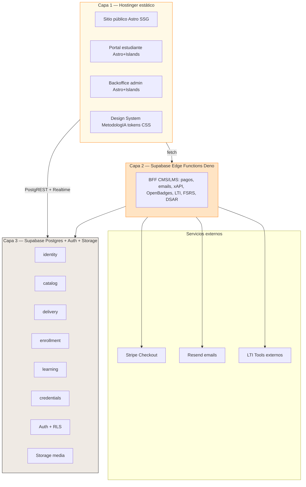
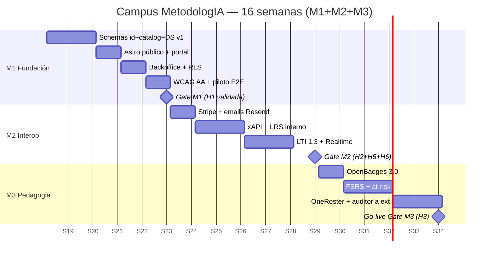
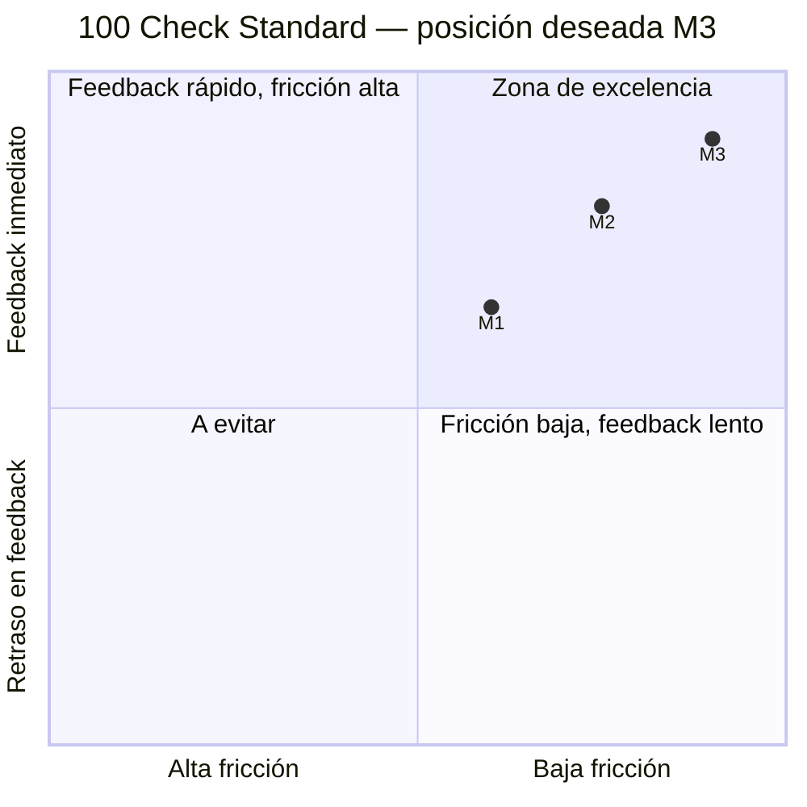
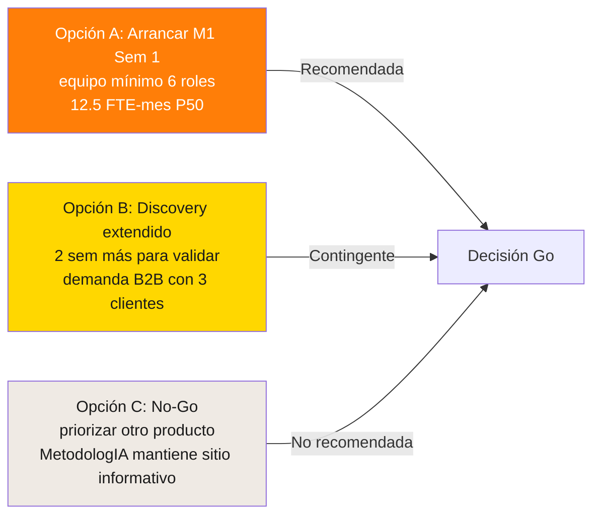

# 08 — Pitch Ejecutivo: Campus MetodologIA

> **Audiencia:** Javier Montaño (sponsor ejecutivo, founder MetodologIA) · **Formato:** narración de 6 pantallas lógicas · **Objetivo:** decisión Go/No-Go sobre arranque de M1 Sem 1 · **Duración de lectura:** <8 min · **Idioma:** español empresarial LatAm.

## TL;DR

- MetodologIA vende **método** pero no tiene **producto digital entregable**; el mercado B2B+B2C latino exige un campus propio, sin lock-in, con estándares IMS nativos desde el día 1 y branding aspiracional consistente. `[INFERENCIA]`
- La propuesta es un campus **10× menos ambicioso que Hubexo** que preserva sus 4 cualidades sistémicas (desacople, composabilidad, interoperabilidad, reusabilidad) en una arquitectura de 3 capas: Hostinger estático + Supabase Edge + Postgres. `[INFERENCIA]`
- **16 semanas · 12.5 FTE-meses P50 · 3 milestones** con hipótesis testables: H1 (matrícula en <3 min), H2 (publicar curso en <10 min), H3 (badge verificable por tercero). `[INFERENCIA]`
- **Los 3 riesgos críticos** (brecha de contenido pedagógico, RLS mal diseñada, a11y como after-thought) llevan mitigación explícita y owner antes de Sem 4. `[INFERENCIA]`
- **Recomendación: Opción A — arrancar M1 Sem 1 con equipo mínimo** (Lead Full-Stack + Edge/SQL + UX/a11y), activar Content strategist en Sem 3 y PM desde Sem 1. `[INFERENCIA]`

---

## Pantalla 1 — El problema

**MetodologIA hoy vende método, no producto.**

La marca se posiciona alrededor de una tesis poderosa — *"El éxito depende más de cómo te apalancas que de cuánto te esfuerzas"* — pero su entregable digital actual es un sitio informativo (metodologia.info) con CTAs hacia conversaciones humanas ("Descubrir Visión / Explorar Ruta / Soluciones"). No existe un **campus propio** donde el aprendiz B2C o el cliente B2B:

1. Descubra una ruta formativa con intención pedagógica explícita.
2. Se matricule sin depender de una conversación comercial.
3. Aprenda con evidencia trazable (xAPI, mastery, spaced repetition).
4. Reciba credenciales **verificables por terceros** (OpenBadges 3.0) que pueda publicar en LinkedIn o exportar a Credly.

El mercado latino de aprendizaje corporativo y profesional — especialmente en el segmento premium que MetodologIA apunta — **ya no acepta lock-in con LMS genéricos** (Moodle saturado, LearnDash acoplado a WordPress, Teachable sin dominio propio). Exige: **branding íntegro, estándares IMS nativos, datos propios, experiencia aspiracional**. `[INFERENCIA]`

**Consecuencia estratégica:** cada mes sin campus es un mes en que MetodologIA compite solo con contenido (blog, podcast, workshops puntuales) sin capturar el valor recurrente del aprendizaje escalable.

---

## Pantalla 2 — La propuesta

**Un campus 10× menos ambicioso que Hubexo, que preserva lo esencial de Hubexo.**

Tres bullets:

1. **10× menos ambicioso** que el modular monolith Hubexo (7 capas, ~20 asistentes, 1,248 manifests, ~100k LOC esperados). El campus MetodologIA tendrá **3 capas, 6 bounded contexts, <15k LOC M3**. `[INFERENCIA]`
2. **4 cualidades sistémicas preservadas** del canon Hubexo: **desacople** (6 schemas Postgres, regla cardinal `Course ≠ CourseRun ≠ Enrollment ≠ Person`), **composabilidad** (plugin points en `content_block.type` + 6 Web Components Lit reusables), **interoperabilidad** (LTI 1.3, xAPI, OpenBadges 3.0 nativos M1+M2), **reusabilidad** (monorepo pnpm con `packages/*` compartidos). `[INFERENCIA]`
3. **Estándares IMS nativos día 1**, no como retrofit: xAPI emitter + LRS interno desde M2, OpenBadges 3.0 con firma Ed25519 en M3, OneRoster 1.2 opcional si aparece cliente B2B enterprise. Esto diferencia **radicalmente** de WordPress+LearnDash (la alternativa obvia, rechazada con argumento en el debate socrático). `[DOC]` `[INFERENCIA]`

### Lo que NO estamos construyendo

Para respetar la consigna "10× menos ambicioso":

- **NO** IA generativa dentro del campus (tutor, grading asistido) en M1-M3 — se sube a roadmap M4 con política explícita.
- **NO** multi-tenant en M1 (single-tenant suficiente; multi-tenant como feature condicional en M2 si aparece cliente enterprise).
- **NO** QTI 3.0 completo ni Caliper (solo LTI + xAPI + OpenBadges).
- **NO** mobile apps nativas (Web estándar + PWA opcional M3).
- **NO** framework pesado (React/Vue/Next) en el sitio público — solo Astro + Lit Web Components en Hostinger.

Esta disciplina de alcance es la que hace viable el roadmap de **16 semanas** con **12.5 FTE-meses P50**.

---

## Pantalla 3 — La arquitectura en 1 imagen

**Lectura ejecutiva:**

- **Capa 1** se sirve **100% estática** desde Hostinger (shared hosting). Cero servidor propio que mantener, cero runtime Node en producción pública.
- **Capa 2** (Edge Functions Deno, managed por Supabase) concentra toda la lógica mutable con side-effects. **Sin estado propio**.
- **Capa 3** (Postgres + Auth + Storage managed por Supabase) es la **única fuente de verdad del dominio**. Las RLS policies son el source-of-truth de permisos.

Esta arquitectura **sobrevive el escenario peor**: si Supabase cambia precios o condiciones, los 6 schemas Postgres se levantan tal cual en cualquier Postgres estándar (AWS RDS, Hostinger VPS Postgres, self-hosted). **No hay lock-in de modelo de datos**. `[INFERENCIA]`

---

## Pantalla 4 — El roadmap en 1 gráfico

**3 hitos inquebrantables:**

| Hito | Semana | Evidencia dura |
|---|---|---|
| **Gate M1** | Sem 5 | Curso piloto vive end-to-end; WCAG 2.2 AA en CI; 4/5 aprendices en UAT completan matrícula en <3 min |
| **Gate M2** | Sem 11 | Pago Stripe funcional; xAPI replay desde SQL; docente publica run en <10 min |
| **Gate M3** | Sem 16 | Badge emitido verificado por `badgecheck.io` externo; auditoría a11y firmada; dashboards docentes operativos |

---

## Pantalla 5 — Los números

### 5.1 Magnitud-FTE por milestone

| Milestone | P50 | P80 | P95 |
|---|---|---|---|
| M1 Fundación (5 sem) | 4.3 FTE-mes | 6.0 | 8.0 |
| M2 Interop (6 sem) | 5.0 | 7.2 | 9.6 |
| M3 Pedagogía (5 sem) | 3.2 | 4.8 | 6.4 |
| **Total 16 sem** | **12.5** | **18.0** | **24.0** |

**Lectura ejecutiva:** la probabilidad P80 sugiere que hay **un 80% de probabilidad** de completar con **18 FTE-meses o menos**. El P95 (24 FTE-meses) es el escenario pesimista con contingencia completa activada.

### 5.2 Equipo mínimo (6 roles)

- **Lead Full-Stack** (pivot técnico, review de PRs, integraciones) · 4 FTE-mes.
- **Edge/SQL Developer** (schemas, RLS, xAPI, LTI, OpenBadges, FSRS) · 3 FTE-mes.
- **UX/Accessibility Designer** (Design System MetodologIA, WCAG) · 2 FTE-mes.
- **Content Strategist (pedagogía)** (curso piloto, DUA, copy) · 1.5 FTE-mes.
- **PM part-time** (roadmap, gates, UAT) · 1 FTE-mes.
- **QA Automation** (Playwright, pgTAP, pa11y, k6) · 1 FTE-mes.

### 5.3 KPIs pedagógicos — 100 Check Standard

El campus se evalúa con el **100 Check Standard** de MetodologIA — cuatro dimensiones de calidad pedagógica operacional:

| Dimensión | M1 target | M3 target | Instrumento |
|---|---|---|---|
| **Time to Value** (visita → primer aprendizaje significativo) | <10 min | <5 min | Plausible funnel |
| **Feedback Delay** (acción → respuesta pedagógica) | <24h | <1h (FSRS + at-risk) | xAPI + cron |
| **Friction Level** (pasos para completar matrícula + acceso) | <5 pasos | <3 pasos | UAT + heurística |
| **QA Pedagógico** (% content_blocks con DUA completo + revisión) | 80% | 100% | Trigger Postgres + review queue |

### 5.4 KPIs de producto

- **Disponibilidad:** 99.5% M1 → 99.9% M3 (Supabase + Hostinger SLA compuesto).
- **Latencia p95:** <600 ms para PostgREST reads.
- **Core Web Vitals:** LCP <2.5s, INP <200ms, CLS <0.1 en todas las páginas públicas.
- **Accesibilidad:** 0 violaciones WCAG 2.2 AA en auditoría externa M3.

---

## Pantalla 6 — Los riesgos top 3 + la decisión

### 6.1 Riesgos críticos y mitigaciones

| # | Riesgo | Mitigación | Owner | Deadline |
|---|---|---|---|---|
| **R1** | 🔴 Brecha de contenido pedagógico: campus listo, catálogo vacío | Contratar Content strategist senior para producir 3 cursos piloto en paralelo a M1-M2 | PM | Sem 3 |
| **R2** | 🔴 RLS mal diseñada filtra datos entre estudiantes | pgTAP suite obligatoria Sem 3; revisión externa de policies Sem 4; ningún merge sin test | Edge/SQL dev | Sem 4 |
| **R3** | 🔴 Accesibilidad como after-thought rompe gate externo M3 | pa11y-ci + axe-core en CI desde Sem 4; auditor externo contratado Sem 10 | UX/a11y | Sem 4 |

> Riesgos completos (R4-R8) y cuadrante de priorización están en `06_Solution_Roadmap.md`.

### 6.2 Tres opciones de decisión

### 6.3 Recomendación: **Opción A**

**Arrancar M1 Sem 1 con equipo mínimo**, con tres condiciones previas de Sem 0:

1. **Workshop de brand tokens** con Javier (1 día) para congelar paleta MetodologIA (no Sofka Neo-Swiss, sin verde) y tipografía primaria.
2. **Contratación del Content Strategist senior** (o acuerdo con proveedor) para que en Sem 3 haya 1 curso piloto escrito y en Sem 8 haya 3 cursos listos.
3. **Decisión firme sobre dominio productivo**: `campus.metodologia.info`, `academia.metodologia.info` u otro; esto bloquea CORS, cookies, OpenBadges DID y SEO.

### 6.4 Rationale de la recomendación

| Criterio | Opción A | Opción B | Opción C |
|---|---|---|---|
| Time to market | 16 sem | 18 sem | ∞ |
| Coste oportunidad | Bajo | Medio | Alto (MetodologIA sigue sin producto) |
| Riesgo técnico | Controlado (HDD + gates) | Similar a A | N/A |
| Riesgo de demanda | 🟡 Supuestos B2B | 🟢 Validada | 🟢 Evitada |
| Coherencia con tesis de marca | 🟢 Alta | 🟢 Alta | 🔴 Baja |

**Veredicto:** Opción A gana porque el riesgo de demanda B2B se puede **mitigar en paralelo a M1-M2** (prospectar clientes mientras se construye) y el costo de oportunidad de Opción B (2 semanas de parálisis adicional) es mayor que el beneficio marginal de validación previa. **El campus puede ser su propio argumento de venta B2B** en demos desde Sem 6. `[INFERENCIA]`

---

## Cierre narrativo

> *El éxito depende más de cómo te apalancas que de cuánto te esfuerzas.*
>
> Hubexo se apalancó en 7 capas y 1,248 manifests. Nosotros nos apalancamos en **3 capas, 6 bounded contexts y 6 Web Components**. Misma física de composición, 10× menos peso. Misma interoperabilidad IMS, la décima parte del code. Misma promesa pedagógica, sin el servidor propio.
>
> El campus MetodologIA no es un producto. Es la **demostración operacional** de la tesis de la marca.

---

## Disclaimer obligatorio

> *Las estimaciones de este pitch se expresan en **magnitud-FTE-meses** y **no constituyen una oferta comercial**. No incluyen costos absolutos en moneda, márgenes, impuestos, ni condiciones de pago. La conversión a moneda y el compromiso económico definitivo están sujetos a un análisis comercial posterior con MetodologIA. El roadmap asume decisiones firmes en Sem 0 (brand tokens, dominio, contratación de Content strategist) y la disponibilidad del equipo descrito.*

---

*MetodologIA — Success as a Service · Construido con método, potenciado por la red agéntica.*
