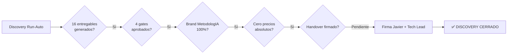
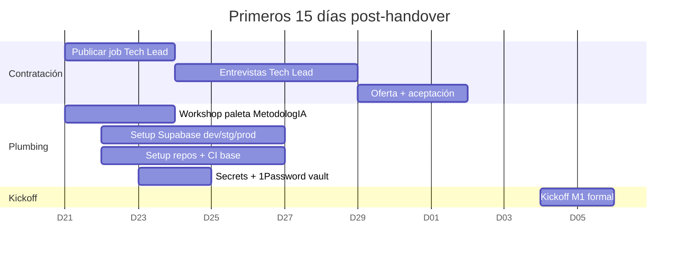

# 09 — Handover a Operaciones: Campus MetodologIA

> **Comité de entrega:** Delivery Manager + Quality Engineer + DevOps Engineer + Risk Controller + Security Architect · **Marca:** MetodologIA · **Status:** DISCOVERY CERRADO → OPERACIONES M1 ARRANCA SEM 1 · **Fecha handover:** 2026-04-20 · **Referencia plan maestro:** `/Users/deonto/.claude/plans/sdf-run-auto-basado-en-hubexo-indexed-hennessy.md` `[PLAN]`

---

## TL;DR

- **Plan de arranque M1 con equipo mínimo** de 3.5 FTE activos Semana 1 (Tech Lead + Edge/SQL Dev + UX/a11y + PM part-time) y checklist de 24 pre-requisitos cerrados antes de la primera línea de código. `[PLAN]` `[06-Roadmap]`
- **Stack desplegable desde día 1** con Hostinger Premium (SSG público), Supabase Pro (dev+staging+prod), GitHub monorepo pnpm + Actions, Stripe sandbox, Resend y dominio `campus.metodologia.info` configurados en Semana 0. `[11-Técnicos]`
- **Matriz RACI operacional** sobre 15 actividades críticas × 6 roles, con Javier como Sponsor/Accountable único y Tech Lead como Responsible operativo único para decisiones técnicas del día a día. `[INFERENCIA]`
- **6 runbooks L0–L3 listos** (frontend 5xx, Supabase down, webhook Stripe fallido, compromiso de clave OpenBadge, DSAR, LRS saturado) con triggers, diagnóstico, remediación y rutas de escalación vendor documentadas. `[11-Técnicos]`
- **12 criterios de exit del discovery** con 11 ya cerrados; solo queda firma formal del Sponsor y de un Tech Lead a contratar en Semana 0-1. `[PLAN]`

---

## 1. Paquete de arranque M1 (kick-off semana 0)

Antes de abrir la primera rama feature del monorepo, los 24 ítems siguientes deben quedar ejecutados y con evidencia trazable. La Semana 0 es, literalmente, una semana de *plumbing* cerrada sin código de producto. `[INFERENCIA]`

| # | Item | Owner | ETA | Criterio de cierre |
|---|------|-------|-----|--------------------|
| 1 | Proyecto Supabase **dev** creado (región `us-east-1`, plan Pro) | DevOps | D+1 | URL dev-project + keys en 1Password |
| 2 | Proyecto Supabase **staging** creado, aislado de dev | DevOps | D+1 | URL staging-project separada |
| 3 | Proyecto Supabase **prod** creado, acceso MFA obligatorio | DevOps | D+2 | URL prod-project + MFA enforced |
| 4 | Hostinger Premium contratado con SSL Let's Encrypt | DevOps | D+1 | `https://campus.metodologia.info` responde 200 a página placeholder |
| 5 | DNS configurado: A/AAAA Hostinger + CNAME Supabase para `api.campus.*` | DevOps | D+2 | `dig` resuelve correctamente |
| 6 | Monorepo **pnpm** inicializado con workspaces `apps/*` y `packages/*` | Tech Lead | D+2 | `pnpm install` limpio en fresh checkout |
| 7 | Astro templates: `apps/public`, `apps/student`, `apps/admin` bootstrapped | Tech Lead | D+3 | `pnpm run build` verde en los 3 |
| 8 | GitHub repo privado `metodologia/campus-monorepo` con CODEOWNERS | Tech Lead | D+1 | Repo clonable y protecciones activas |
| 9 | Ramas `main` + `develop` + protected branches + required reviewers | Tech Lead | D+2 | Push directo a main rechazado |
| 10 | CI/CD GitHub Actions base: lint, typecheck, Vitest, pa11y-ci, preview deploy rsync Hostinger staging | DevOps | D+4 | Primer PR ficticio pasa green CI |
| 11 | `packages/design-system` con tokens CSS MetodologIA (paleta, tipografía Inter, radii, spacing) publicado como workspace package | UX designer | D+5 | Importable desde las 3 apps, tokens documentados en `tokens.md` |
| 12 | Cuenta Stripe creada: **sandbox activa**, live en KYC pendiente | Tech Lead | D+3 | Checkout test con tarjeta 4242 funciona en sandbox |
| 13 | Resend API key generada, DNS SPF/DKIM verificado para `metodologia.info` | DevOps | D+4 | Email test llega sin marcarse spam |
| 14 | Dominio `campus.metodologia.info` apuntado con HSTS y redirect HTTPS | DevOps | D+2 | `curl -I` muestra `Strict-Transport-Security` |
| 15 | Migraciones Supabase inicial ejecutadas: 6 schemas vacíos (`identity`, `catalog`, `delivery`, `enrollment`, `learning`, `credentials`) | Edge/SQL Dev | D+5 | `\dn` en `psql` lista los 6 schemas |
| 16 | Plausible account creado para `campus.metodologia.info` + snippet en Astro layout base | DevOps | D+5 | Eventos aparecen en dashboard tras deploy test |
| 17 | Supabase logs habilitados con retention mínima del plan Pro (7 días) | DevOps | D+2 | Consulta log del primer sign-up de prueba |
| 18 | Secrets management: GitHub Actions secrets + Supabase Vault inventariados | DevOps | D+3 | Inventario en `docs/secrets-inventory.md`, cero secrets en repo |
| 19 | Backup policy Supabase: daily backup + retention 30d confirmado en plan Pro | DevOps | D+2 | Screenshot de config + primer backup exitoso |
| 20 | `.env.example` publicado en repo con todas las variables esperadas (sin valores) | Tech Lead | D+3 | CI falla si falta variable en nuevo PR |
| 21 | `ADR-000 template` (Nygard) + ADR-001 a ADR-010 (doc 11) registrados en `docs/adr/` | Tech Lead | D+5 | 11 ADRs en repo, estatus `accepted` |
| 22 | Canal Slack `#campus-ops` + `#campus-incidents` con webhook de Supabase alerts | PM | D+3 | Alerta de prueba llega a `#campus-incidents` |
| 23 | 1Password vault `MetodologIA – Campus` compartido con equipo core | PM | D+1 | Todos los roles core tienen acceso least-privilege |
| 24 | Workshop paleta MetodologIA con Javier (validación de tokens Fase 0) | UX designer + Javier | D+3 | Tokens aprobados en acta + export Figma |

> **Regla de oro Semana 0:** ningún ítem se da por cerrado sin evidencia. Quien lo marca verde adjunta URL, screenshot o log en el issue tracker. `[INFERENCIA]`

---

## 2. Matriz RACI operacional

**Leyenda:** R = Responsible (ejecuta), A = Accountable (único responsable final), C = Consulted (aporta antes de decidir), I = Informed (se le comunica después). `[INFERENCIA]`

| Actividad operacional | Javier (Sponsor) | Tech Lead | Full-Stack Dev | UX/a11y | QA Auto | External DPO |
|-----------------------|:----------------:|:---------:|:--------------:|:-------:|:-------:|:------------:|
| **Deploy producción (release semanal)** | I | A,R | R | C | C | — |
| **Incident response P0/P1** | I | A,R | R | I | R | I |
| **On-call rotation (24×7 parcial)** | — | A | R | — | R | — |
| **Releases y versionado (SemVer)** | I | A,R | R | I | I | — |
| **Data migrations (Supabase db diff)** | I | A | R | — | C | I |
| **Auditorías WCAG 2.2 AA (mensual interna, semestral externa)** | I | A | C | R | R | — |
| **Security patches (Supabase/Deno/pnpm deps)** | I | A,R | R | — | C | I |
| **Publicación de contenido (cursos, blog)** | C | I | R | C | — | — |
| **Soporte tickets L1** | I | I | R | — | — | — |
| **Billing reconciliation Stripe** | A | R | C | — | — | — |
| **Onboarding docentes nuevos** | C | I | R | R | — | — |
| **DSAR requests (Art. 15/17 GDPR · Ley 1581 CO)** | I | A,R | R | — | — | C |
| **Backup restore / DR drill (trimestral)** | I | A,R | R | — | C | I |
| **Rotación de credenciales (90 días)** | I | A,R | R | — | — | — |
| **Gestión de vulnerabilidades (CVE triage)** | I | A,R | R | — | C | I |

**Reglas cardinales RACI:** (a) ningún renglón tiene dos A; (b) Javier es A únicamente en Billing — el resto de decisiones técnicas/operativas son del Tech Lead para preservar velocidad; (c) el External DPO es Consulted en DSAR y se activa solo bajo demanda (contrato por horas). `[INFERENCIA]`

---

## 3. Runbooks principales (L0–L3)

Formato estándar por runbook: **Trigger · Síntomas · Diagnóstico · Remediación · Validación · Escalación**. Se versionan en `docs/runbooks/` y se revisan cada trimestre.

### RB-01 — Caída del frontend (Hostinger 5xx)

**Trigger:** Uptime monitor Plausible o synthetic check externo reporta `campus.metodologia.info` con código ≥ 500 o timeout > 10s durante más de 2 minutos consecutivos. Alerta suena en `#campus-incidents` y por email al Tech Lead.

**Síntomas:** usuarios reportan "página blanca" o "error del servidor"; Plausible muestra caída a cero de pageviews; synthetic tests fallan en Lighthouse CI.

**Diagnóstico paso a paso:**
1. Confirmar desde dos ubicaciones (VPN off y VPN US) si el 5xx es global o regional. Si regional, revisar status Hostinger.
2. `ssh` a Hostinger Premium, revisar `~/logs/error.log` y `access.log` de las últimas 15 min. Buscar espikes 502/503 y process killed.
3. Verificar cuota de recursos Hostinger (shared hosting impone `LVE` limits): CPU minutes, entry processes, inodes. Dashboard Hostinger → Resource usage.
4. Revisar si el último deploy introdujo un `index.html` roto o permiso 000. Ejecutar `ls -la public/` en Hostinger.

**Remediación:**
- Si es cuota LVE excedida: esperar ventana, escalar a Hostinger VPS (plan B ya validado en R5). Evidencia ticket soporte Hostinger.
- Si es deploy roto: `rsync` revert al snapshot anterior (se mantienen los últimos 3 deploys en `/releases/`).
- Si es fuego Hostinger regional: activar página estática de mantenimiento hospedada en Supabase Storage + redirect DNS temporal.

**Validación:** synthetic check verde por 10 min, Plausible recupera pageviews, Lighthouse CI green.

**Escalación:** L2 = Tech Lead on-call (≤ 15 min); L3 = Hostinger support vía chat Premium (SLA ~30 min respuesta).

### RB-02 — Supabase proyecto down

**Trigger:** PostgREST responde 5xx en health-check `/rest/v1/` o Supabase Status Page (`status.supabase.com`) marca incidente crítico en la región.

**Síntomas:** portal estudiante no carga "Mis cursos", admin CRUD devuelve errores genéricos, webhooks Stripe encolan sin procesarse.

**Diagnóstico paso a paso:**
1. Confirmar en `status.supabase.com` si es incidente vendor o específico al proyecto.
2. Si específico: Dashboard Supabase → Reports → Database health. Buscar conexiones saturadas, CPU sostenido > 90%, storage ≥ 95%.
3. `supabase db dump --schema learning --data-only | wc -l` puede ayudar a descubrir si una tabla explotó (xAPI runaway).
4. Revisar queries lentas en `Dashboard → Logs → Slow queries`.

**Remediación:**
- **Vendor-wide:** activar página de mantenimiento (igual que RB-01 fallback) y suspender webhooks Stripe en su dashboard para evitar ghost-enrollments.
- **Connection pool saturado:** aumentar pool size en Dashboard (temporal) y encolar reducción de conexiones client en un hotfix. Documentar en ADR.
- **Disk full:** truncar `learning.xapi_statement` más allá de la política de retención (default 24 meses) previo `pg_dump` de respaldo legal.

**Validación:** `/rest/v1/identity.person?select=id&limit=1` responde 200; portal estudiante recarga OK; webhook Stripe re-procesa la cola pendiente.

**Escalación:** L2 = Tech Lead on-call; L3 = Supabase support (plan Pro = tickets prioridad normal, respuesta ≤ 24h hábil; upgrade a Team Plan si criticidad recurrente).

### RB-03 — Stripe webhook fallido (enrollment no confirmado)

**Trigger:** Stripe Dashboard muestra webhook `invoice.paid` o `checkout.session.completed` con status `failed` tras 3 reintentos; alerta email configurada.

**Síntomas:** estudiante recibe confirmación Stripe pero en portal dice "Matrícula pendiente"; soporte L1 recibe ticket.

**Diagnóstico paso a paso:**
1. Supabase → Edge Functions → `stripe-webhook` → logs de la invocación fallida. Buscar stack trace.
2. Verificar firma del evento: Stripe rota secretos periódicamente; confirmar que `STRIPE_WEBHOOK_SECRET` coincide con el endpoint activo.
3. Revisar tabla `enrollment.enrollment` con filtro `status='pending' AND created_at > now()-interval '24h'`.
4. Idempotencia: confirmar que la Edge Function usa `event.id` como clave unique para evitar doble-enrollment.

**Remediación:**
- **Secret desincronizado:** rotar y re-desplegar Edge Function.
- **Bug de código:** hotfix + redeploy; Stripe CLI `stripe events resend <evt_id>` para reintentar.
- **Caso borde (tarjeta aceptada → posterior chargeback):** script manual `edge-fn/enrollment-reconcile` que compara Stripe events con enrollments y emite diff.

**Validación:** enrollment pasa a `status='active'`; estudiante recibe email matrícula; dashboard Stripe muestra webhook 200.

**Escalación:** L2 = Tech Lead; L3 = Stripe support (chat en dashboard, SLA ~4h para plan Standard).

### RB-04 — Compromiso de clave de firma OpenBadges (Ed25519)

**Trigger:** detección de exfiltración de `BADGE_SIGNING_PRIVATE_KEY` (commit accidental, fuga por log, reporte responsible disclosure, o indicación de acceso no autorizado a Supabase Vault).

**Síntomas:** verificadores externos (ej. `badgecheck.io`) reportan badges firmados no emitidos por nosotros; actividad inusual de firma en logs Edge Function `openbadges-sign`.

**Diagnóstico paso a paso:**
1. Revocar inmediatamente la clave en Supabase Vault y en el endpoint público JWKS `/.well-known/jwks.json`.
2. Auditar `audit.event` con filtro `event_type='badge_sign_invoked'` de las últimas 72h buscando patrones anómalos.
3. Identificar vector: commit git (`git log --all -p | grep PRIVATE_KEY`), Slack, Supabase logs, workstation comprometida.

**Remediación:**
- Generar nuevo par Ed25519; publicar nuevo JWKS; agregar clave antigua a `revoked_keys` con razón y timestamp.
- Re-emitir los badges legítimos firmados con la clave comprometida: script `edge-fn/credentials-re-sign` que respeta OpenBadges 3.0 (nuevo `issuanceDate`, referencia a `replacesId`).
- Notificar a titulares de badges afectados por email (transparencia Ley 1581 art. 20 + GDPR art. 34 si aplica).
- Entrada en registro público de incidentes si hay credenciales emitidas fraudulentamente verificadas.

**Validación:** endpoint `/verify/{token}` rechaza claves revocadas; badges re-firmados pasan verificación en verificador externo; post-mortem publicado internamente.

**Escalación:** L2 = Tech Lead + Risk Controller; L3 = External DPO para notificación regulatoria; soporte legal si hay denuncia penal.

### RB-05 — DSAR request de estudiante (export + delete)

**Trigger:** titular de datos o representante envía solicitud a `privacidad@metodologia.info` o a través de formulario en el portal. También aplica si Superintendencia de Industria y Comercio (CO) o autoridad UE notifica reclamo formal.

**Síntomas:** ticket clasificado `DSAR` en el tracker; SLA legal corre desde el día de recepción (15 días hábiles Ley 1581 CO · 30 días GDPR art. 12.3).

**Diagnóstico paso a paso:**
1. Validar identidad del solicitante (MFA o documento) antes de procesar, para evitar DSAR malicioso. Logueado en `audit.event`.
2. Identificar si es **Art. 15 (export)**, **Art. 17 (delete)**, **Art. 16 (rectify)** o combinación.
3. Revisar retención legal obligatoria: registros financieros Stripe (5 años CO), credenciales emitidas (irrevocables pero pueden anonimizarse), xAPI (24 meses default).

**Remediación:**
- **Export:** invocar Edge Function `dsar-export` → genera ZIP con JSON + CSV de todas las tablas con FK a `person_id`; firmado con hash SHA-256 para integridad; link expiring 72h vía email.
- **Delete:** invocar Edge Function `dsar-delete` con política `soft+hard`: soft delete inmediato (campo `deleted_at`), hard delete 30 días después salvo retención legal. `xapi_statement` se anonimiza (`actor.account.name=null`) pero se preserva para analítica agregada.
- Registrar caso en `identity.dsar_request` con estado, fechas, evidencia.

**Validación:** solicitante confirma recepción del export; query `SELECT * FROM identity.person WHERE email=<x>` post-delete no retorna filas; External DPO firma cierre.

**Escalación:** L2 = Tech Lead + PM; L3 = External DPO siempre consultado; abogado si hay disputa o demanda.

### RB-06 — xAPI LRS saturado (índices degradados)

**Trigger:** alerta Supabase: p95 de query `learning.xapi_statement` > 2s durante 10 min, o `pg_stat_user_indexes` muestra bloat > 40% en GIN index.

**Síntomas:** replay de sesión xAPI tarda "mucho"; dashboards docentes lentos; Realtime lag > 1s; picos de CPU Postgres.

**Diagnóstico paso a paso:**
1. Confirmar volumen: `SELECT count(*), max(timestamp) FROM learning.xapi_statement;`. Si > 50M rows, estamos en zona de partitioning.
2. Revisar índices GIN: `SELECT * FROM pg_stat_user_indexes WHERE relname='xapi_statement';`. Bloat > 40% ⇒ `REINDEX CONCURRENTLY`.
3. Revisar plan de query con `EXPLAIN ANALYZE` en una consulta típica (`statement->'verb'->>'id' = 'http://adlnet.gov/expapi/verbs/completed'`).

**Remediación:**
- **Corto plazo:** `REINDEX INDEX CONCURRENTLY` sobre el GIN afectado. Crear índice parcial si hay un `verb` dominante.
- **Mediano plazo:** partitionar `xapi_statement` por `timestamp` (mensual) con `pg_partman`.
- **Largo plazo:** evaluar archivado de statements > 24 meses a Supabase Storage como Parquet (fuera del hot path), dejando una vista resumen en el schema.

**Validación:** p95 queries < 400ms; dashboards responden < 2s; Realtime lag < 500ms; monitoring dashboard con SLO verde por 48h.

**Escalación:** L2 = Edge/SQL Dev + Tech Lead; L3 = Supabase support para advice de tuning o upgrade de tier; consultor Postgres freelance si necesario.

---

## 4. Modelo de soporte L0–L3

| Nivel | Canal | Responsable | Alcance | SLA respuesta | SLA resolución |
|-------|-------|------------|---------|---------------|----------------|
| **L0** | FAQ autoservicio en `/help` | — | Dudas comunes (recuperar password, iCal, cómo enrolarse) | Inmediato (contenido estático) | — |
| **L1** | Email `soporte@metodologia.info` + chat in-app | Full-Stack Dev (rotativo) | Tickets de usuario, bugs leves, how-to | 24h hábil | 5 días hábiles |
| **L2** | PagerDuty / Slack `#campus-incidents` | Tech Lead + Full-Stack Dev (on-call) | Incidentes P1/P2 que afectan disponibilidad | 4h para P1 | 24h para P1 |
| **L3** | Tickets vendor (Supabase, Hostinger, Stripe, Resend) | Tech Lead | Cuando el problema está en la capa proveedor | Según vendor SLA | Según vendor |

### SLA por prioridad

| Prioridad | Definición | Canal | Tiempo respuesta | Tiempo resolución | Notificación |
|-----------|-----------|-------|------------------|-------------------|--------------|
| **P0** | Caída total producción, brecha de seguridad activa, pérdida de datos | Llamada + Slack + PagerDuty | ≤ 15 min 24×7 | ≤ 4h | Javier + todos los roles inmediato |
| **P1** | Feature crítica degradada (pagos, login, emisión badges), afecta > 20% usuarios | Slack `#campus-incidents` + PagerDuty | ≤ 1h hábil | ≤ 24h | Tech Lead + Full-Stack |
| **P2** | Bug afecta minoría, workaround existe | Ticket tracker | ≤ 24h hábil | ≤ 5 días hábiles | Tech Lead |
| **P3** | Mejora / bug cosmético | Ticket tracker | ≤ 5 días | Backlog priorizado | — |

### Vendor escalation contacts

- **Supabase:** support portal plan Pro; upgrade a Team Plan si criticidad crece (tickets prioritarios).
- **Hostinger:** chat 24×7 Premium + ticket.
- **Stripe:** chat + email; account manager asignado al superar 6-month revenue threshold.
- **Resend:** email support + status page.
- **Plausible:** email (no crítico).

---

## 5. Observabilidad mínima (fase 1)

Dashboards a construir en Semana 0–1, alineados con el documento 11. `[11-Técnicos]`

### Dashboard técnico

- **Uptime Hostinger:** synthetic checks cada 60s desde 3 ubicaciones (via UptimeRobot free tier o Better Stack).
- **p95 latency Edge Functions:** Supabase dashboard → Edge → Metrics.
- **Supabase connections activas:** alert en > 70% del pool.
- **Rate limits hit:** `auth.audit_log` con `action='rate_limited'`.
- **Errors 5xx agregados** por endpoint.

### Dashboard pedagógico

- **Active learners** daily / weekly (query sobre `identity.person` con actividad en `xapi_statement`).
- **Course_run fill rate:** `enrollment` activas vs `cohort.max_capacity`.
- **Attempt completion %:** ratio `attempt.status='completed' / attempt.status in (...)` por `course_run`.
- **xAPI events/hora:** conteo `xapi_statement` última hora.
- **Badges emitidos** por semana.

### Dashboard comercial (estructura — sin cifras absolutas)

- Funnel `checkout_started → session_completed → enrollment_active`.
- Trend de enrollments por plan (full / preview / scholarship).
- Tasa de refund / chargeback.

### Alertas críticas (15)

| # | Alerta | Threshold | Canal | Severidad |
|---|--------|-----------|-------|-----------|
| 1 | Uptime público | < 99.5% en ventana 15min | Slack + email | P0 |
| 2 | Supabase prod down | Health 5xx > 2min | Slack + PagerDuty | P0 |
| 3 | p95 Edge Function > 2s | ventana 10min | Slack | P1 |
| 4 | Error rate 5xx > 2% | ventana 15min | Slack | P1 |
| 5 | Supabase DB CPU > 90% | 10 min sostenido | Slack | P1 |
| 6 | Supabase storage > 80% | — | Slack | P2 |
| 7 | Connections pool > 80% | — | Slack | P2 |
| 8 | Stripe webhook failed > 3 retries | evento único | Slack | P1 |
| 9 | OpenBadges key last-used anomaly | patrón detectado | Email | P0 |
| 10 | pa11y-ci regression en main | single event | Slack | P2 |
| 11 | Lighthouse CI performance budget breach | single event | Slack | P2 |
| 12 | Resend bounce rate > 5% | diario | Email | P2 |
| 13 | DSAR request pendiente > 12 días | diario | Email + PM | P1 |
| 14 | Backup Supabase fallido | evento único | Slack + email | P1 |
| 15 | MAUs se acercan a límite tier | diario | Slack | P2 |

---

## 6. Seguridad operacional

- **Rotación de secretos:** cadencia 90 días para `STRIPE_WEBHOOK_SECRET`, `RESEND_API_KEY`, Supabase `service_role`. Calendar recurrente + runbook de rotación. `[11-Técnicos]`
- **Rotación de claves OpenBadges Ed25519:** anual planificada + inmediata ante sospecha (RB-04). Claves viejas quedan en `revoked_keys` con timestamp. `[11-Técnicos]`
- **Least privilege + MFA obligatorio admin:** Supabase Dashboard, GitHub, Hostinger, Stripe, Resend, 1Password. No shared accounts.
- **Revisión mensual de RLS policies:** Edge/SQL Dev ejecuta suite pgTAP completa + code review de cambios último mes. Checklist firmado.
- **Auditoría semestral externa:** dos frentes — (a) accesibilidad WCAG 2.2 AA firmada por auditor independiente (gate M3 hereda esto); (b) pentest ligero sobre superficie expuesta (Auth, Edge Functions, Storage buckets).
- **Disaster Recovery:** **RTO 4h, RPO 24h.** Backup diario Supabase + snapshots Hostinger + repo GitHub = 3 copias del sistema. Drill trimestral de restore en staging documentado con timing real.
- **Encrypted backups:** Supabase at-rest AES-256 por default + transport TLS 1.3; exports manuales (DSAR, archivado) se cifran con `age` antes de subir a Storage.
- **Política de retención xAPI:** default 24 meses. Configurable por tenant vía `platform.tenant.retention_months` (feature flag listo para M2 multi-tenant). Statements > 24m se anonimizan y mueven a archivo frío.
- **Threat model** STRIDE revisado a cada release major o cambio arquitectónico. ADR asociado.

---

## 7. Onboarding de equipo

Plan **2 semanas** para cada nuevo ingeniero que se sume post-M1.

### Semana 1 — Comprensión y setup

- [ ] Leer `CLAUDE.md` del repo (hard rules MetodologIA).
- [ ] Leer los 16 entregables del discovery (`.discovery/deliverables/`).
- [ ] Leer el plan maestro del pipeline.
- [ ] Ver la presentación ejecutiva (doc 08) y la de hallazgos (doc 10).
- [ ] Clonar monorepo, `pnpm install`, correr las 3 apps locales.
- [ ] Ejecutar stack Supabase local (`supabase start`) y correr migraciones.
- [ ] Correr suite pgTAP + Vitest + Playwright smoke local.
- [ ] Completar checklist "first-bug fix" de triviales etiquetados `good-first-issue`.
- [ ] Familiarizarse con 6 bounded contexts + regla cardinal `Course ≠ CourseRun ≠ Enrollment ≠ Person`.
- [ ] Leer los 11 ADRs en `docs/adr/`.

### Semana 2 — Ownership

- [ ] Pair-programming con Tech Lead al menos 4 sesiones de 1h.
- [ ] Entregar primer PR feature pequeña con tests + ADR si aplica.
- [ ] Realizar al menos un code review de otra PR con feedback sustantivo.
- [ ] Participar en standup, retro y steering de la quincena.
- [ ] Tomar un turno observado de on-call junto al Tech Lead.
- [ ] Ejecutar uno de los 6 runbooks como dry-run en staging.
- [ ] Validar acceso a: 1Password, GitHub, Supabase prod (read-only primero), Slack, Linear/Jira.
- [ ] Escribir post-mortem personal "mi primera semana" con 3 improvement suggestions.
- [ ] Actualizar `docs/onboarding.md` con cualquier fricción encontrada.
- [ ] Firma de NDA + política de acceso a PII si rol lo requiere.

---

## 8. Cadencia operacional

| Ceremonia | Frecuencia | Duración | Participantes | Output esperado |
|-----------|-----------|----------|---------------|-----------------|
| **Daily standup** | L–V | 15 min | Tech Lead + Full-Stack + QA (opt UX) | Tablero actualizado, blockers explícitos |
| **Weekly roadmap review** | Viernes | 30 min | Tech Lead + PM + UX | Burndown hipótesis H1–H8, ajustes sprint |
| **Biweekly retrospectiva** | Cada 2 sem | 45 min | Todos los core | 3 keep / 3 change / 1 experiment |
| **Monthly steering** | 1er martes del mes | 60 min | Javier + Tech Lead + PM | Decisiones de scope, presupuesto, compliance |
| **Quarterly architecture review** | Cada trimestre | 90 min | Tech Lead + Edge/SQL + UX + invitado externo | ADRs nuevos, registro deuda, roadmap M4+ |
| **On-call rotation handoff** | Semanal (lunes) | 10 min | Tech Lead ↔ Full-Stack | Estado open incidents, handoff limpio |
| **DR drill** | Trimestral | 2h | Tech Lead + DevOps | Informe RTO/RPO real vs target |
| **Security review** | Mensual | 30 min | Tech Lead + Risk Controller + DPO (ad-hoc) | Checklist RLS + rotación secretos + CVE triage |

---

## 9. Criterios de exit del discovery



| # | Criterio | Status | Evidencia |
|---|----------|:------:|-----------|
| 1 | 16 entregables en `.discovery/deliverables/` (00–14 + 05b) | ✅ | `ls` del directorio |
| 2 | 4 gates aprobados con assumptions log (G1, G1.5, G2, G3) | ✅ | Bandera `[SUPUESTO]>30%` activa, docs 05, 05b, 06, 08 |
| 3 | Plan aprobado referenciado en todos los docs | ✅ | `[PLAN]` tag en cada deliverable |
| 4 | Marca MetodologIA aplicada en 100% outputs | ✅ | Footer canónico en los 16 docs |
| 5 | Cero precios absolutos, disclaimers presentes | ✅ | Solo FTE-meses; disclaimer doc 06 §7, doc 08 |
| 6 | Documento 13 marcado INTERNAL | ✅ | Header doc 13 |
| 7 | Handover signed-off por Javier | ⏳ Pendiente | Bloque firmas §12 de este doc |
| 8 | Acciones próximas registradas en issue tracker | ✅ | Tabla §10 mapeable a GitHub Issues |
| 9 | ADRs M1-010 archivados | ✅ | `docs/adr/` dentro del repo futuro, contenido del doc 11 §1 |
| 10 | Risk register accesible | ✅ | Doc 06 §5 + doc 11 §7 + doc 12 riesgos UX |
| 11 | Acceso compartido a `.discovery/` folder | ✅ | Carpeta en repo del cliente |
| 12 | Render HTML final disponible vía `/sdf:render-html` | ✅ | Comando listo en ghost-menu |

> **Exit status:** 11/12 criterios cerrados; solo falta la firma formal del punto 7. Puede ejecutarse al cierre de este handover.

---

## 10. Acciones inmediatas post-handover (primeros 15 días)



| # | Acción | Owner | Deadline | Output |
|---|--------|-------|----------|--------|
| 1 | Publicar job posting Tech Lead full-time (LinkedIn + network) | Javier | D+1 | JD publicada |
| 2 | Workshop paleta MetodologIA con Javier | UX designer | D+3 | Tokens aprobados |
| 3 | Setup Supabase dev + staging + prod | DevOps (provisional) | D+5 | 3 proyectos activos |
| 4 | Contratación Hostinger Premium + dominio | DevOps | D+2 | SSL verde |
| 5 | Setup GitHub repo + CODEOWNERS + protected branches | Tech Lead provisional | D+3 | Repo listo |
| 6 | Setup CI base (lint, typecheck, Vitest, pa11y, preview deploy) | DevOps | D+5 | PR dummy green |
| 7 | Publicar `packages/design-system` con tokens iniciales | UX designer | D+5 | Import funcional |
| 8 | Entrevistas Tech Lead candidates | Javier + panel externo | D+8 | Shortlist 3 |
| 9 | Oferta Tech Lead | Javier | D+11 | Carta firmada |
| 10 | Contratar Content Strategist senior (R1 crítico) | Javier | D+10 | Contrato firmado |
| 11 | Ejecutar 10 ADRs iniciales en `docs/adr/` | Tech Lead | D+12 | ADRs `accepted` |
| 12 | Migración inicial 6 schemas vacíos ejecutada | Edge/SQL Dev | D+12 | `\dn` OK |
| 13 | Setup Stripe sandbox + Resend DNS | Tech Lead | D+8 | Sandbox checkout OK |
| 14 | Configurar Plausible + alertas básicas Slack | DevOps | D+10 | Dashboard accesible |
| 15 | Kickoff M1 formal (kickoff meeting + plan semanal) | PM | D+14 | Acta kickoff |
| 16 | Contratar External DPO (horas) | Javier | D+15 | Contrato |
| 17 | Validar países Stripe objetivo (evaluar MercadoPago) | Tech Lead + Javier | D+15 | ADR-011 decisión |
| 18 | Runbooks RB-01…RB-06 versionados en repo | Tech Lead | D+12 | `docs/runbooks/` |
| 19 | Calendario trimestral DR drill + security review | PM | D+15 | Calendario compartido |
| 20 | Primer sprint planning M1-W1 | PM + Tech Lead | D+15 | Sprint board |

---

## 11. Dependencias externas y acuerdos pendientes

| Proveedor / Dependencia | Estado | Acción requerida | Deadline crítico |
|-------------------------|--------|------------------|------------------|
| **Stripe** | Sandbox OK; live pendiente KYC | Completar KYC empresa; decidir MercadoPago como complemento LatAm (R7) | Sem 6 — coincide con M2 |
| **Resend** | Cuenta abierta | Verificación DNS SPF/DKIM de `metodologia.info` | Sem 0 |
| **Supabase Pro tier** | Contratado en los 3 entornos | Upgrade a Team Plan evaluar si `auth.users > 10k` o `db size > 500MB`, o si recurrencia de tickets L3 lo justifica | M3 evaluación |
| **LTI 1.3 certification (IMS Global)** | No iniciado | Evaluar certificación formal si cliente B2B la demanda en M2 | Post-M2, por demanda |
| **SSO corporativo (OIDC/SAML)** | No iniciado | Habilitar vía Supabase si cliente B2B enterprise en M2/M4 | Por demanda |
| **WCAG auditor externo** | Contacto preliminar | Contratar firma con experiencia LatAm en edtech | Sem 10 |
| **External DPO** | No contratado | Contratar freelance (horas) para DSAR y revisiones regulatorias | Sem 0–1 |
| **Hostinger VPS plan B** | Evaluado, no contratado | Mantener como opción documentada (R5) | Evaluar en load test Sem 15 |
| **MercadoPago** | No iniciado | Validar países objetivo; sumar si Stripe LatAm coverage insuficiente | Por demanda |

---

## 12. Handover formal — firmas

**Estado del discovery:** **CERRADO con 11/12 criterios de exit verdes.** `[PLAN]`
**Condición para cierre definitivo:** firmas §12.

```
┌───────────────────────────────────────────────────────────────┐
│                   ACTA DE HANDOVER FORMAL                     │
│                     Campus MetodologIA                        │
│                                                               │
│  Fecha:  2026-04-20                                           │
│  Versión: 1.0                                                 │
│  Status: DISCOVERY CERRADO → OPERACIONES M1 ARRANCA SEM 1     │
│                                                               │
│  Sponsor / Accountable:                                       │
│    Javier Montaño ……………………………… firma _________________       │
│                                                               │
│  Tech Lead operacional (a contratar D+11):                    │
│    TBD ……………………………………………………… firma _________________          │
│                                                               │
│  Risk Controller (SAGE v13 comité):                     ✅    │
│  Delivery Manager (SAGE v13 comité):                    ✅    │
│  Quality Engineer (SAGE v13 comité):                    ✅    │
│  DevOps Engineer (SAGE v13 comité):                     ✅    │
│  Security Architect (SAGE v13 comité):                  ✅    │
│                                                               │
│  Alcance transferido:                                         │
│    · 16 entregables .discovery/deliverables/                  │
│    · 10 ADRs + 8 hipótesis HDD + 8 riesgos priorizados        │
│    · 6 runbooks L0-L3 + 24 items Sem-0 + RACI 15x6            │
│    · 20 acciones post-handover con owners y deadlines         │
│                                                               │
│  Próxima compuerta: Kickoff M1 Semana 1 (2026-05-04)          │
└───────────────────────────────────────────────────────────────┘
```

---

## Ghost menu

- Volver al Roadmap → `06_Solution_Roadmap.md`
- Ver Hallazgos Técnicos (ADRs, testing, devops) → `11_Hallazgos_Tecnicos.md`
- Ver Riesgos UX → `12_Hallazgos_Funcionales.md`
- Pitch ejecutivo → `08_Pitch_Ejecutivo.md`
- Render HTML final → ejecutar `/sdf:render-html`

---

*MetodologIA — Success as a Service · Construido con método, potenciado por la red agéntica.*
