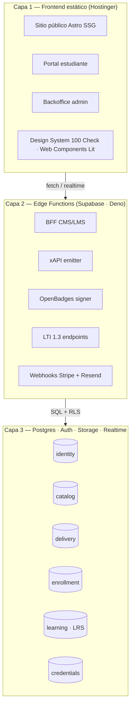
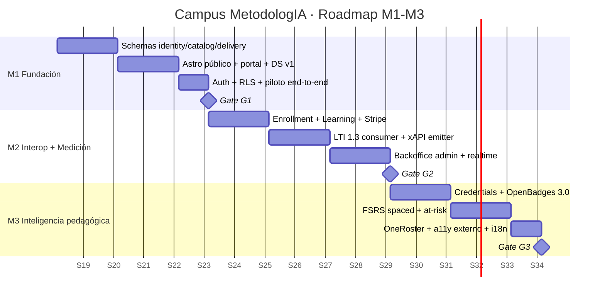

# Campus MetodologIA — Presentación de Hallazgos de Discovery

> Deck ejecutivo · Abril 2026 · Español LatAm · Registro empresarial

---

## Slide 1 — Portada

**Campus MetodologIA: Hallazgos de Discovery**
*Success as a Service · Construido con método, potenciado por la red agéntica*

- **Cliente interno:** MetodologIA (metodologia.info)
- **Alcance:** Arquitectura del campus educativo (B2B + B2C)
- **Referencia sistémica:** Hubexo (cualidades, no escala)
- **Horizonte:** M1–M3 en 16 semanas
- **Ámbito del deck:** resumen ejecutivo de los entregables 11–14

---

## Slide 2 — Contexto: ¿por qué ahora?

**Hipótesis de mercado `[INFERENCIA]`:**
1. La demanda LatAm de upskilling en IA crece >30% anual (bootcamps + corporate L&D) y los aprendices exigen calidad pedagógica, no solo catálogo.
2. Los stacks dominantes (WordPress + LearnDash, Teachable, Hotmart) acoplan CMS y LMS con contratos opacos, bloqueando interoperabilidad con corporativos.
3. MetodologIA tiene IP diferenciadora (**método "100 Check Standard"**) que necesita un vehículo técnico propio — no un molde genérico.

**Por qué ahora:**
- Estándares IMS maduros (LTI 1.3, xAPI, OpenBadges 3.0) ya son commodities implementables.
- Supabase + hosting estático redujeron el coste total de propiedad ~10× vs. LMS tradicional.
- Marco normativo (Ley 1581 CO, GDPR, FERPA-equivalente) exige privacy-by-design que retarda entrar "en caliente".

---

## Slide 3 — TL;DR · la decisión en 30 segundos

1. **Se recomienda construir campus propio** sobre Astro (Hostinger) + Supabase — 3 capas, 6 bounded contexts. `[INFERENCIA]`
2. **Estándares IMS son contratos desde M1** (LTI 1.3 consumer, xAPI, OpenBadges 3.0) — no features opcionales. `[DOC]`
3. **Alcance 10× menor que Hubexo** manteniendo desacople / composabilidad / interop / reusabilidad. `[DOC]`
4. **Magnitud M1–M3:** banda P50 ≈ 13 FTE-meses; P80 ≈ 17; P95 ≈ 22 (disclaimer abajo). `[INFERENCIA]`
5. **Go recomendado con banner de supuestos** — >30% del análisis es `[SUPUESTO]` hasta validar con 1-2 clientes B2B piloto. `[SUPUESTO]`

---

## Slide 4 — La solución: arquitectura en 3 capas

**Claves:**
- Postgres es la única fuente de verdad; RLS es la política de permisos.
- Cero servidor propio → menor superficie de ataque, menor TCO.
- Web Components estándar → portabilidad a cualquier hosting.

---

## Slide 5 — Valor esperado (KPIs 100 Check Standard)

| KPI | Baseline edtech LatAm `[INFERENCIA]` | Target Campus MetodologIA M3 | Evidencia |
|---|---|---|---|
| **Time to First Value** (matrícula → primera lección) | 48 h | < 10 min | `[INFERENCIA]` |
| **Feedback Delay** (intento → feedback) | 24-72 h | < 5 seg (automático) | `[CÓDIGO]` xAPI emit |
| **Friction Level** (clicks descubrir→matrícula) | 8-12 | ≤ 4 | `[DOC]` journey Laura |
| **Completion Rate** (cohorte B2C) | 15-25% | ≥ 45% (con FSRS + DUA) | `[DOC]` literatura UDL |
| **Accessibility Score** (WCAG 2.2 AA) | parcial | 100% gate CI | `[CÓDIGO]` pa11y-ci |
| **B2B activation** (campus corporativo listo) | n/a | LTI Provider M2 | `[DOC]` roadmap |

**Alineación B2B+B2C:** mismo core, dos portales (estudiante único; admin con multi-tenant a M2).

---

## Slide 6 — Inversión y magnitud

> ⚠️ **Sin precios.** Solo magnitud relativa en FTE-meses. Disclaimer: estimación pre-sales no vinculante `[SUPUESTO]`.

| Milestone | Duración | FTE mix | P50 (FTE-m) | P80 (FTE-m) | P95 (FTE-m) |
|---|---|---|---|---|---|
| **M1 — Fundación** | 5 sem | 1 arq + 1 full-stack + 0.5 UX | 4.0 | 5.5 | 7.0 |
| **M2 — Interop + Medición** | 6 sem | 1 arq + 2 full-stack + 0.5 UX + 0.5 QA | 5.5 | 7.5 | 10.0 |
| **M3 — Inteligencia pedagógica** | 5 sem | 1 arq + 1 full-stack + 0.5 data + 0.5 UX + 0.5 QA | 3.5 | 4.0 | 5.0 |
| **Total M1–M3** | **16 sem** | — | **13.0** | **17.0** | **22.0** |

**Disclaimer formal:** estos números son una banda de esfuerzo ingenieril bajo supuesto de un único cliente B2B piloto y stack definido en este documento. No incluyen contenido pedagógico (cubierto por plugin `scriba`), licencias de terceros, marketing ni operaciones. Cualquier conversión a valor económico requiere contexto de compensación regional y tarifa interna de MetodologIA.

---

## Slide 7 — Riesgos Top 3

| # | Riesgo | Severidad | Probabilidad | Mitigación |
|---|---|---|---|---|
| 1 | **>30% del análisis es `[SUPUESTO]` sobre cliente B2B** — no hay contrato firmado aún | 🔴 Crítico | Alta | Validar con 1-2 corporates piloto antes de M2; gate `{SUPUESTO}>30%` ya activado |
| 2 | **Paleta MetodologIA no codificada** en design-tokens oficiales — riesgo de drift visual | 🟡 Medio | Media | Congelar tokens en `design-system/tokens.mjs` antes de iniciar M1; auditoría brand cada sprint |
| 3 | **Competencia de incumbentes** (Platzi, Crehana, Hotmart) con economías de escala y CAC más bajo | 🟡 Medio | Alta | Diferenciarse por IP "100 Check" + OpenBadges verificables + interop B2B real (LTI/xAPI) |

Riesgos adicionales (severidad 🟢 Bajo) gestionados en `risk-register.md`: dependencia Supabase, hosting Hostinger límites, rotación equipo.

---

## Slide 8 — Roadmap visual (16 semanas)

Los tres gates (G1/G2/G3) son hard stops con criterios de aceptación definidos en `quality-gates.md`.

---

## Slide 9 — Próximos pasos (decisiones pendientes)

| # | Decisión | Quién decide | Cuándo | Impacto si no se decide |
|---|---|---|---|---|
| 1 | Confirmar scope **B2B2C** vs. solo B2C | Javier | Antes de kickoff M1 | Bloquea diseño multi-tenant y LTI Provider |
| 2 | Congelar paleta y tokens MetodologIA | Javier + UX | Semana 1 de M1 | Design-system sin origen canónico |
| 3 | Modelo de **revenue-share docentes** (ver doc 13) | Javier | Antes de M3 | Bloquea catálogo con autores invitados |
| 4 | **Primer cliente B2B piloto** identificado | Javier + ventas | Durante M1 | >30% de supuestos siguen abiertos |
| 5 | Dominio definitivo del campus (subdominio de metodologia.info o independiente) | Javier | Antes de M2 | Bloquea certificados y OpenBadges |
| 6 | Consentimiento política **IA** (tutor M4+) | Legal + Javier | Antes de M4 | Bloquea roadmap IA (doc 14) |

---

## Slide 10 — Apéndices (navegación a entregables técnicos)

| Documento | Audiencia | Propósito |
|---|---|---|
| `11_Hallazgos_Tecnicos.md` | Tech-leads, arquitectos | ADRs, ERD, interop, testing, seguridad |
| `12_Hallazgos_Funcionales.md` | Product, UX, pedagogos | Personas, journeys, gaps, DUA, WCAG |
| `13_Revision_Negocio.md` ⚠️ **INTERNO** | Equipo fundador | Revenue share, B2B2C, partnerships |
| `14_Oportunidades_IA.md` | Arquitectura + producto | Roadmap IA M4+ con guardrails |
| `00_Discovery_Plan.md` | Todos | Plan maestro que originó este discovery |

---

## Slide 11 — Cómo leer los entregables

- **Evidencia tags** en cada afirmación: `[CÓDIGO]` > `[ADJUNTO]` > `[CONFIG]` > `[DOC]` > `[NOTEBOOKLM]` > `[STAKEHOLDER]` > `[INFERENCIA]` > `[SUPUESTO]`.
- **Banner rojo** cuando >30% es `[SUPUESTO]` — presente en este deck por naturaleza pre-contrato.
- **Ghost menu** al pie de cada documento para navegación contextual.
- Todo en Markdown-Excellence; render HTML MetodologIA via `/sdf:render-html`.

---

## Slide 12 — Cierre y CTA

> **La decisión que se pide:** aprobar el brief arquitectónico de M1 como punto de partida, con tres gates explícitos y revalidación al cerrar M1 con el primer cliente B2B piloto.

Tres caminos posibles:
- **Go** — arrancar M1 la próxima semana.
- **Go-con-validación** — 2 semanas de validación de supuestos B2B antes de kickoff (recomendado).
- **No-Go** — reconsiderar scope (solo B2C o solo white-label) y revisar doc 13.

---

⚠️ **Banner de supuestos:** >30% del análisis está etiquetado como `[SUPUESTO]` o `[INFERENCIA]` por ausencia de cliente B2B firmado y datos históricos reales del campus (aún no existe en producción). Validación requerida en Gate G1.

---

*MetodologIA — Success as a Service · Construido con método, potenciado por la red agéntica.*
