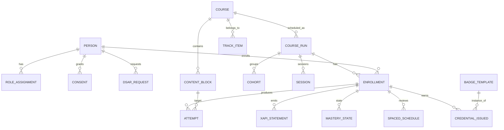
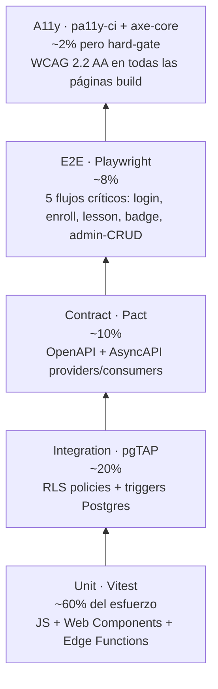
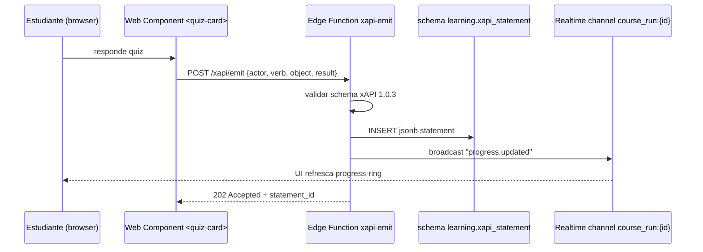

# Campus MetodologIA — Hallazgos Técnicos

> Deep-dive de ingeniería · Audiencia: tech-leads, arquitectos, DevOps, QA lead · Abril 2026

---

## TL;DR (tech)

1. Arquitectura **MACH-light estática** sobre Hostinger + Supabase; 3 capas; 6 bounded contexts como schemas Postgres. `[DOC]` plan maestro.
2. **10 ADRs** cristalizan las decisiones irreversibles: Astro, Supabase, Web Components, separación `Course/CourseRun/Enrollment/Person`, xAPI > SCORM, LTI 1.3, OpenBadges 3.0, FSRS, WCAG 2.2 AA como gate CI.
3. **Testing pyramid** completo desde M1: Vitest (unit), pgTAP (RLS), Playwright (E2E), pa11y-ci (a11y), Pact (contratos).
4. **Observabilidad mínima viable** con Supabase logs + Plausible + OTel opcional M2.
5. **Deuda técnica = 0** al ser greenfield; cualquier skip de WCAG/RLS/testing se registra inmediatamente.

---

## 1. Decisiones arquitectónicas clave (10 ADRs resumidos)

| ID | Decisión | Contexto `[DOC]` | Consecuencias positivas | Consecuencias negativas / Trade-offs |
|---|---|---|---|---|
| **ADR-001** | **Astro 4.x** como framework del sitio | Hostinger = shared hosting, requiere SSG; queremos islands para interactividad puntual | Build estático puro; islands opt-in; cero lock-in; 0-JS por defecto | Menos madurez que Next.js; ecosistema de templates menor |
| **ADR-002** | **Supabase** como backend gestionado | Alternativas: Firebase (NoSQL), Postgres desnudo | Postgres estándar + Auth + Realtime + Storage + Edge; RLS de fábrica; exit-ramp a cualquier Postgres | Dependencia de un proveedor; pricing por row-reads a gran escala |
| **ADR-003** | **Web Components + Lit** para interactividad | Alternativas: React, Vue, Svelte | Estándar W3C; 2kb runtime; portables a cualquier hosting; SSR-friendly | Curva de aprendizaje para equipos React; DX menos rica |
| **ADR-004** | **6 bounded contexts como schemas Postgres** | DDD sobre dominio educativo | Aislamiento lógico; RLS por schema; migraciones independientes | Joins cross-schema requieren cuidado; algunos ORMs menos cómodos |
| **ADR-005** | **Desacople estricto `Course ≠ CourseRun ≠ Enrollment ≠ Person`** | Patrón industrial e-commerce aplicado a edtech | Un curso → N ciclos; persona → N roles temporales; matrícula por ejecución; catálogo reusable | Modelado inicial más costoso; equipos junior pueden colapsar los 4 si no hay revisión |
| **ADR-006** | **xAPI emitter desde M1**, SCORM solo import opcional M3 | xAPI = estándar vigente; SCORM = legado | Modelo de actividad granular; LRS interno en `learning` schema; queries jsonb + GIN | Algún contenido legado corporativo requiere conversión SCORM→cmi5 |
| **ADR-007** | **LTI 1.3 consumer en M1**, provider en M2 | M1 = consumir herramientas externas (H5P, Jupyter); M2 = ofrecer el campus como tool a corporates | Apalanca ecosistema LTI maduro; postpone complejidad de provider | M1 no permite white-label dentro de Moodle/Canvas hasta M2 |
| **ADR-008** | **OpenBadges 3.0 con firma Ed25519** | VC + OB 3.0 = credenciales verificables interoperables | Portabilidad del aprendizaje; verificable sin MetodologIA viva; alineado DIF/W3C VC | Gestión de claves Ed25519 requiere rigor; rotación documentada |
| **ADR-009** | **FSRS v4** para spaced repetition | Alternativas: SM-2 (Anki clásico), Leitner | FSRS supera a SM-2 en estudios recientes; parámetros adaptativos por learner | Implementación en Edge Function + job cron; mayor complejidad vs. Leitner |
| **ADR-010** | **WCAG 2.2 AA como hard-gate en CI** (pa11y-ci + axe-core) | Política privacy-by-design + inclusión | Accesibilidad desde día 1; bloqueo de merge si regresa; cumplimiento Ley 1618 CO y equivalentes | Sprints más lentos al inicio; requiere training pa11y |

Cada ADR completo se emite en `/adr/` al abrir M1; plantilla Nygard clásica (contexto / decisión / consecuencias / estatus).

---

## 2. Modelo de datos (ERD y claves entre schemas)



**Claves cross-schema `[CONFIG]`:**
- `identity.person.id` es FK en **todas** las tablas con usuarios; nunca duplicar email.
- `catalog.course.id` **nunca** es FK en `enrollment`; sólo vía `delivery.course_run.id`.
- `learning.xapi_statement` usa `jsonb` con índice GIN en `statement->'verb'->>'id'` y `statement->'object'->>'id'`.
- `credentials.credential_issued` guarda el VC completo en `jsonb` firmado y el `verification_token` como índice único.

**RLS policies de ejemplo (Postgres):**
```sql
create policy enrollment_owner on enrollment.enrollment
  for select using (person_id = auth.uid());
create policy enrollment_instructor on enrollment.enrollment
  for select using (
    exists (select 1 from identity.role_assignment ra
            where ra.person_id = auth.uid()
              and ra.role = 'instructor'
              and ra.scope_course_run_id = enrollment.course_run_id)
  );
```

---

## 3. Interoperabilidad IMS (matriz estándar × milestone × estado)

| Estándar | M1 | M2 | M3 | Notas |
|---|---|---|---|---|
| **LTI 1.3 (Tool Consumer)** | 🟢 Obligatorio | 🟢 | 🟢 | Consumir H5P, Jupyter, herramientas externas |
| **LTI 1.3 (Tool Provider)** | 🔴 No | 🟢 Obligatorio | 🟢 | Ofrecer campus como tool en LMS cliente |
| **xAPI 1.0.3** | 🟢 Obligatorio | 🟢 | 🟢 | LRS interno en schema `learning` |
| **cmi5 (profile xAPI)** | 🟡 Opcional | 🟡 Opcional | 🟢 Recomendado | Para empaquetar contenido exportable |
| **OneRoster 1.2 REST** | 🔴 No | 🟡 Opcional | 🟢 Obligatorio | Enterprise SIS sync |
| **QTI 3.0** | 🔴 No | 🔴 No | 🟡 Opcional | Import parcial de preguntas |
| **Caliper 1.2** | 🔴 No | 🟡 Opcional | 🟡 Opcional | Superposición con xAPI; evaluar duplicación |
| **OpenBadges 3.0 / VC** | 🔴 No | 🟡 Opcional | 🟢 Obligatorio | Firma Ed25519; verificación pública |
| **iCal (RFC 5545)** | 🟢 Obligatorio | 🟢 | 🟢 | Feed por `course_run` |
| **RSS / JSON Feed** | 🟢 Obligatorio | 🟢 | 🟢 | Catálogo público descubrible |
| **OpenAPI 3.1** | 🟢 Obligatorio | 🟢 | 🟢 | Generado de Postgres + PostgREST |
| **AsyncAPI 3.0** | 🟡 Opcional | 🟢 Obligatorio | 🟢 | Eventos Supabase Realtime |

**Criterio general:** un estándar entra como 🟢 sólo cuando existe caso de uso inmediato y suite de pruebas automatizada. Ningún estándar decorativo.

---

## 4. Estrategia de testing (pyramid)



**Reglas:**
- **Cobertura mínima** M1: 70% líneas / 60% branches en packages compartidos.
- **RLS obligatorio**: cada policy nueva requiere un pgTAP test que pruebe deny + allow.
- **Playwright fixtures** usan Supabase local dev-stack (no mocks) para reproducibilidad.
- **pa11y-ci bloquea merge** si hay errores AA; warnings AAA se registran pero no bloquean.
- **Ningún PR mergea** sin: green CI + code review + ADR nuevo si cambia una decisión del registro.

---

## 5. Observabilidad mínima viable

| Pilar | M1 | M2 | M3 |
|---|---|---|---|
| **Logs** | Supabase logs (Postgres + Edge) | + Logflare forward a S3 propio | + retención 90d |
| **Métricas** | Plausible (analytics) + Supabase dashboard | + OTel → Grafana Cloud free tier | + SLO dashboards |
| **Trazas** | n/a | OTel sdk en Edge Functions (spans: LTI, xAPI, OpenBadges) | + RUM cliente opcional |
| **Alertas** | email Supabase en SLA breach | PagerDuty free / OpsGenie | runbooks por alerta |

**OTel propuesta minimal (M2):** 4 spans nombrados obligatorios por Edge Function — `edge.invoke`, `db.query`, `external.call` (Stripe/Resend/LRS), `business.event`. Correlation-id via W3C traceparent. No over-engineer.

---

## 6. Performance targets

| Métrica | Target M1 | Target M3 | Tool |
|---|---|---|---|
| **LCP** (Largest Contentful Paint) | < 2.5s p75 | < 1.8s p75 | Lighthouse CI |
| **INP** (Interaction to Next Paint) | < 200ms | < 150ms | Lighthouse CI |
| **CLS** | < 0.1 | < 0.05 | Lighthouse CI |
| **TTFB** sitio público (Hostinger) | < 800ms | < 500ms | Plausible |
| **API p95 latency** (PostgREST Supabase) | < 400ms | < 250ms | Supabase dashboard |
| **xAPI ingest throughput** | 50 stmts/s | 200 stmts/s | Edge Function bench |
| **Realtime fan-out lag** | < 500ms | < 200ms | Supabase Realtime logs |

Presupuestos enforced via `@lhci/cli` en CI; regresiones >10% bloquean merge.

---

## 7. Seguridad

**Superficie mínima:**
- Sitio estático (Hostinger) → sin runtime de servidor propio.
- Backend = Edge Functions Deno (sandbox V8) + Postgres + Auth → gestionados por Supabase.
- Terceros: Stripe (PCI-DSS saas), Resend (SOC 2), Hostinger, Supabase (SOC 2 Type II).

**Controles por capa `[CONFIG]`:**

| Dominio | Control | Cumplimiento |
|---|---|---|
| **Auth** | Supabase Auth (OIDC + magic link + TOTP 2FA opcional) | Ley 1581 CO art. 4 |
| **Autz** | RLS Postgres por schema + policy; CLS (column-level) para PII | GDPR art. 32 |
| **Cifrado tránsito** | TLS 1.3 forzado | baseline |
| **Cifrado reposo** | Supabase at-rest AES-256 + Storage encryption | GDPR art. 32 |
| **Secretos** | Supabase Vault + GitHub encrypted secrets; `.env` nunca commited | OWASP ASVS L2 |
| **Firma OpenBadges** | Ed25519; clave privada en Supabase Vault; rotación documentada | W3C VC DM v2 |
| **Consentimientos** | Tabla `identity.consent` granular por finalidad; versionado | Ley 1581 art. 9 + GDPR art. 7 |
| **DSAR (export/delete)** | Edge Functions `dsar-export` (zip json+csv) y `dsar-delete` (soft+hard con retención legal) | GDPR art. 15/17 |
| **Audit log** | Tabla `audit.event` append-only; hash-chain opcional M3 | ISO 27001 A.12 |
| **Rate-limit** | Supabase Edge rate-limit por IP + por user; Cloudflare opcional | OWASP API4 |
| **Threat model** | STRIDE por bounded context en ADR; revisado cada release major | baseline |

**Política de gestión de identidades:** zero-trust con Supabase Auth; no hay usuarios-servicio compartidos; cada Edge Function usa service-role key con scope mínimo; PII nunca se loggea.

---

## 8. DevOps

**Pipeline CI (GitHub Actions):**

```mermaid
flowchart LR
    A[PR abierto] --> B[lint + typecheck]
    B --> C[vitest unit]
    C --> D[pgTAP vs supabase-local]
    D --> E[playwright E2E smoke]
    E --> F[pa11y-ci gate WCAG AA]
    F --> G[lhci performance gate]
    G --> H[build astro]
    H --> I[preview deploy Hostinger staging]
    I --> J[review humano + QA]
    J --> K[merge main]
    K --> L[migraciones supabase cli]
    L --> M[deploy producción]
    M --> N[smoke test prod]
```


**Puntos clave:**
- **Preview deploys** por PR vía rsync a subcarpeta Hostinger staging.
- **Migraciones Supabase CLI** con `db diff` como diff-guard; no hay DDL manual en prod.
- **Rollback** documentado: (a) Postgres point-in-time recovery Supabase (7d free); (b) revert de Edge Function por deploy previo; (c) rollback de sitio estático = rsync snapshot anterior.
- **Feature flags** via Supabase tabla `platform.feature_flag` + row-level; cliente lee en SSR build-time (flags públicos) y runtime (flags por-user).
- **Branching:** trunk-based; main siempre deployable.

---

## 9. Deuda técnica identificada

**Estado actual:** 0 (greenfield).

**Política explícita de deuda (desde día 1):**
- Cualquier skip de WCAG 2.2 AA, RLS, test o ADR se registra en `debt.log.md` con: descripción, razón, owner, fecha-límite, métrica de aceptación.
- Revisión cada sprint-review; máximo 3 items simultáneos en el registro.
- Debt-items bloquean el paso a Gate G3 si > 3 o si > 2 son severidad 🔴.

**Prehashes de riesgos que podrían convertirse en deuda:**
- Usar `any` en TS contracts (prohibido por linter strict).
- Hardcodear strings (i18n aware desde M1 aunque único idioma sea español).
- Saltar RLS con `service_role` desde cliente (prohibido; sólo Edge Functions puede).

---

## 10. Recomendaciones de evolución (M4+)

| Milestone | Foco | FTE-meses típicos `[INFERENCIA]` |
|---|---|---|
| **M4 — Multi-tenant enterprise** | Schema `platform.tenant`; RLS `tenant_id`; white-label por tenant; SSO SAML/OIDC custom; reportería por tenant | 8–12 |
| **M5 — IA generativa (ver doc 14)** | Tutor embebido, grading asistido, at-risk ML, generación DUA asistida | 10–15 |
| **M6 — Móvil nativo** (opcional) | React Native / Flutter sobre la misma API; offline-first; sincronización xAPI | 12–18 |
| **M7 — Marketplace de autores** | Portal creadores con revenue-share automatizado; workflow editorial; moderación | 8–10 |

**Secuencia recomendada:** M4 > M5 > M7 > M6. Priorizar multi-tenant antes de IA para poder vender B2B serio; móvil solo si hay demanda validada.

---

## Sequence diagram — xAPI emit flow (referencia)



Invariantes:
- El statement se firma con un hash del payload para integridad.
- Si Edge cae, el WC reintenta con backoff exp (max 3); statements bufferizados localmente.
- `verb.id` siempre de la lista cerrada xAPI + vocabulario MetodologIA (namespace propio).

---

## Contratos tipados (TypeScript)

```ts
// packages/supabase-types/src/index.ts (generado)
export interface Enrollment {
  id: string;                    // uuid
  person_id: string;             // FK identity.person
  course_run_id: string;         // FK delivery.course_run (NUNCA course)
  status: 'pending' | 'active' | 'completed' | 'withdrawn' | 'failed';
  entitlement: 'full' | 'preview' | 'scholarship';
  created_at: string;            // ISO8601
  started_at: string | null;
  completed_at: string | null;
}

// packages/xapi/src/types.ts
export interface XapiStatement {
  actor: { account: { homePage: string; name: string } };
  verb: { id: string; display: Record<string, string> };
  object: { id: string; objectType: 'Activity'; definition: ActivityDefinition };
  result?: { score?: { scaled: number }; completion?: boolean; success?: boolean };
  context?: { contextActivities?: Record<string, Activity[]> };
  timestamp: string;
}
```

Todos los paquetes compartidos usan `tsconfig.strict.json` con `noImplicitAny`, `strictNullChecks`, `exactOptionalPropertyTypes`.

---

## Ghost menu

- Volver al deck ejecutivo → `10_Presentacion_Hallazgos.md`
- Ver hallazgos funcionales / UX → `12_Hallazgos_Funcionales.md`
- Ver oportunidades IA (M4+) → `14_Oportunidades_IA.md`
- Plan maestro → `/Users/deonto/.claude/plans/sdf-run-auto-basado-en-hubexo-indexed-hennessy.md`

---

*MetodologIA — Success as a Service · Construido con método, potenciado por la red agéntica.*
