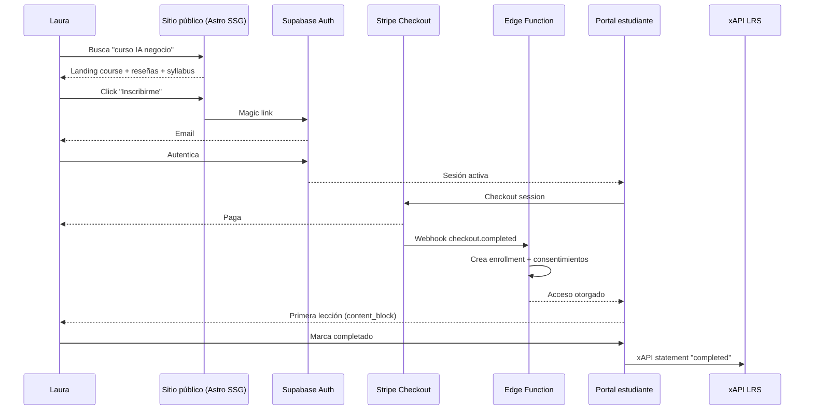
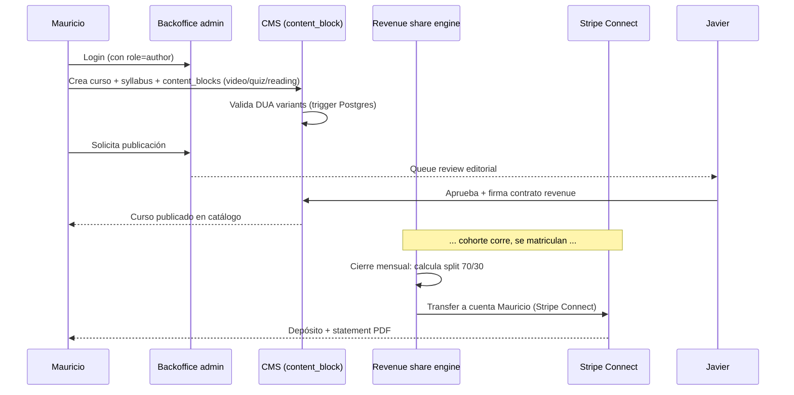
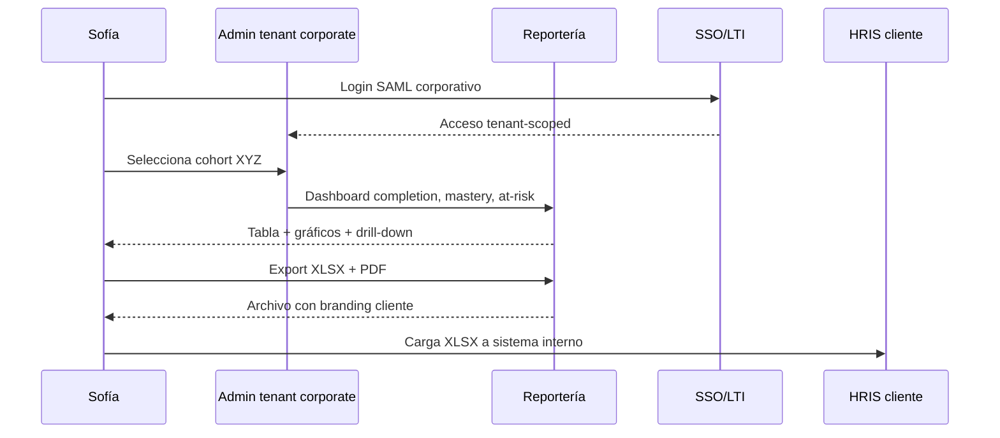

# Campus MetodologIA — Hallazgos Funcionales (Journeys, Gaps, UX)

> Audiencia: Product Owners, UX Leads, Pedagogos, L&D Managers · Abril 2026

---

## TL;DR funcional

1. **5 personas canónicas** cubren B2C (Laura, David), creadores (Mauricio), B2B (Sofía) y plataforma (Javier).
2. **3 journeys críticos** se mapean con gaps concretos; prioridad focalizada en "descubrir→matrícula→primera lección" para B2C.
3. **14 gaps funcionales** identificados; 4 son 🔴 para M1, 6 son 🟡 para M2, 4 son 🟢 para M3+.
4. **DUA/UDL 3.0** queda codificada en el modelo de datos — no es una intención, es un constraint de BD.
5. **Accesibilidad WCAG 2.2 AA** como gate CI; checklist de 31 criterios AA trackeado por build.
6. **KPIs UX (100 Check Standard)** definidos con targets claros.

---

## 1. Personas

### 1.1 Laura — Aprendiz B2C (arquetipo principal)

| Atributo | Valor |
|---|---|
| **Edad / contexto** | 32 años, emprendedora digital, vive en Medellín. |
| **Meta primaria** | Upskill en IA aplicada a su negocio; dominio práctico, no académico. |
| **Conocimiento previo** | Intermedio en marketing; básico en programación. |
| **Dispositivos** | Laptop 70%, móvil 30%; banda ancha fija + datos móvil variable. |
| **Motivadores** | Resultados tangibles; credenciales verificables; comunidad. |
| **Frustraciones** | Cursos largos sin aplicación; feedback tardío; certificados "de papel". |
| **Quotes** (`[INFERENCIA]`) | "Si no puedo aplicarlo esta semana, no me sirve." / "Quiero algo que pueda mostrar en LinkedIn." |
| **Tecno-literacy** | Alto en SaaS (Notion, Figma, ChatGPT); bajo en desarrollo. |

### 1.2 Mauricio — Docente Invitado / Creador

| Atributo | Valor |
|---|---|
| **Edad / contexto** | 45, PhD en Ciencia de Datos, consultor independiente, Bogotá. |
| **Meta primaria** | Distribuir su conocimiento sin montar plataforma propia; monetizar audiencia. |
| **Motivadores** | Reach amplio; control editorial; revenue-share transparente; brand co-build. |
| **Frustraciones** | Plataformas que imponen formato; comisiones opacas; pérdida de propiedad intelectual. |
| **Dispositivos** | Macbook + iPad + tablet Wacom para contenido. |
| **Tecno-literacy** | Alto en contenido audio-video; medio en plataformas educativas. |
| **Expectativa clave** | Publicar un curso end-to-end en ≤ 1 semana usando las herramientas MetodologIA. |

### 1.3 Sofía — L&D Manager Corporate (B2B)

| Atributo | Valor |
|---|---|
| **Edad / contexto** | 38, Jefa de Capacitación en fintech mediana (300 colaboradores), CDMX. |
| **Meta primaria** | Campus white-label para su equipo con reportería a recursos humanos. |
| **Motivadores** | Completion rates medibles; integración con su HRIS / LMS; compliance documentado. |
| **Frustraciones** | Plataformas que no se integran (SAML, LTI, OneRoster); reportería manual; onboarding lento. |
| **Exigencias técnicas** | SSO (OIDC/SAML), reportería por cohorte, export a XLSX/CSV, branding cliente. |
| **Decisor** | Firma contratos; influencia sobre CIO para integraciones. |
| **Expectativa clave** | Onboarding campus ≤ 2 semanas; compliance GDPR/Ley 1581 firmado. |

### 1.4 Javier — Admin / Founder MetodologIA

| Atributo | Valor |
|---|---|
| **Edad / contexto** | Fundador de MetodologIA; PreSales Architect Sofka Technologies. |
| **Meta primaria** | Definir catálogo, publicar `course_run`, medir KPIs por cohorte, cerrar contratos B2B. |
| **Motivadores** | Consistencia de marca; método "100 Check" aplicado; network agéntica opera en background. |
| **Frustraciones** | Herramientas que no respetan la metodología; esfuerzo editorial repetitivo. |
| **Expectativa clave** | Todo el backoffice operable por 1 persona + agentes SDF/MAO. |

### 1.5 David — Aprendiz Corporate B2B

| Atributo | Valor |
|---|---|
| **Edad / contexto** | 29, desarrollador backend en la fintech de Sofía, Guadalajara. |
| **Meta primaria** | Completar el plan de formación asignado por su empresa (obligatorio + electivo). |
| **Motivadores** | Bajo fricción; contenido relevante al puesto; certificados que queden en su perfil. |
| **Frustraciones** | Cursos genéricos no alineados a su rol; interrupciones por notificaciones corporativas. |
| **Expectativa clave** | Login vía SSO corporativo; contenido accesible desde VPN; progreso visible para su jefe. |

---

## 2. Journey maps (3 flujos críticos)

### 2.1 Laura — Descubrir → Matrícula → Primera lección (B2C)



**Etapas · Emoción · Touchpoint · Gap detectado**

| Etapa | Emoción | Touchpoint | Gap `[INFERENCIA]` |
|---|---|---|---|
| Descubrir | curiosidad | SEO, LinkedIn, Google | 🟡 Falta landing con social proof fuerte hasta M2 |
| Decidir | duda | página curso | 🔴 Falta preview gratuito de lección 1 (M1) |
| Registrarse | tensión | magic link | 🟡 Alternativa OIDC Google no activa hasta M1 final |
| Pagar | fricción | Stripe Checkout | 🟢 Baja, Stripe hace el trabajo |
| Primera lección | emoción | Portal | 🔴 Tiempo desde pago a primera lección < 60s (crítico) |
| Avanzar | compromiso | contenido + FSRS | 🟡 Recordatorios FSRS solo desde M3 |

### 2.2 Mauricio — Publicar curso → Cobrar regalías



**Gap clave:** Stripe Connect multi-party no está en M1–M3. Workaround manual hasta M4.

### 2.3 Sofía — Evaluar cohorte corporate → Reportar



**Gaps:** SSO SAML y multi-tenant white-label sólo desde M2 (OIDC) / M4 (SAML enterprise).

---

## 3. Gaps funcionales (14 identificados)

| # | Categoría | Gap | Prioridad | Solución propuesta | Milestone |
|---|---|---|---|---|---|
| G-01 | Auth | Sin SSO enterprise SAML | 🟡 | OIDC custom (Azure AD, Google Workspace) vía Supabase Auth custom provider | M2 |
| G-02 | Auth | SSO SAML 2.0 estricto | 🔴 para clientes enterprise | Integración con plataforma SAML (Auth0 bridge o Keycloak autogestionado) | M4 |
| G-03 | Offline | Sin modo offline para contenido | 🟢 | PWA + Service Worker + IndexedDB para cacheo de lessons; opt-in | M3 (spike) / M4 (prod) |
| G-04 | Accesibilidad | Voice input para expression variants DUA | 🟡 | Web Speech API (browser) + fallback texto | M3 |
| G-05 | Pagos | Stripe Connect multi-party (revenue share automatizado) | 🔴 para docentes invitados | Workaround manual M1–M3; Connect en M4 | M4 |
| G-06 | Pagos | Métodos locales LatAm (PSE, Nequi, OXXO, PIX) | 🟡 | Stripe + PayU / MercadoPago como proveedor alterno | M3 |
| G-07 | Interop B2B | OneRoster 1.2 roster sync | 🟡 para B2B | Edge Function que hace pull/push OneRoster | M3 |
| G-08 | Móvil | App nativa iOS/Android | 🟢 | PWA M3 cubre 80% casos; nativa solo si demanda valida | M6 |
| G-09 | Comunidad | Foros / discusión / peer-review | 🟡 | Integrar Discourse vía LTI 1.3 (consumer) | M2 |
| G-10 | Gamificación | Leaderboards / streaks más allá de badges | 🟢 | Vista materializada Postgres + componente `<streak-ring>`; opt-in para B2B | M3 |
| G-11 | Contenido | Editor rico para docentes (markdown + medios) | 🔴 | Tiptap (basado en ProseMirror) + storage Supabase | M2 |
| G-12 | Evaluación | Rúbricas para preguntas abiertas | 🟡 | Tabla `rubric` + UI de evaluación manual; ML-assisted en M5 | M3 |
| G-13 | Notificaciones | Push web + email secuenciados por cohorte | 🟡 | Resend + Web Push API; templated en backoffice | M2 |
| G-14 | Multi-idioma | EN + PT-BR además de ES | 🟢 | i18n keys desde M1; contenido traducido M3 (ES-only en M1-M2 UI) | M3/M4 |

**Distribución:** 4 🔴 críticos · 6 🟡 medios · 4 🟢 bajos / diferibles.

---

## 4. Experiencia pedagógica (DUA/UDL 3.0 concreto)

### 4.1 DUA codificada en el modelo de datos

Cada `catalog.content_block` tiene 3 columnas `jsonb not null`:

```sql
create table catalog.content_block (
  id uuid primary key,
  course_id uuid references catalog.course(id),
  type text check (type in ('video','quiz','reading','interactive','project','discussion')),
  representation_variants jsonb not null,  -- DUA Principle 1
  expression_variants jsonb not null,      -- DUA Principle 2
  engagement_hooks jsonb not null,         -- DUA Principle 3
  bloom_level text check (bloom_level in ('recordar','entender','aplicar','analizar','evaluar','crear')),
  ...
);

-- Trigger: rechaza rows con menos de mínimos por principio
create function catalog.check_dua_minimums() returns trigger ...;
```

### 4.2 Representation variants por `content_block.type`

| Tipo | Variantes obligatorias | Evidencia UDL |
|---|---|---|
| **video** | (a) subtítulos ES, (b) transcripción texto, (c) audio-descripción, (d) versión texto equivalente | UDL 1.1–1.3 |
| **reading** | (a) texto html semántico, (b) audio TTS, (c) resumen infográfico, (d) key-points bullet | UDL 1.1, 3.1 |
| **quiz** | (a) pregunta texto, (b) pregunta audio, (c) opciones multimodales, (d) feedback explicativo | UDL 2.5 |
| **interactive** | (a) modo teclado-only, (b) modo mouse/táctil, (c) alternativa no-interactiva (texto guía) | UDL 4.1 |
| **project** | (a) rúbrica explícita, (b) ejemplos (low/mid/high), (c) scaffolding descomposición | UDL 5.3, 6.2 |
| **discussion** | (a) texto, (b) audio, (c) video, (d) emoji-reacciones low-bar | UDL 5.1 |

### 4.3 Expression variants soportadas

- Texto escrito (default).
- Audio (Web Audio API + upload a Storage).
- Video corto (≤ 5 min, comprimido cliente).
- Código (code-block con ejecución sandbox M3).
- Imagen / sketch (canvas + upload).
- Tabla estructurada (spreadsheet-lite inline).

### 4.4 Engagement hooks (Principle 3)

- **Elección de ruta** (branch tracks): el learner elige entre 2-3 rutas de profundidad.
- **Relevancia contextual:** ejemplos ajustados a sector del learner (dato de onboarding).
- **Gamificación con sentido:** badges OpenBadges 3.0 por competencia, no por "participación" trivial.
- **Peer interaction:** foro por cohorte (G-09).
- **Self-regulation scaffolding:** journaling corto al cierre de cada lección (opcional).

### 4.5 Bloom alignment

Cada `content_block.bloom_level` es enum obligatorio. El trigger pedagógico exige que el 60% de una lección esté en `aplicar|analizar|evaluar|crear` (no solo memorizar). Métrica `v_bloom_ratio` por curso.

### 4.6 Spaced repetition (FSRS v4)

- Job cron Edge Function `cron-schedule-reviews` corre cada noche.
- Materializa `learning.spaced_schedule` con próximas revisiones por learner y por competencia.
- Portal estudiante muestra "Para hoy" con 3-7 items priorizados.
- Notificaciones opt-in (web push + email).

---

## 5. Accesibilidad — Checklist WCAG 2.2 AA (31 criterios)

| # | Criterio WCAG 2.2 AA | Estado target M1 | Método de verificación |
|---|---|---|---|
| 1.1.1 | Contenido no textual | 🟢 | axe-core + revisión manual |
| 1.2.1 | Solo audio / solo video (pre) | 🟢 | alt content obligatorio |
| 1.2.2 | Subtítulos (pre) | 🟢 | trigger catalog.content_block |
| 1.2.3 | Audio-descripción (pre) | 🟡 | variante DUA |
| 1.2.4 | Subtítulos (live) | 🔴 no aplica M1 | n/a hasta live sessions M2 |
| 1.2.5 | Audio-descripción (pre) AA | 🟡 | variante DUA |
| 1.3.1 | Info y relaciones | 🟢 | axe-core |
| 1.3.2 | Secuencia significativa | 🟢 | axe-core |
| 1.3.3 | Características sensoriales | 🟢 | revisión manual |
| 1.3.4 | Orientación | 🟢 | CSS no force orientation |
| 1.3.5 | Identificar propósito input | 🟢 | autocomplete attr |
| 1.4.1 | Uso del color | 🟢 | axe-core |
| 1.4.2 | Control de audio | 🟢 | componentes Lit media |
| 1.4.3 | Contraste mínimo 4.5:1 | 🟢 | pa11y + design tokens |
| 1.4.4 | Redimensionar texto 200% | 🟢 | CSS clamp + rem |
| 1.4.5 | Imágenes de texto | 🟢 | revisión manual |
| 1.4.10 | Reflow 320px | 🟢 | Playwright viewport |
| 1.4.11 | Contraste no-texto 3:1 | 🟢 | axe-core |
| 1.4.12 | Espaciado de texto | 🟢 | CSS variable tokens |
| 1.4.13 | Contenido on-hover | 🟢 | Web Components tooltip |
| 2.1.1 | Teclado | 🟢 | Playwright keyboard-only |
| 2.1.2 | Sin trampa de teclado | 🟢 | Playwright |
| 2.1.4 | Atajos de teclado char | 🟢 | prefijo con modifier |
| 2.2.1 | Tiempo ajustable | 🟢 | sin timeouts UI sin aviso |
| 2.2.2 | Pausar, detener, ocultar | 🟢 | controles media Lit |
| 2.4.1 | Saltar bloques (skip-link) | 🟢 | Astro layout |
| 2.4.2 | Título de página | 🟢 | Astro `<title>` |
| 2.4.3 | Orden del foco | 🟢 | axe-core + manual |
| 2.4.4 | Propósito del enlace | 🟢 | axe-core |
| 2.4.6 | Encabezados y etiquetas | 🟢 | axe-core |
| 2.4.7 | Foco visible | 🟢 | CSS :focus-visible |
| 2.4.11 | Foco no oculto (min) WCAG 2.2 | 🟢 | axe-core |
| 2.5.7 | Movimientos drag WCAG 2.2 | 🟢 | alternativa click/teclado |
| 2.5.8 | Tamaño target 24×24 WCAG 2.2 | 🟢 | design tokens |
| 3.1.1 | Idioma de la página | 🟢 | Astro lang |
| 3.1.2 | Idioma partes | 🟢 | manual |
| 3.2.1 | En el foco | 🟢 | no side-effects on focus |
| 3.2.2 | En el input | 🟢 | no submit-on-change |
| 3.2.6 | Ayuda consistente WCAG 2.2 | 🟢 | footer consistente |
| 3.3.1 | Identificar errores | 🟢 | formularios Astro |
| 3.3.2 | Etiquetas o instrucciones | 🟢 | Astro forms |
| 3.3.7 | Entrada redundante WCAG 2.2 | 🟢 | autocomplete + localStorage |
| 3.3.8 | Autenticación accesible WCAG 2.2 | 🟢 | magic link + passkeys opt-in |
| 4.1.1 | Parseo (obsoleto) | 🟢 | auto |
| 4.1.2 | Nombre, rol, valor | 🟢 | axe-core + Lit ARIA |
| 4.1.3 | Mensajes de estado | 🟢 | aria-live regions |

Total: 31 criterios relevantes AA cubiertos en target M1. 3 🟡 dependen de variantes DUA por content_block. 1 🔴 (1.2.4 live) no aplica hasta sesiones en vivo en M2.

---

## 6. Métricas UX (100 Check Standard aplicado)

| Métrica | Definición | Target M3 | Fuente de dato |
|---|---|---|---|
| **Time to Value (TTV)** | Tiempo desde matrícula exitosa hasta primera lección consumida | < 10 min p75 | xAPI `completed` primer statement |
| **Feedback Delay** | Tiempo desde envío de intento hasta recibir feedback automático o humano | < 5s (auto) / < 24h (manual) | diff `attempt.submitted_at` → `attempt.feedback_at` |
| **Friction Level** | # de clicks desde "descubrir" hasta "pagar" | ≤ 4 | Plausible funnel |
| **QA UX** | % de tickets soporte categoría UX / total tickets en 30d | < 8% | taxonomía tickets |
| **NPS in-product** | Encuesta inline post-módulo | ≥ 45 | `engagement.nps_response` |
| **Completion Rate** | % enrollments con `completed_at not null` dentro de cohort | ≥ 45% B2C / ≥ 70% B2B | vista `v_completion` |
| **Drop-off por content_block** | % drop en cada bloque | < 20% por bloque | xAPI `attempted` sin `completed` |
| **Accessibility score** | % páginas sin errores axe AA | 100% | pa11y-ci CI |
| **Activation (B2C)** | % usuarios que completan al menos lección 1 en 7 días | ≥ 70% | análisis cohort |
| **Activation (B2B)** | % seats licenciados con al menos 1 login en 14 días | ≥ 80% | análisis tenant |

---

## 7. Heurísticas de diseño (no negociables)

1. **Todo CTA con verbo + resultado explícito** ("Inscribirme al ciclo de mayo", no "Enviar").
2. **Empty states** siempre con acción sugerida y contexto de por qué está vacío.
3. **Progreso visible** en cada page (breadcrumb + progress-ring).
4. **Undo siempre que sea reversible** (matrícula, abandono cohorte con política de ventana).
5. **Errores con siguiente paso**, nunca solo "Error: inválido".
6. **Dark mode** por preferencia de sistema desde M1 (CSS var tokens).
7. **Mobile-first** en public site; portal estudiante y admin pueden ser desktop-first pero nunca mobile-broken.
8. **Componentes Web (Lit)** con API mínima coherente: `value`, `disabled`, `loading`, `error`.

---

## 8. Content strategy (pedagógica)

- **Unidad mínima:** `content_block` ≤ 7 min de tiempo esperado (microlearning).
- **Lección:** 3-7 content_blocks + 1 quiz + 1 reflexión corta.
- **Módulo:** 4-8 lecciones.
- **Curso:** 3-6 módulos + proyecto final.
- **Track:** N cursos ordenados por competencia acumulada.

Metadata obligatoria por curso: prerequisitos (FK competency), competencias otorgadas, tiempo estimado, bloom distribution, DUA coverage ratio.

---

## 9. Open questions funcionales (para Javier)

1. ¿Se permite a docentes invitados modificar curso ya publicado o sólo versionado?
2. ¿Política de reembolso B2C (7d / 14d / condicional)?
3. ¿Se obliga a completar prerequisitos o sólo se recomienda?
4. ¿Política de reintentos en quiz (ilimitado, 3, 1)?
5. ¿Public course review (como Coursera)? → decisión brand vs. ruido.
6. ¿Se ofrece "learning path recommendation" IA desde M3 o M4?

---

## Ghost menu

- Deck ejecutivo → `10_Presentacion_Hallazgos.md`
- Hallazgos técnicos → `11_Hallazgos_Tecnicos.md`
- Oportunidades IA (incluye tutor, grading asistido) → `14_Oportunidades_IA.md`

---

*MetodologIA — Success as a Service · Construido con método, potenciado por la red agéntica.*
