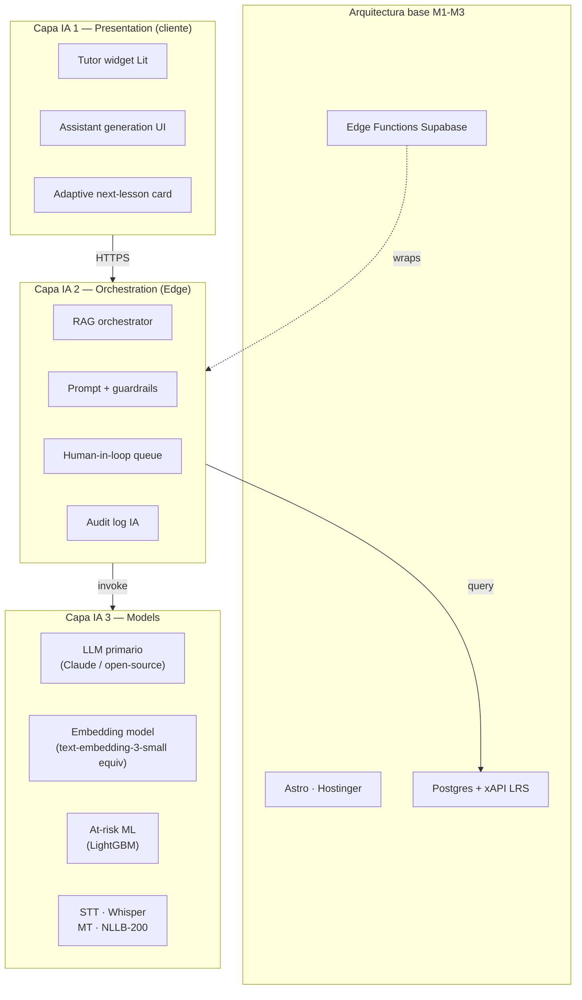

# Campus MetodologIA — Oportunidades de IA (Roadmap M4+)

> Explícitamente fuera de M1–M3 · Mapeadas para M4/M5/M6 · Abril 2026
> Audiencia: Arquitectura, Producto, L&D, Legal/Privacidad

---

## TL;DR IA

1. **Ocho oportunidades IA** mapeadas para M4+, ordenadas por valor pedagógico × factibilidad.
2. **Política de guardrails explícita**: ninguna feature IA a producción sin (a) consent, (b) guardrails, (c) human-in-the-loop, (d) audit log, (e) opt-out gratuito.
3. **Foco pedagógico**, no tecnológico: la IA amplifica el método "100 Check", no lo reemplaza.
4. **Arquitectura de 3 capas IA** (Presentation / Orchestration / Model) se superpone a la arquitectura base sin reescribirla.
5. **Estimación total M4–M6** (IA stream): ~30–45 FTE-meses `[INFERENCIA]`, dependiente de LLM stack elegido.

---

## 1. Diagrama: capas IA sobre la arquitectura base

---

## 2. Inventario de oportunidades (8)

### 2.1 Tutor IA embebido

| Dimensión | Detalle |
|---|---|
| **Problema que resuelve** | Learner sin acceso a docente 24/7; "stuck moments" causan abandono |
| **Approach técnico** | RAG sobre KB MetodologIA (embeddings de cursos, transcripciones, rúbricas). LLM con system prompt estricto por contexto de `content_block` actual. Citación obligatoria a fuente del corpus |
| **LLM stack propuesto** | Primario: Claude (Anthropic) por calidad en español + reasoning. Alternativa open-source: Llama 3.1/4 sobre vLLM self-hosted cuando madure. Decisión por tenant (enterprise puede exigir self-host) |
| **Guardrails** | (a) no responder fuera del contexto del curso; (b) no dar respuestas de evaluaciones en curso; (c) flag a docente si learner insiste en bypass; (d) rate-limit por learner |
| **Privacidad** | Consentimiento explícito; no se entrenan modelos con data learners; retention 30d conversaciones |
| **Costo** | Token-based, cap por learner/mes; tier Pro incluye 500k tokens/mes `[INFERENCIA]`; overage visible |
| **Riesgos** | Hallucination → mitigado por RAG + citación obligatoria + eval. Consentimiento parental si menores |
| **Magnitud** | 2–3 FTE-meses para piloto (1 curso) + 2 FTE-meses producción |
| **Milestone** | **M5** |
| **Métrica éxito** | NPS conversacional ≥ 60; tasa de escalado a docente humano < 15%; mejora completion +10pp vs control |

### 2.2 Generación asistida de contenido (para docentes)

| Dimensión | Detalle |
|---|---|
| **Problema que resuelve** | Producción de contenido DUA (3+ variantes por `content_block`) es 3× más lenta que contenido monomodal |
| **Approach técnico** | Wizard en backoffice: docente sube "texto madre" → LLM genera borrador de representation_variants (resumen, infografía bullet, audio script, quiz derivado). QC manual obligatorio antes de publish |
| **LLM stack** | Mismo stack Tutor. Temperatura más alta por creatividad |
| **Guardrails** | (a) watermark AI-generated en borrador; (b) docente debe editar ≥ 30% para publicar; (c) tabla `content_draft.ai_origin` true para audit |
| **Privacidad** | Docente es autor, mantiene IP del resultado. Transparencia hacia learner opcional (config por curso) |
| **Costo** | Absorbido por tier Pro-Author; cap por curso |
| **Riesgos** | Sesgo, plagio (eval con Turnitin-like antes de publish M5) |
| **Magnitud** | 3 FTE-meses |
| **Milestone** | **M5** |
| **Métrica éxito** | Time-to-first-publish de curso -50% vs M3 baseline; satisfaction docente ≥ 80% |

### 2.3 Grading asistido (human-in-the-loop obligatorio)

| Dimensión | Detalle |
|---|---|
| **Problema que resuelve** | Evaluación de preguntas abiertas / proyectos consume 60-70% tiempo docente |
| **Approach técnico** | Docente define rúbrica → LLM evalúa respuesta learner contra rúbrica + ejemplos → produce `suggested_score` + `feedback_draft` → docente revisa y aprueba |
| **Regla dura** | **NO se publica nota sin review humano**. El LLM sugiere; el docente decide |
| **LLM stack** | Mismo + prompt estructurado rubric→score |
| **Guardrails** | (a) doble-ciego: 2 evaluaciones LLM independientes, si divergen >10pp → flag; (b) learner ve "evaluado con asistencia IA · revisado por [docente]"; (c) audit log con payload completo |
| **Privacidad** | Respuesta learner no reentrena modelo |
| **Costo** | Por evaluación; cap por tier |
| **Riesgos** | Sesgo en rúbricas; bias sobre lenguaje / estilo → auditoría trimestral |
| **Magnitud** | 2–3 FTE-meses piloto |
| **Milestone** | **M5** |
| **Métrica éxito** | Tiempo medio por evaluación docente -60%; inter-rater agreement human-AI > 0.75; quejas learners < 3% |

### 2.4 At-risk prediction (ML predictivo)

| Dimensión | Detalle |
|---|---|
| **Problema que resuelve** | Intervención tardía = drop-off irreversible. Detectar at-risk proactivamente |
| **Approach técnico** | Pipeline ML: features desde xAPI + mastery_state + inactividad + score histórico. Modelo LightGBM / XGBoost entrenado batch; inference via Edge Function que llama servicio ML externo (o on-Postgres con pg_vector + ONNX Runtime M6) |
| **Output** | `risk_score` 0-1 por enrollment + top-3 features contribuyendo (SHAP) |
| **Triggers** | score > 0.7 → email docente + tarea en backoffice de outreach |
| **Guardrails** | (a) no mostrar a learner su risk_score (evitar stigma); (b) auditoría bias trimestral por género/edad/geo; (c) explicabilidad SHAP en backoffice |
| **Privacidad** | Modelo entrenado con data agregada + anonimizada. Consent para uso de data personal en training |
| **Magnitud** | 3–4 FTE-meses piloto (requiere dataset histórico M2-M3); 2 FTE-meses prod |
| **Milestone** | **M4** (heurística simple ya vive en M3); ML **M5** |
| **Métrica éxito** | Recall > 0.7 detección drop-off 2 semanas antes; reducción drop-off post-intervención ≥ 20% |

### 2.5 Personalización adaptativa (next-best-lesson)

| Dimensión | Detalle |
|---|---|
| **Problema que resuelve** | Rutas fijas desperdician tiempo para quienes ya dominan ciertos bloques, o sub-desafían |
| **Approach técnico** | Multi-armed bandit simple sobre `content_block` candidatos condicionado a `mastery_state` + `learner_goal` + context_tag. Contextual Thompson Sampling |
| **Stack** | On-Edge: Deno + módulo probabilístico; escala a Python service en M6 si es necesario |
| **Guardrails** | (a) learner puede siempre volver a ruta lineal (opt-out); (b) never-repeat bloque ya superado salvo spaced-review; (c) explainability: "te sugerimos X porque..."|
| **Privacidad** | Uso interno del motor; sin venta/compartir data |
| **Magnitud** | 3 FTE-meses |
| **Milestone** | **M5** |
| **Métrica éxito** | Tiempo-a-competencia -25%; completion +8pp vs ruta lineal |

### 2.6 Traducción automática ES ↔ EN ↔ PT (MT + human in loop)

| Dimensión | Detalle |
|---|---|
| **Problema que resuelve** | Expandir de mercado ES (LatAm + ES España) a PT-BR (Brasil) y EN-US (mercado global / expats) sin duplicar costo de producción |
| **Approach técnico** | MT (NLLB-200 / DeepL / Claude) para borrador → traductor humano especializado revisa y aprueba antes de publish. Segmentación por párrafo para diff-friendly |
| **Pipeline** | `content_block_translation` tabla con estado `draft_mt` → `human_reviewing` → `approved` → `published` |
| **Guardrails** | (a) never serve MT sin revisión humana si `content_block.severity = crítico`; (b) version-pin por idioma; (c) metadata visible al learner "traducido por [humano]" |
| **Privacidad** | n/a (contenido público del autor) |
| **Magnitud** | 2–3 FTE-meses infra + costo variable traductores |
| **Milestone** | **M6** |
| **Métrica éxito** | Cobertura de 50% catálogo en 2 idiomas adicionales Y1 M6; NPS contenido traducido ≥ 40 |

### 2.7 Voice-to-text para expression variants DUA

| Dimensión | Detalle |
|---|---|
| **Problema que resuelve** | Learners con dificultad escribiendo (dislexia, movilidad, preferencia); cumple UDL principle 2 (Expression) |
| **Approach técnico** | Web Speech API (browser-native, privacy-first, cero server) como default. Fallback Whisper (OpenAI o self-hosted) cuando Web Speech no disponible |
| **Guardrails** | (a) consentimiento explícito por sesión; (b) audio no se envía a server salvo opt-in para mejorar transcripción; (c) transcripción editable por learner antes de submit |
| **Privacidad** | Browser-native procesa localmente; fallback server tiene retention 24h |
| **Magnitud** | 1 FTE-mes (Web Speech) + 2 FTE-meses (Whisper integración) |
| **Milestone** | **M4** (Web Speech simple) + **M5** (Whisper) |
| **Métrica éxito** | Adopción ≥ 10% respuestas abiertas en B2C; 0 incidencias privacidad |

### 2.8 Análisis de engagement (anomaly detection)

| Dimensión | Detalle |
|---|---|
| **Problema que resuelve** | Detectar patrones raros: cold-start masivo, drop-off súbito, abuso, accesibilidad fallida |
| **Approach técnico** | Isolation Forest / DBSCAN sobre features xAPI agregadas por cohort/learner/hora. Ventana sliding 24h. Alerta a operations si anomalía > threshold |
| **Stack** | Python Edge Service o scheduled job en Supabase. Compute sobre views materializadas |
| **Guardrails** | (a) anomaly != culpa, solo signal; (b) no penalización automática; (c) privacy: agregados, no individuales |
| **Magnitud** | 2 FTE-meses |
| **Milestone** | **M5** |
| **Métrica éxito** | Detección proactiva ≥ 80% incidentes críticos cohort; falsos positivos < 20% |

---

## 3. Resumen en matriz de priorización

| # | Oportunidad | Valor pedagógico | Factibilidad | Riesgo | Milestone |
|---|---|---|---|---|---|
| 1 | Tutor IA embebido | Muy alto | Alta | Medio | **M5** |
| 2 | Generación contenido docentes | Alto | Alta | Bajo | **M5** |
| 3 | Grading asistido HITL | Alto | Media-Alta | Medio | **M5** |
| 4 | At-risk ML | Alto | Media (requiere dataset) | Bajo | **M4** heurística / **M5** ML |
| 5 | Personalización adaptativa | Medio-Alto | Media | Bajo-Medio | **M5** |
| 6 | Traducción MT + humano | Alto (expansión) | Alta | Bajo | **M6** |
| 7 | Voice-to-text DUA | Medio | Muy alta | Muy bajo | **M4** |
| 8 | Anomaly detection engagement | Medio | Media | Bajo | **M5** |

---

## 4. Política de guardrails (no negociable)

**Ninguna feature IA va a producción sin cumplir los 5 criterios:**

### 4.1 Consent
- Learner / docente / admin consintieron explícitamente uso de IA en esa feature.
- Consent granular (tutor on/off separado de generación on/off).
- Renovación anual + cada cambio material.
- Consent parental si menores (menor de 18 por defecto o menor local-aware).

### 4.2 Guardrails
- System prompt auditado y versionado.
- Rate limits por user.
- Allow-list de fuentes RAG.
- Content filters (safety classifiers) en input y output.
- Kill-switch por feature (tabla `platform.feature_flag` con scope global/tenant/user).

### 4.3 Human-in-the-loop
- Grading: review humano obligatorio antes de nota visible.
- Generación: docente edita ≥ 30% antes de publish.
- Tutor: escalación a docente humano si learner insiste o si safety classifier dispara.

### 4.4 Audit log
- Tabla `audit.ai_event` con: user, feature, input_hash, output_hash, model, model_version, tokens, latency, safety_flags, decision.
- Retención 12 meses (configurable por tenant).
- Exportable vía DSAR.

### 4.5 Opt-out gratuito
- Cualquier learner / docente puede desactivar features IA sin perder acceso al producto.
- Opt-out no degrada servicio core (curso + evaluación humana siguen disponibles).
- Opt-out visible en UI ≤ 2 clicks.

---

## 5. Arquitectura técnica IA (detalle por capa)

### 5.1 Presentation (cliente)
- Web Components `<metodologia-tutor>`, `<metodologia-suggest>`, `<metodologia-voice-input>`.
- Streaming UI (SSE) para respuestas LLM.
- Fallback skeleton + mensaje si AI service caído.
- Consent checkbox siempre visible.

### 5.2 Orchestration (Edge Functions Deno)
- `ai-tutor` — RAG + LLM call + safety filter + audit log.
- `ai-generate-draft` — draft_content → queue para docente.
- `ai-grade-suggest` — rubric + respuesta → suggested_score + feedback.
- `ai-recommend-next` — mastery_state + goal → next content_block.
- `ai-translate-draft` — segmento ES → EN/PT borrador.
- `ai-anomaly-scan` (job) — cohort metrics → alertas ops.

Todas las funciones:
- Inputs validados con Zod.
- Errores estructurados (`AIError` con code/message/retryable).
- OTel tracing.
- Audit log insert sincrónico antes de responder.

### 5.3 Models (estrategia)

| Caso | Primary | Fallback | Self-host option |
|---|---|---|---|
| General reasoning / tutor / grading | Claude 3.5/4 Sonnet | GPT-4o | Llama 3.3/4 70B |
| Embeddings | text-embedding-3-small | Cohere embed | BGE-M3 |
| STT | Whisper v3 | Web Speech native | Whisper self-host |
| MT | NLLB-200 | DeepL / Claude | NLLB self-host |
| At-risk ML | LightGBM (propio) | XGBoost | propio |
| Anomaly | Isolation Forest | DBSCAN | propio |

Enterprise tenants pueden exigir self-host (M6 feature).

---

## 6. Compliance y ética IA

- **EU AI Act** (categorización de riesgos) — Campus MetodologIA caería en **High Risk** por uso en educación (Annex III). Obligaciones: documentación, gestión de riesgos, logging, transparencia, supervisión humana, robustez. `[DOC]` AI Act art. 6–15.
- **UNESCO Ethics of AI in Education** — principios inclusión, equidad, transparencia, accountability. Adoptamos como framework.
- **Ley 1581 CO + GDPR** — ya cubierto en doc 11 (seguridad).
- **Bias audits trimestrales** — testing ML con dataset controlado; reporta al comité interno.
- **Model card** por modelo usado, publicada en docs públicos del campus.

---

## 7. Estimación agregada IA M4-M6

| Milestone | Features IA | FTE-meses `[INFERENCIA]` |
|---|---|---|
| **M4** | At-risk heurística + voice Web Speech | 3–5 |
| **M5** | Tutor + Generación + Grading + Adaptive + At-risk ML + Anomaly | 18–25 |
| **M6** | Traducción + Whisper self-host opt + Multi-tenant AI routing | 10–15 |
| **Total IA stream** | — | **31–45** |

**Supuestos clave:**
- LLM de terceros pay-per-token, no auto-hosting salvo enterprise específico.
- Infra Supabase cubre orchestration sin self-host.
- Equipo IA requerido: 1 ML engineer + 1 full-stack Deno + 0.5 UX + 0.3 Legal/Ethics durante M5.

---

## 8. Roadmap de experimentación pre-M4

Durante M1-M3 (antes de IA en producto), el equipo debe:
1. **Recolectar xAPI histórico** necesario para at-risk ML (M3 dataset mínimo ~1000 enrollments).
2. **Definir rúbricas 100 Check** en formato estructurado (json-schema) para grading asistido.
3. **Construir KB RAG corpus** con cursos M1 embebidos para piloto tutor M5.
4. **Model cards borrador** y policy IA pública para ethics committee.
5. **Ethics board** (3-5 personas externas) constituido antes de piloto M5.

---

## 9. Riesgos específicos stream IA

| # | Riesgo | Severidad | Probabilidad | Mitigación |
|---|---|---|---|---|
| AI-R1 | Hallucination del tutor causa info incorrecta al learner | 🔴 | Media | RAG + citación obligatoria + disclaimer + safety classifier |
| AI-R2 | Costo token explota por mal-uso (prompt injection, bucle) | 🟡 | Media | Rate limit + cap por user + alerta spend |
| AI-R3 | Bias en grading asistido perjudica learners por idioma/estilo | 🔴 | Media | Doble-ciego + auditoría trimestral + HITL obligatorio |
| AI-R4 | Privacy leak vía context fed to LLM (PII) | 🔴 | Baja | PII redaction en pre-prompt + DLP layer |
| AI-R5 | Dependencia de un vendor LLM (lock-in) | 🟡 | Alta | Abstract model client + soporte 2+ vendors + self-host roadmap |
| AI-R6 | Regulación EU AI Act + local cambia requisitos | 🟡 | Alta | Monitoreo trimestral + model cards + ethics board |
| AI-R7 | Learner percibe IA como "reemplazo" del docente, pierde valor humano | 🟡 | Media | Posicionar IA como "asistente", nunca "profesor". UI + comms refuerzan |
| AI-R8 | Data de training con sesgos históricos reproduce discriminación | 🔴 | Baja-Media | Selección curated, auditoría, no fine-tune con data learner salvo opt-in |

---

## 10. Decisión recomendada

**Activar stream IA en M4 con dos quick-wins:**
- At-risk heurística (sin ML aún).
- Voice-to-text Web Speech (privacy-first, browser-native).

**Escalar a M5 full** cuando:
- KB RAG esté curada (≥ 2 cursos completos embebidos).
- Ethics board operativo.
- Dataset xAPI ≥ 1000 enrollments.
- Política IA pública publicada en `/legal/ai`.
- Presupuesto confirmado (ver doc 13 para magnitud sin cifras).

**No escalar si:**
- Completion rate M3 < 35% (arreglar fundamentos primero, no endulzar con IA).
- Incidencias accesibilidad WCAG abiertas (IA no tapa gaps de fundamentos).
- Equipo core < 4 FTE (no distraer en stream IA prematuro).

---

## Ghost menu

- Deck ejecutivo → `10_Presentacion_Hallazgos.md`
- Hallazgos técnicos (arquitectura base) → `11_Hallazgos_Tecnicos.md`
- Hallazgos funcionales (DUA + UX) → `12_Hallazgos_Funcionales.md`
- Revisión negocio interna → `13_Revision_Negocio.md` ⚠️ INTERNO

---

*MetodologIA — Success as a Service · Construido con método, potenciado por la red agéntica.*
